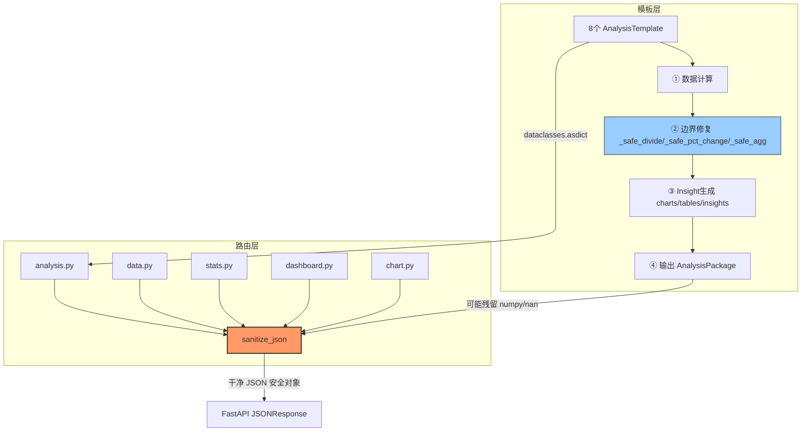

## 产品概述

DataMind AI 数据分析平台的双层防护架构加固——模板层边界修复 + 全局统一 JSON 序列化层。

## 核心功能

- 每个分析模板的 execute() 内部强制遵循四步流程：①数据计算 → ②边界修复 → ③Insight生成 → ④输出Package，模板层主动处理 nan/inf/除零等边界情况
- 升级 sanitize_json()：覆盖 NaN→None、inf→None、numpy.float64→float、numpy.int64→int、Timestamp→ISO字符串、Decimal→float、ndarray→list，递归清理所有非 JSON 安全类型
- 提取 sanitize_json 为公共工具（src/utils/json_serializer.py），全项目唯一一份，所有 API 返回前必须经过此函数
- 删除 analysis.py 中原有的 _sanitize_json，5 个高风险路由（analysis/data/stats/dashboard/chart）统一调用公共版本

## 视觉效果

前端无变化，此次改动纯粹是后端数据质量保障层——确保所有 API 永不因 nan/inf/numpy 类型导致 500 错误，分析结果数据干净可序列化

## Tech Stack

- 语言：Python 3.11
- 后端框架：FastAPI + Uvicorn
- 数据处理：Pandas + NumPy
- 序列化：dataclasses.asdict() + 自定义 sanitize_json 递归清理
- 模板引擎：自定义 AnalysisTemplate ABC + 8 个模板子类

## Implementation Approach

### 双层防护策略（Strategy C）

**末端兜底层**（src/utils/json_serializer.py）：

- 递归遍历 dict/list/嵌套结构，将所有非 JSON 安全类型统一转换
- 作为最后一道防线，确保任何残留的 numpy 类型、nan、inf 都不会到达 FastAPI JSON 序列化器
- 所有 API 路由返回前必须调用 `sanitize_json(result)`，全项目统一入口

**模板边界修复层**（base.py + 8 个模板）：

- 在 base.py 中添加 3 个静态工具方法：`_safe_divide`、`_safe_pct_change`、`_safe_agg`，供所有模板复用
- 更新 execute() 抽象方法文档，明确声明四步模式规范
- 每个模板的 execute() 按四步重构，边界修复步骤用注释标记 `# ② 边界修复`

### 为什么不是 Template Method Pattern（抽象子方法）？

每个模板的计算逻辑差异很大（groupby vs corr vs pct_change），强行拆成 `_calculate()/_fix/_insight/_package` 四个抽象方法会导致签名不统一、灵活性差。采用"文档规范 + 公共工具方法 + 模板内显式注释标记"更实用。

## Implementation Notes

1. **numpy 类型是隐形杀手**：`dataclasses.asdict()` 会保留 `numpy.float64/int64` 原样输出，`isinstance(obj, float)` 对 numpy float 不返回 True，当前 `_sanitize_json` 完全无法捕获。升级版必须用 `np.floating/np.integer` 检查。

2. **sanitize_json 性能**：递归遍历对大 dict/list 有开销，但 API 返回数据量通常在 10KB 以内（packages 约 7KB），不会成为瓶颈。对超大数据（如 data preview 的 100 行 dict）也可安全处理。

3. **向后兼容**：sanitize_json 只做类型转换，不改变数据结构或业务逻辑。None 替代 nan 在 ECharts 中语义正确（断点），在前端表格中显示为空白也符合预期。

4. **不要在模板层过度修复**：边界修复只处理"数学上确实无意义"的值（首行无上年、除零、单行 std），不改变有意义的负增长、高异常率等业务数据。

5.  **Blast radius**：新增 `src/utils/json_serializer.py` 不影响任何现有模块；修改路由层只改 import 和 return 语句，不改业务逻辑；模板改动只增加边界修复步骤，不删除原有计算。

## Architecture Design



## Directory Structure

```
d:\数据分析项目\
├── src/utils/                          # [NEW] 新建目录
│   ├── __init__.py                     # [NEW] 空文件，使目录成为 Python 包
│   └── json_serializer.py              # [NEW] 全项目唯一 JSON 序列化安全层
│       # sanitize_json(obj) 递归函数
│       # 覆盖：NaN→None, inf→None, np.float64→float, np.int64→int,
│       #        Timestamp→ISO字符串, Decimal→float, np.ndarray→list, np.bool_→bool
│       # 所有 API 返回前必须调用此函数
│
├── src/analysis_templates/
│   ├── base.py                         # [MODIFY] 添加 3 个边界修复工具方法 + 四步模式文档
│       # 新增静态方法：
│       #   _safe_divide(a, b, default=None) — 安全除法，b=0 返回 default
│       #   _safe_pct_change(series, default=None) — pct_change 首行替换为 default
│       #   _safe_agg(series, func_name, default=None) — 安全聚合，std/skew 单行返回 default
│       # 更新 execute() 文档字符串，声明四步模式规范
│       #
│   ├── growth_analysis.py              # [MODIFY] execute() 四步重构 + 边界修复
│       # ① 数据计算：groupby + pct_change + cumsum
│       # ② 边界修复：growth_rate 首行 NaN → None，avg_growth 排除 NaN 行
│       # ③ Insight 生成：KPI + table + ChartData + insights
│       # ④ 输出 Package：AnalysisPackage()
│       #
│   ├── ranking_analysis.py             # [MODIFY] execute() 四步重构 + 边界修复
│       # ② 边界修复：total=0 时 top3/top5 占比 → None，用 _safe_divide
│       #
│   ├── structure_analysis.py           # [MODIFY] execute() 四步重构 + 边界修复
│       # ② 边界修复：total=0 时占比 → None，用 _safe_divide
│       #
│   ├── concentration_analysis.py       # [MODIFY] execute() 四步重构 + 边界修复
│       # ② 边界修复：total=0 时 HHI/CR 指标 → None，用 _safe_divide
│       #
│   ├── distribution_analysis.py        # [MODIFY] execute() 四步重构 + 边界修复
│       # ② 边界修复：std/skew 单行数据 → None，用 _safe_agg
│       #
│   ├── correlation_analysis.py         # [MODIFY] execute() 四步重构 + 边界修复
│       # ② 边界修复：corr() NaN 结果 → None，fillna 替换
│       #
│   ├── anomaly_analysis.py             # [MODIFY] execute() 四步重构 + 边界修复
│       # ② 边界修复：std()=0 时 z-score → None，用 _safe_agg
│       #
│   ├── proportion_analysis.py          # [MODIFY] execute() 四步重构 + 边界修复
│       # ② 边界修复：total=0 时占比 → None，用 _safe_divide
│
├── backend/routers/
│   ├── analysis.py                     # [MODIFY] 删除 _sanitize_json + import math/dataclasses
│       # 删除本地 _sanitize_json 函数（约10行）
│       # 删除 import math
│       # 新增 from src.utils.json_serializer import sanitize_json
│       # return 语句改为 sanitize_json(packages)
│       #
│   ├── data.py                         # [MODIFY] 5个返回点加 sanitize_json
│       # 新增 from src.utils.json_serializer import sanitize_json
│       # /data/preview: sanitize_json(preview) 已有 replace({np.nan:None})，保留并叠加
│       # /data/column_info: sanitize_json(column_info)
│       # /data/summary: sanitize_json(summary_dict)
│       # /data/correlation: sanitize_json(corr_dict)
│       # /data/compare: sanitize_json(compare_dict)
│       #
│   ├── stats.py                        # [MODIFY] 3个返回点加 sanitize_json
│       # 新增 from src.utils.json_serializer import sanitize_json
│       # /stats/descriptive: sanitize_json(result)
│       # /stats/group: sanitize_json(result)
│       # /stats/correlation: sanitize_json(result)
│       #
│   ├── dashboard.py                    # [MODIFY] 2个返回点加 sanitize_json
│       # 新增 from src.utils.json_serializer import sanitize_json
│       # /dashboard/kpis: sanitize_json({"success":True,"kpis":kpis})
│       # /dashboard/charts: sanitize_json({"success":True,"tabs":tabs,"charts":result})
│       #
│   ├── chart.py                        # [MODIFY] 1个返回点加 sanitize_json
│       # 新增 from src.utils.json_serializer import sanitize_json
│       # /chart/generate: sanitize_json({"success":True,"option":option})
```

## Key Code Structures

```python
# src/utils/json_serializer.py — 核心接口签名

def sanitize_json(obj) -> Any:
    """递归清理所有非 JSON 安全类型，转换为 JSON 兼容对象。
    
    覆盖规则：
    - NaN/inf → None
    - numpy.float64/32 → float（含 inf/nan 检查）
    - numpy.int64/32 → int
    - numpy.bool_ → bool
    - numpy.ndarray → list（递归清理元素）
    - pd.Timestamp/datetime → ISO 字符串
    - Decimal → float
    - dict → 递归清理所有 value
    - list/tuple → 递归清理所有元素
    - 其他类型 → 原样返回
    """
    ...

# src/analysis_templates/base.py — 新增工具方法签名

class AnalysisTemplate(ABC):
    @staticmethod
    def _safe_divide(a: Any, b: Any, default: Any = None) -> Any:
        """安全除法：b=0 或结果为 inf/nan 时返回 default"""
        ...
    
    @staticmethod
    def _safe_pct_change(series: pd.Series, default: Any = None) -> pd.Series:
        """安全环比/同比：首行和 inf/nan 替换为 default"""
        ...
    
    @staticmethod
    def _safe_agg(series: pd.Series, func_name: str, default: Any = None) -> Any:
        """安全聚合：std/skew/kurt 单行或结果为 nan 时返回 default"""
        ...
```

## Agent Extensions

### Skill

- **quality-assurance-sop**
- Purpose: 防止急躁/部分/虚假完成三大错误模式，确保修改完整验证
- Expected outcome: 每个修改步骤都经过完整理解→详细计划→动手修改→重新读取验证→如实报告的流程，杜绝遗漏

### SubAgent

- **code-explorer**
- Purpose: 验证修改后所有受影响文件的导入关系和调用链路
- Expected outcome: 确认所有路由正确导入 sanitize_json，无遗漏的路由文件