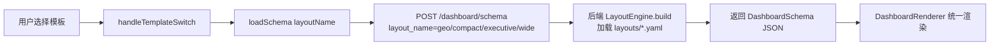

## 用户需求

将 DashboardPage 接入已建好的"新链路"（DashboardSchema 管线），而非继续走旧的 kpis+echarts 硬编码老路。

## 产品概述

前端 DashboardPage 当前仅对 command/grid/medical 三个模板做了半吊子集成，report 模板仍完全脱离新链路。本次为纯集成改造：让 4 个旧模板统一通过 /dashboard/schema API 获取 DashboardSchema JSON，并用 DashboardRenderer 统一渲染，模板差异仅体现为不同的 layout_name。

## 核心特性

- 4 个模板（command/grid/medical/report）各自映射到布局库中的 layout_name（geo/compact/executive/wide），通过 LayoutEngine 加载对应 YAML。
- 统一调用 /dashboard/schema 生成 DashboardSchema，统一用 DashboardRenderer 渲染，消除各模板硬编码 kpis+echarts 的分叉路径。
- report 模板的 AI 报告生成能力（generateAIReport）保留为工具栏动作，不占据主画布。
- 清理此前误改遗留的诊断日志，恢复刷新/导出按钮对 report 的正常启用。

## 技术栈

- 前端：React 18 + TypeScript + Tailwind CSS（项目既有）
- 既有桥接能力（已验证可用，本次不改动）：
- 后端 POST /dashboard/schema（backend/routers/dashboard.py:305）接收 layout_name，经 LayoutEngine.build(layout_name=) 加载 src/dashboard/layouts/*.yaml
- 前端 api.getDashboardSchema(sessionId, title?, layoutName?)（frontend/src/api/client.ts:354）
- DashboardRenderer 组件（frontend/src/components/DashboardRenderer/DashboardRenderer.tsx）

## 实现方案

策略：仅修改 frontend/src/pages/DashboardPage.tsx 一处，把"模板→布局"的映射补全、把模板切换与渲染统一到新链路，不触碰后端、布局 YAML、DashboardRenderer 及其他页面。

- 补全 TEMPLATE_LAYOUT_MAP：command→geo、grid→compact、medical→executive、report→wide（finance/sales 暂不映射）。
- handleTemplateSwitch 去掉对 report 的排除，所有模板切换都调用 loadSchema(layoutName) 拉取对应布局的 DashboardSchema。
- 主画布用单一 `<DashboardRenderer schema loading error/>` 分支渲染全部 4 个模板，删除原 report 专用的 AI 报告面板分支。
- AI 报告生成（handleExportReport，内部调用 generateAIReport 并复用 schema.widgets 提取图表/KPI）迁移为工具栏"生成AI分析报告"按钮，保留 reportHtml 弹窗预览与下载。
- 清理 loadSchema 入口与 Schema 返回处的 console.log 诊断日志；修正"刷新仪表盘"按钮对 report 的禁用逻辑。

关键决策与权衡：

- 不改后端/布局 YAML：用户纪律约束（"只解决新链路弄错，没让你改其他"），且后端桥已通、布局库已设计好，前端只需正确传 layout_name。
- report 仍走 DashboardRenderer（wide 布局）而非独立 AI 面板：满足"统一 DashboardSchema"诉求，同时把 AI 报告入口降为工具栏动作，保留差异化能力。
- 首屏与"恢复默认"仍传 layout_name=None，由后端 LayoutEngine 自动选布局（selector），保持原有智能选布局行为。

## 性能与可靠性

- 切换模板触发一次 /dashboard/schema 请求（已有 ThreadPoolExecutor 后台计算），无额外开销；DashboardRenderer 内部 React.memo 组件避免无谓重渲染。
- loadSchema 使用 useCallback 且依赖 [hasData, sessionId]，避免重复请求；请求中 setSchemaLoading 提供加载态。
- 保留 try/catch 与 schema 空值兜底（setSchemaError），不引入新的失败面。

## 实现注意事项

- 严格遵守只改 DashboardPage.tsx：不修改 src/dashboard/layouts/*.yaml、DashboardRenderer 及子组件、backend/routers/*、其他页面。
- 不要删除/改动 handleExportReport 的 AI 报告逻辑，仅移动触发入口；其依赖的 schema.widgets 在统一渲染后必然已加载。
- 移除诊断日志时只删 loadSchema 入口的 console.log（约 L102-103）与 Schema 返回处的 console.log（约 L109-113），保留 handleExportReport 中真正的错误处理 console.error。

## 架构设计

数据流（新链路）：



旧链路（被移除的分叉）：report 模板直接走 generateAIReport + exportEChartsDashboard 硬编码 kpis/echarts。

## 目录结构

```
frontend/src/pages/
└── DashboardPage.tsx   # [MODIFY] 唯一改动文件。补全 TEMPLATE_LAYOUT_MAP（加 report→wide）；
                        # handleTemplateSwitch 去掉 report 排除；主画布统一为 DashboardRenderer；
                        # AI 报告入口迁移为工具栏按钮；清理诊断日志；
                        # 修正"刷新仪表盘"按钮对 report 的禁用逻辑。
```

## 关键代码结构

```typescript
// DashboardPage.tsx —— 模板到布局名的映射（补全后）
const TEMPLATE_LAYOUT_MAP: Record<TemplateType, string> = {
  command: 'geo',
  grid: 'compact',
  medical: 'executive',
  report: 'wide',
};

```