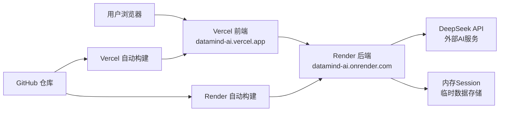

## 产品概述

将 DataMind AI V2 版本免费部署上线，前端和后端均可通过公网访问，总费用为零。

## 核心功能需求

- 前端（React）通过公网 URL 可访问
- 后端（FastAPI）通过公网 URL 可访问
- 前端能正确调用后端 API（跨域通信正常）
- HTTPS 自动配置，无需手动处理网络协议
- 部署过程简单，无需自购服务器
- 总费用为 $0（完全免费）

## Tech Stack

- 前端部署：**Vercel**（免费层，React 静态托管，自动 HTTPS + GitHub 集成）
- 后端部署：**Render**（免费 Web Service，Python runtime，自动 HTTPS + GitHub 集成）
- 代码托管：**GitHub**（免费私有仓库，Vercel/Render 自动从 GitHub 部署）

## Implementation Approach

### 为什么选 Vercel + Render 组合？

1. **Vercel** 专为前端设计，React 构建零配置，CDN 全球加速，免费层无请求限制
2. **Render** 支持原生 Python runtime，FastAPI 直接运行，免费层 750 小时/月（够用）
3. 两者都支持从 GitHub 自动部署，push 代码即上线
4. 两者都自动配置 HTTPS，无需手动处理 SSL/TLS
5. **无需绑信用卡**（Render 免费层不强制绑卡）
6. 唯一限制：Render 后端 15 分钟无请求会休眠，冷启动约 30 秒

### 关键技术决策

| 决策 | 选择 | 原因 |
| --- | --- | --- |
| 前端 baseURL | 环境变量动态切换 | 开发用 `/api`（走 Vite proxy），生产用 Render 后端完整 URL |
| CORS 配置 | 动态 allow_origins | 开发加 localhost，生产加 Vercel 前端域名 |
| 会话存储 | 保持内存存储 | Render 免费 instance 重启会丢失数据，但对演示项目可接受；升级时改用 Redis |
| AI API Key | 前端传入（已有设计） | 后端不存 Key，每次请求由前端传 api_key 参数，无需在 Render 配环境变量 |


## Implementation Notes

- **前端 baseURL 切换**：当前 `client.ts` 用 `baseURL: '/api'`（依赖 Vite proxy），部署后需改为 `https://xxx.onrender.com/api`。用 `import.meta.env` 环境变量实现切换，避免硬编码
- **Render 休眠问题**：可用免费 cron-job.org 每 14 分钟 ping `/api/health`，防止后端休眠。这是可选优化
- **跨域通信**：前端 Vercel 域名（如 `datamind-ai.vercel.app`）→ 后端 Render 域名（如 `datamind-ai.onrender.com`），必须配置 CORS
- **Session 数据丢失**：Render 重启后内存清空。当前设计是每次上传 CSV 创建新 session，重启后用户需重新上传，这对演示项目可接受
- **构建产物路径**：Vercel 默认从 `frontend/` 子目录构建，需在 Vercel 配置中指定 root directory 为 `frontend`

## Architecture Design



## Directory Structure — 需要修改/新增的文件

```
数据分析项目/
├── frontend/
│   ├── src/api/client.ts           # [MODIFY] baseURL 改为环境变量动态切换，开发用 /api，生产用 Render URL
│   ├── vite.config.ts              # [MODIFY] 无需改动（Vercel 构建时不需要 proxy，Vercel 只做静态托管）
│   └── .env.production             # [NEW] 生产环境变量 VITE_API_BASE_URL=https://datamind-ai.onrender.com/api
│   └── package.json                # [MODIFY] 无需改动（Vercel 自动识别 Vite 项目）
├── backend/
│   ├── main.py                     # [MODIFY] CORS allow_origins 加入环境变量，支持 Vercel 前端域名 + 允许所有来源（演示阶段）
│   └── requirements.txt            # [MODIFY] 无需改动（Render 自动安装）
├── render.yaml                     # [NEW] Render 部署配置文件（指定 build/start 命令、env）
├── vercel.json                     # [NEW] Vercel 前端部署配置（指定 rootDirectory 为 frontend）
└── .gitignore                      # [MODIFY] 无需改动（已包含 .env、dist 等）
```

### 文件详细说明

**frontend/src/api/client.ts** — [MODIFY]

- 当前 `baseURL: '/api'` 仅在开发时有效（靠 Vite proxy 转发到 localhost:8000）
- 改为 `baseURL: import.meta.env.VITE_API_BASE_URL || '/api'`
- 开发时走 Vite proxy（`/api` → `localhost:8000`），生产时走 Render 后端完整 URL
- 无需改动其他 API 调用逻辑

**frontend/.env.production** — [NEW]

- `VITE_API_BASE_URL=https://datamind-ai.onrender.com/api`
- Vercel 构建时自动加载此文件

**backend/main.py** — [MODIFY]

- CORS allow_origins 改为环境变量驱动：开发加 localhost，生产加 Vercel 前端域名
- 演示阶段可临时设为 `["*"]` 允许所有来源（方便快速上线）

**render.yaml** — [NEW]

- 指定后端服务配置：build command `pip install -r backend/requirements.txt`，start command `cd backend && uvicorn main:app --host 0.0.0.0 --port $PORT`
- Render 自动分配 PORT 环境变量

**vercel.json** — [NEW]

- 指定 rootDirectory 为 `frontend`
- 确保 Vercel 从正确的子目录构建

## 免费部署平台对比

| 平台 | 免费额度 | 绑卡要求 | 休眠限制 | HTTPS | 适用层 |
| --- | --- | --- | --- | --- | --- |
| **Vercel** | 无限制（前端） | 不需要 | 不休眠 | 自动 | 前端 |
| **Render** | 750h/月 | 不强制 | 15分钟无请求休眠 | 自动 | 后端 |
| Cloudflare Pages | 无限制 | 不需要 | 不休眠 | 自动 | 前端（不支持Python后端） |
| GitHub Pages | 无限制 | 不需要 | 不休眠 | 自动 | 静态前端（不支持后端） |
| Railway | $5额度/月 | 需绑卡 | 不休眠 | 自动 | 全栈（额度易耗尽） |
| Fly.io | 3台小VM | 需绑卡 | 不休眠 | 自动 | 全栈（需绑卡） |
| PythonAnywhere | 有限CPU | 不需要 | 每天重启 | 需手动 | 简单Python（不支持复杂依赖） |


**结论**：Vercel(前端) + Render(后端) 是唯一完全免费、无需绑卡、支持复杂 Python 依赖（LangChain/pandas）的组合方案。

## Agent Extensions

### Integration

- **eop** (EdgeOne Pages)
- Purpose: 快速部署前端项目的备选方案，如果 Vercel 在国内访问慢，可考虑 EdgeOne Pages 替代前端部署
- Expected outcome: 前端可通过国内 CDN 更快访问（当前状态 disconnected，需要先连接）
- **cloudStudio** (Cloud Studio)
- Purpose: 作为备选开发环境，用于在线编写和调试部署配置
- Expected outcome: 在线 IDE 环境可用（当前状态 disconnected）