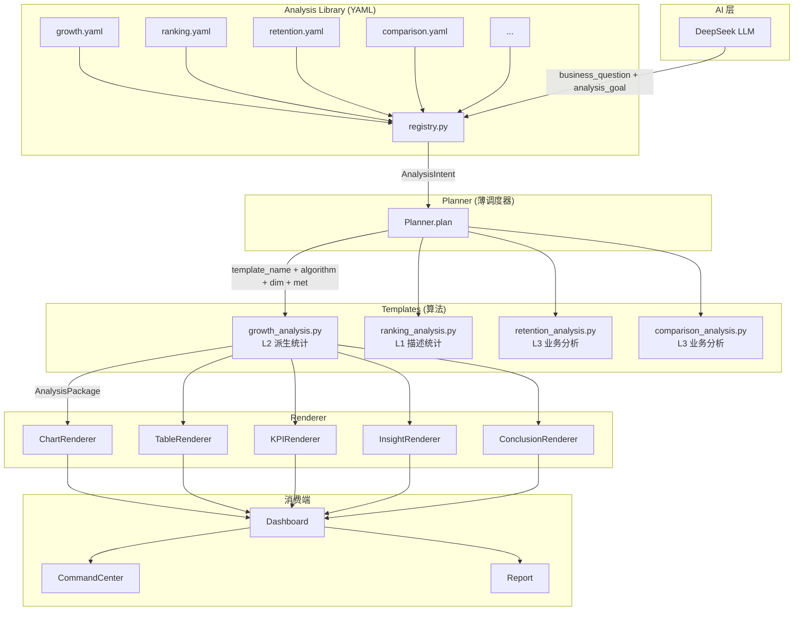

## 产品概述

将 DataMind AI 数据分析平台从 V1 升级到 V2 架构。核心变化是新增 **YAML 驱动的 Analysis Library（分析知识库）** 作为独立层，实现"AI 理解业务问题 → Library 翻译为分析意图 → Planner 调度模板 → Template 算法计算 → Renderer 统一渲染"的五层流水线架构。

## 核心功能

### 第一阶段：Analysis Library（分析知识库）

- 新建 `src/analysis_library/` 目录，每个分析类型一个 YAML 文件（growth.yaml / ranking.yaml / retention.yaml 等）
- `registry.py` 统一加载所有 YAML，对外提供 `lookup(analysis_goal: str) → AnalysisIntent` 查询接口
- YAML 只包含业务知识：intent、keywords、template 映射、默认算法、输出类型、示例问题、fallback 策略。绝不包含算法实现和列要求
- 中文 analysis_goal → intent 枚举的翻译由 Library 完成

### 第二阶段：Planner 重写

- 删除 `Planner` 类中所有业务知识：`KEYWORD_SCORES`（regex 评分表）、`ENTITY_MAP`（语义实体映射）、`IMPLEMENTED`（已实现列表）、`DEFAULT_ALGORITHMS`
- Planner 变为纯调度器：接收 AI 的 `analysis_goal` → 查询 Library → 获得 template 名称和算法 → 用 ColumnClassifier 推断列 → 调用模板
- 保留 `_validate_columns`（列存在性校验）和 fallback 降级链逻辑

### 第三阶段：Template 升级

- 8 个现有模板全部增加 `build_kpis()`、`build_tables()`、`build_charts()`、`build_insights()`、`build_conclusion()` 方法，替代当前 execute() 内部直写逻辑
- 按三级分层：L1 描述统计（ranking/distribution/structure/correlation）、L2 派生统计（growth 真正的 YoY/MoM 同环比）、L3 业务分析（retention/comparison）
- 新增 3 个业务模板：`retention_analysis.py`（复购率）、增强 `growth_analysis.py`（真正 YoY/MoM/QoQ）、`comparison_analysis.py`（AB 对比）
- `TemplateSpec` 拆为 `TemplateMeta`（display_name/algorithm/version 等元信息）+ `TemplateRuntime`（can_run/execute/build_*）
- 6 个远期模板（ABC/RFM/Funnel/Cohort/Forecast/LTV）预留文件占位

### 第四阶段：统一 Renderer

- 新增 `src/table_renderer.py`：统一处理 summary/ranking/cross/growth/correlation/detail 六种表格类型
- 新增 `src/kpi_renderer.py`：统一格式化 KPI 为前端可消费结构
- 新增 `src/insight_renderer.py`：统一 insight 文本的优先级排序和截断
- 新增 `src/conclusion_renderer.py`：统一结论汇总
- 现有 `chart_renderer.py` 保持不变
- Renderer 层不包含任何业务判断——输入 `ChartData/TableData/KPIItem`，输出渲染后的数据

### 第五阶段：统一消费

- Dashboard 从 `saved_charts` 切换为 `saved_packages`，全面消费 AnalysisPackage
- AI 报告（Report）从 `saved_charts` 切换为 `saved_packages`
- 前端 `VisualizationRenderer` 支持 KPI → Table → Chart → Insight → Conclusion 的统一渲染顺序

## 技术栈

- **后端**：Python 3.11 + FastAPI + Pandas + PyYAML
- **前端**：React 18 + TypeScript + ECharts
- **配置格式**：YAML（分析知识库）
- **现有依赖沿用**：ColumnClassifier、ChartRenderer、AnalysisPackage、ECharts generator

## 实现方案

### 第一阶段：Analysis Library

**核心思路**：用 YAML + Registry 模式替代 Planner 中硬编码的业务规则。

**目录结构**：

```
src/analysis_library/
├── __init__.py              # 导出 AnalysisLibrary 类
├── registry.py              # Registry：加载 YAML、lookup()、get_all()
├── analysis_intent.py       # AnalysisIntent dataclass
├── growth.yaml              # 增长分析配置
├── ranking.yaml             # 排名分析配置
├── structure.yaml           # 结构分析配置
├── concentration.yaml       # 集中度分析配置
├── distribution.yaml        # 分布分析配置
├── correlation.yaml         # 相关分析配置
├── anomaly.yaml             # 异常分析配置
├── proportion.yaml          # 占比分析配置
├── retention.yaml           # 复购分析配置（新增）
└── comparison.yaml          # 对比分析配置（新增）
```

**关键设计决策**：

- `registry.py` 中的 `AnalysisLibrary` 类负责加载所有 YAML 文件、按 priority 排序、提供 `lookup(goal: str) -> AnalysisIntent | None`
- lookup 基于中文关键词匹配（遍历 YAML 的 keywords 列表），不依赖正则
- 每个 YAML 中的 `intent` 字段是系统内部标识（如 "growth"），`keywords` 是中文触发词列表
- YAML 的 `fallback` 字段是 intent 列表（如 ["ranking", "proportion"]），Planner 据此执行降级

### 第二阶段：Planner 重写

**Planner 类变更**：

- **删除**：`KEYWORD_SCORES`、`ENTITY_MAP`、`IMPLEMENTED`、`DEFAULT_ALGORITHMS`、`_match_with_score()`、`_extract_entity()`、`_pick_dimension()`、`_pick_metric()`、`_default_columns()`
- **保留**：`ColumnClassifier`（列类型识别）、`_validate_columns()`（列存在性校验）、`plan()` 方法签名
- **新增**：`library: AnalysisLibrary` 依赖、`_infer_columns_from_schema()`（根据 Template 的 REQUIRED_SCHEMA + ColumnClassifier 选列）

**新的 plan() 流程**：

```
intent["analysis_goal"] → library.lookup() → AnalysisIntent
  → 获得 template_name + algorithm
  → 加载模板获取 REQUIRED_SCHEMA
  → ColumnClassifier 按 schema 选 dim/metric
  → _validate_columns 校验
  → 返回 {analysis_method, algorithm, dimension, metric}
```

### 第三阶段：Template 升级

**TemplateSpec 拆分为 TemplateMeta + TemplateRuntime**：

```python
@dataclass
class TemplateMeta:
    analysis_type: str
    display_name: str
    version: str = "1.0"
    description: str = ""
    supported_algorithms: list = field(default_factory=list)

@dataclass
class TemplateRuntime:
    REQUIRED_SCHEMA: dict
    MIN_ROWS: int = 2
    DERIVED_REQUIREMENTS: dict = field(default_factory=dict)
    FALLBACK: str | None = None
```

**新增 grow/_analysis 的 YoY/MoM 算法**：

- 识别时间列粒度（年/月/日）
- `algorithm="yoy"` → 当前周期 / 去年同期 - 1
- `algorithm="mom"` → 当前周期 / 上一周期 - 1
- `algorithm="qoq"` → 当前季度 / 上一季度 - 1

**新增 retention_analysis 模板**：

- 需要列：客户ID + 订单日期 + 订单号（DERIVED_REQUIREMENTS）
- 计算逻辑：按客户分组统计购买次数 → 购买≥2次占比 = 复购率
- 输出：复购率 KPI + 产品复购排行表 + 柱状图

**新增 comparison_analysis 模板**：

- 需要列：至少 1 个分类列 + 1 个数值列
- 计算逻辑：按分类列分组 → 计算各组均值/总和 → 组间差异百分比
- 输出：差异率 KPI + 对比表 + 分组柱状图

### 第四阶段：统一 Renderer

**TableRenderer**（新增）：

- 输入 `TableData`（已有 dataclass），输出带格式表格
- 支持六种类型：summary / ranking / cross / growth / correlation / detail
- 返回通用 `RenderedTable` dataclass，含 columns/rows/highlights

**KPIRenderer**（新增）：

- 输入 `List[KPIItem]`，返回前端可直接渲染的 `RenderedKPI[]`
- 统一格式化：数值千分位、百分比保留 1 位小数、变化量加颜色标记

**InsightRenderer**（新增）：

- 输入 `List[str]`，按模板优先级排序，限制长度
- 返回 `RenderedInsight[]`

**ConclusionRenderer**（新增）：

- 输入 `List[str]`，汇总为完整结论段落
- 返回 `RenderedConclusion`

### 第五阶段：统一消费

**后端改动**：

- `backend/routers/dashboard.py`：dashboard/echarts 路由从 `saved_charts` 切换为 `saved_packages`
- `backend/routers/report.py`：ai-analyze 路由从 `saved_charts` 切换为 `saved_packages`
- `backend/services/session_manager.py`：get_saved_charts 标记 deprecated，保留向后兼容

**前端改动**：

- `DashboardPage.tsx`：图表数据源从 saved_charts API 切换为 saved_packages API
- `VisualizationRenderer.tsx`：支持按 KPI → Table → Chart → Insight → Conclusion 顺序渲染

## 架构图



## 目录结构

```
d:/数据分析项目/
├── src/
│   ├── analysis_library/                    # [NEW] YAML 驱动的分析知识库
│   │   ├── __init__.py                      # [NEW] 导出 AnalysisLibrary 类
│   │   ├── registry.py                      # [NEW] 核心 Registry：load_yaml_configs()、lookup(goal)、get_all()、list_intents()
│   │   ├── analysis_intent.py               # [NEW] AnalysisIntent dataclass（intent/display_name/template/algorithm/keywords/outputs/fallback）
│   │   ├── growth.yaml                      # [NEW] 增长分析（keywords: 增长/趋势/同比/环比/放缓）
│   │   ├── ranking.yaml                     # [NEW] 排名分析（keywords: 排名/最高/最低/TOP）
│   │   ├── structure.yaml                   # [NEW] 结构分析（keywords: 构成/结构/占比）
│   │   ├── concentration.yaml               # [NEW] 集中度分析（keywords: 二八/帕累托/集中度）
│   │   ├── distribution.yaml                # [NEW] 分布分析（keywords: 分布/直方图/频率）
│   │   ├── correlation.yaml                 # [NEW] 相关分析（keywords: 相关/关联/关系）
│   │   ├── anomaly.yaml                     # [NEW] 异常分析（keywords: 异常/离群/波动）
│   │   ├── proportion.yaml                  # [NEW] 占比分析（keywords: 占比/比例/饼图）
│   │   ├── retention.yaml                   # [NEW] 复购分析（keywords: 复购/回头客/重复购买）
│   │   └── comparison.yaml                  # [NEW] 对比分析（keywords: 对比/比较/差异/VS）
│   │
│   ├── analysis_templates/
│   │   ├── base.py                          # [MODIFY] TemplateSpec 拆为 TemplateMeta + TemplateRuntime；AnalysisTemplate 增加 build_kpis/tables/charts/insights/conclusion 抽象方法
│   │   ├── growth_analysis.py               # [MODIFY] 拆出 build_*() 方法；增加 YoY/MoM/QoQ 算法实现
│   │   ├── ranking_analysis.py              # [MODIFY] 拆出 build_*() 方法
│   │   ├── structure_analysis.py            # [MODIFY] 拆出 build_*() 方法
│   │   ├── concentration_analysis.py        # [MODIFY] 拆出 build_*() 方法
│   │   ├── distribution_analysis.py         # [MODIFY] 拆出 build_*() 方法
│   │   ├── correlation_analysis.py          # [MODIFY] 拆出 build_*() 方法
│   │   ├── anomaly_analysis.py              # [MODIFY] 拆出 build_*() 方法
│   │   ├── proportion_analysis.py           # [MODIFY] 拆出 build_*() 方法
│   │   ├── retention_analysis.py            # [NEW] 复购分析模板（L3 业务分析，DERIVED_REQUIREMENTS: 客户ID+订单日期+订单号）
│   │   └── comparison_analysis.py           # [NEW] 对比分析模板（L3 业务分析，分组均值对比 + 差异率）
│   │
│   ├── planner.py                           # [MODIFY] 删除 KEYWORD_SCORES/ENTITY_MAP/IMPLEMENTED/DEFAULT_ALGORITHMS；新增 library 依赖；plan() 改为 Library.lookup → Template 调度
│   ├── chart_renderer.py                    # [KEEP] 保持不变
│   ├── table_renderer.py                    # [NEW] 统一表格渲染器（summary/ranking/cross/growth/correlation/detail）
│   ├── kpi_renderer.py                      # [NEW] 统一 KPI 格式化渲染器
│   ├── insight_renderer.py                  # [NEW] 统一洞察文本渲染器
│   ├── conclusion_renderer.py                # [NEW] 统一结论汇总渲染器
│   ├── column_classifier.py                 # [KEEP] 列分类器保持不变
│   └── ai_agent/
│       └── prompts.py                       # [MODIFY] INSIGHTS_SYSTEM_PROMPT 微调 analysis_goal 输出格式
│
├── backend/
│   ├── routers/
│   │   ├── analysis.py                      # [MODIFY] _TEMPLATES 注册表改为 Library 驱动；Planner 实例注入 library
│   │   ├── dashboard.py                     # [MODIFY] 从 saved_charts 改为 saved_packages；使用 Renderer 层渲染
│   │   └── report.py                        # [MODIFY] 从 saved_charts 改为 saved_packages
│   └── services/
│       └── session_manager.py               # [MODIFY] get_saved_charts 标记 deprecated；增加 get_saved_packages_full
│
├── frontend/
│   └── src/
│       ├── pages/
│       │   └── DashboardPage.tsx            # [MODIFY] 图表数据源从 saved_charts API 改为 saved_packages API
│       └── components/
│           └── VisualizationRenderer.tsx    # [MODIFY] 支持 KPI → Table → Chart → Insight → Conclusion 统一渲染顺序
│
└── requirements.txt                         # [MODIFY] 新增 pyyaml 依赖
```

## 关键代码结构

### AnalysisIntent dataclass（analysis_intent.py）

```python
@dataclass
class AnalysisIntent:
    intent: str                    # "growth"
    display_name: str              # "增长分析"
    description: str               # "用于分析指标增长趋势"
    template: str                  # "growth_analysis"
    default_algorithm: str | None  # "yoy"
    supported_algorithms: list     # ["yoy", "mom", "qoq"]
    keywords: list                 # ["增长", "趋势", "同比", ...]
    priority: int                  # 90
    outputs: dict                  # {"charts": [...], "tables": [...], "kpis": [...]}
    examples: list                 # ["销售增长怎么样？"]
    fallback: list                 # ["ranking", "proportion"]
```

### AnalysisLibrary 核心接口（registry.py）

```python
class AnalysisLibrary:
    def __init__(self, yaml_dir: str = "src/analysis_library"):
        self.intents: List[AnalysisIntent] = []
        self._load_all()

    def lookup(self, analysis_goal: str) -> AnalysisIntent | None:
        """中文分析目标 → AnalysisIntent，按 keyword 匹配 + priority 排序"""

    def get_by_intent(self, intent: str) -> AnalysisIntent | None:
        """按 intent 标识精确获取"""

    def list_intents(self) -> List[str]:
        """列出所有已注册的 intent"""
```

### Planner 新 plan() 流程

```python
class Planner:
    def __init__(self):
        self.classifier = ColumnClassifier()
        self.library = AnalysisLibrary()

    def plan(self, intent: dict, df: pd.DataFrame) -> dict:
        # 1. Library.lookup(analysis_goal) → AnalysisIntent
        # 2. 加载模板获取 REQUIRED_SCHEMA
        # 3. ColumnClassifier 按 schema 选 dim/metric
        # 4. _validate_columns 校验
        # 5. 返回 {analysis_method, algorithm, dimension, metric}
```

## Agent Extensions

### SubAgent

- **code-explorer**
- 用途：在模板重构阶段，探索所有 8 个现有模板的 execute() 方法内部逻辑，确保 build_kpis/tables/charts/insights/conclusion 拆分完整覆盖所有计算路径
- 预期结果：每个模板的 execute() 方法分解为 5 个独立 build_*() 方法，功能等价无遗漏