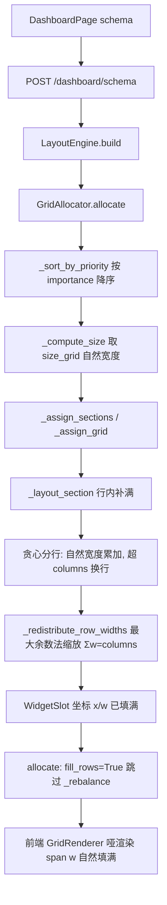

## 用户需求

修正「可视化看板」（DashboardPage 第 5 选项 schema 模板）图表布局的算法根因：每一行必须完整填满 12 列栅格，行内不允许出现空位；最后一行即使只剩 1 个图也必须拉伸占满整行，不缩在右侧；整体呈规整的整行 / 二等分 / 三等分节奏，视觉完整无空洞。

## 产品概述

当前后端 `GridAllocator._layout_section` 采用贪心铺行，放不下就换行但本行已占列不拉伸，导致凑不满 12 列便留空，前端 `GridRenderer` 忠实按 `gridColumn: span w` 渲染，于是出现「缩在右边没占满」的空洞。本次在后端算法层做真因修复：让每个 section 内逐行按自然宽度贪心分行后，用最大余数法把行内宽度等比缩放至恰好等于 `config.columns`（12），从而每行被图表完整填满。

## 核心功能

- 行内补满：每个 section 内任意一行（含末行）的 widget 列宽之和恒等于 12，无空隙。
- 三种节奏：hero(12) 独占整行；large(6) 一行两张；medium(4) 一行三张；small(3) 一行四张（按需）。
- 末行拉伸：末行仅剩 1 个图时宽度归一为 12，占满整行。
- 不改动任何配色（星光蓝 10 色板打头，银河紫仅辉光/按钮/交互），前端 `GridRenderer` 保持哑渲染、无需修改。

## 技术栈

- 后端：Python（FastAPI + 现有 `src/dashboard/layout_engine.py` 布局引擎），纯数据模型，不引入新依赖。
- 前端：保持现状（React + TypeScript + CSS Grid `repeat(12, minmax(80px,1fr))` + `gridColumn: span w`），本次不动。

## 实现思路

根因在 `src/dashboard/layout_engine.py` 的 `GridAllocator._layout_section`（342-408）：逐 widget 累加 `x`，`x + gw > 12` 即换行，但已占列不拉伸，行内宽度和 < 12 → 空洞。修复策略：保留「按 importance 降序、按自然宽度贪心分行」的阅读顺序，但在每行结算时用**最大余数法（largest remainder）**把行内自然宽度等比缩放，使总和恰为 `config.columns`。

关键决策与权衡：

- **后端修真因而非前端**：用户已确认改算法，前端只是渲染后端坐标；后端吐出每行 sum==columns 的坐标后，`GridRenderer` 天然填满，无需改前端、无逻辑冗余。
- **最大余数法保证整数列宽**：自然宽度 `w_i` → `ratio_i = w_i / S * 12`，取整后把余数单位补给余数最大的 widget，确保 `Σw'_i == 12` 且每个 `w'_i >= 1`，避免浮点列宽与 CSS Grid 整数 span 冲突。
- **跳过 `_rebalance`**：`allocate`（240）原在填坐标后调 `_rebalance`（412-442），它依赖 x 坐标把最重 widget 从左半区挪到右半区；行内补满后每行已连续占满 12 列，再挪移会制造列重叠/破坏填满。新增 `LayoutConfig.fill_rows` 标志（默认 True），`allocate` 改为 `if config.rebalance_enabled and not config.fill_rows` 才走 rebalance，补满模式天然已按 importance 平衡视觉，rebalance 在此场景冗余且有害。
- **向后兼容**：YAML 不写 `fill_rows` 时默认 True（新补满行为）；若某布局需回退旧贪心，可在 YAML 设 `fill_rows: false`，`_layout_section` 保留旧分支。

性能与可靠性：补满为 O(n) 纯函数，行数 = O(n)，无额外 I/O/重排；`_redistribute_row_widths` 为无副作用静态方法，便于单测。y 坐标仍按行递增（`y += row_h + widget_gap`），前端入场动画 `position.y*40ms` 延迟与阅读顺序不变。`gridColumn: span w'`（w' 为整数且行内和=12）与 `repeat(12,…)` 完全契合，横向 `gap-4` 均匀分配，行尾无空洞。

## 实现要点 / 注意事项

- 复用现有 `_sort_by_priority` 已保证 section 内 widget 按 importance 降序，贪心分行直接继承该顺序即可。
- `_layout_section` 重写时完整保留 `WidgetSlot` 构造字段（widget_id/title/widget_type/size_class/importance_score/group_id/section_id/chart_type/chart_config/supported_filters/metadata），仅变更 `x/w`，`h` 用行内最大值，`y` 按行推进。
- hero section：至多 1 个 hero（w=12），单行缩放后仍为 12，无需特判。
- `layout_schema.py` 的 `LayoutConfig` 新增 `fill_rows: bool = True` 字段并在 `from_dict` 中以 `data.get("fill_rows", True)` 读取；不修改任何 YAML。
- 改动后务必重启 uvicorn 才生效（用户已知悉）；前端无需改动，但需刷新验证渲染。
- 验证：调用 `/dashboard/schema` 后断言每个 section 内按 y 分组的行，`Σw == 12`；构造「末行单 large」「large+medium 混排」用例确认无空位与末行拉伸。

## 架构设计



## 目录结构

```
src/dashboard/
├── layout_engine.py   # [MODIFY] GridAllocator._layout_section 重写为「贪心分行 + 行内补满」；新增静态辅助 _redistribute_row_widths（最大余数法缩放至 columns）；allocate 中按 fill_rows 跳过 _rebalance；保留 fill_rows=False 的旧贪心分支以兼容。
└── layout_schema.py   # [MODIFY] LayoutConfig 新增 fill_rows: bool = True 字段；from_dict 以 data.get("fill_rows", True) 读取，不改动其它字段与 YAML。
```

## 关键代码结构

```python
# layout_schema.py —— LayoutConfig 新增字段
fill_rows: bool = True   # 行内补满（每行宽度和=columns）；默认开启

# layout_engine.py —— 最大余数法缩放（新增静态方法）
@staticmethod
def _redistribute_row_widths(widths: List[int], columns: int) -> List[int]:
    """将一行自然宽度等比缩放，使整数列宽之和恰为 columns（行内补满）。"""

# layout_engine.py —— _layout_section 新分支（fill_rows=True）
# 1) 按自然宽度贪心分行：cur_w + gw > columns 且已有内容则结算当前行
# 2) 每行调用 _redistribute_row_widths(nat, columns) 得整数 w'
# 3) 行内顺序分配 x，y 按行高 + widget_gap 推进
```