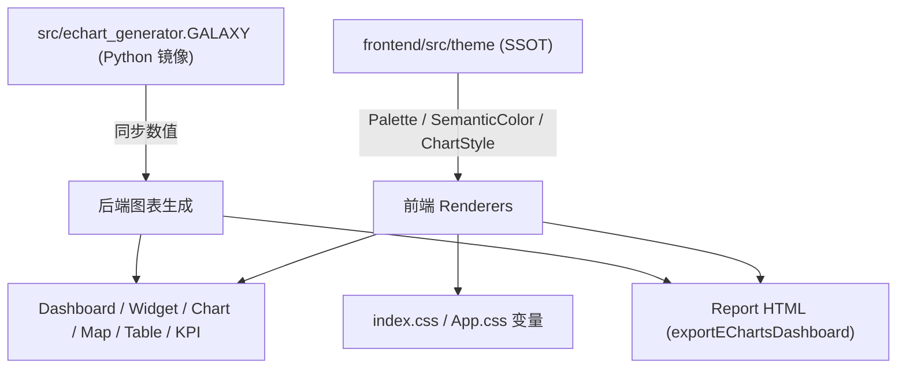

## 用户需求

为「AI 数据分析平台」建立统一 **Visual Design System（Galaxy AI Analytics）**，使 Dashboard / Report / Insight / KPI / Widget / Chart / Map / Table / Tooltip / Legend / Axis 所有生成内容保持完全一致的专业品牌风格，形成「蓝色=数据 / 紫色=AI / 青色=交互」的统一认知。

## 产品概览

在现有 `frontend/src/theme/` 基础上演进为整个项目唯一视觉来源（Single Source of Truth）。前端与后端图表生成统一到同一套品牌配色与图表规范，彻底移除所有写死 HEX 与默认 ECharts Palette，消除 Dashboard 与 Report 风格割裂、图表像 ECharts Demo 的问题。

## 核心特性

- **品牌色板**：主背景 #020617、深空蓝(表面) #0F172A、星光蓝(数据) #38BDF8、银河紫(AI) #8B5CF6、月光白(内容) #F8FAFC、极光青(交互) #22D3EE。
- **语义色系统**：Data=星光蓝（图表/KPI/趋势/统计，约占 Dashboard 90%）、AI=银河紫（Insight/Recommendation/Finding/Reasoning/Agent/Smart Card，禁用于普通图表）、Interaction=极光青（Hover/Active/Selected/Filter/Button/Slider/Focus，禁作普通图表色）、Content=月光白、Surface=深空蓝。
- **逐类型图表规范**：Line/Bar/Area/Pie/Scatter/Radar/Heatmap/Map 各类型线宽、点径、面积透明度、渐变方向、禁止项（白描边、蓝白蓝、彩虹、每柱不同色、白柱）统一约束。
- **组件样式令牌**：Grid、Axis、Legend、Tooltip、Card(radius16+柔和阴影+Hover上浮)、Typography 全部令牌化。
- **前后端同源**：前端 `theme/` 为 SSOT；后端 `echart_generator.py` 的 GALAXY 字典镜像同一套色，保持同步。
- **Report HTML 改造**：`exportEChartsDashboard.ts` 中 ~140 处内联写死色全部改为读取主题。
- **禁止项落地**：默认 ECharts Palette、彩虹配色、蓝白交替、每图一色、白色柱子、写死 HEX、各 Renderer 自定颜色一律消除。

## 目录与范围决策（用户确认）

- 保留 `theme/`，新增 `SemanticColor.ts`，将 `ChartPalette.ts` 改名为 `ChartStyle.ts`，套用新配色（不新建 visual/）。
- 前端 + 后端一起统一到新配色。

## 技术栈

- 前端：React + TypeScript，现有 `frontend/src/theme/` 作为 SSOT（保留目录）。
- 后端：Python / FastAPI，图表 option 由 `src/echart_generator.py` 生成，通过 `GALAXY` 字典镜像前端品牌色。

## 实现方案

### 总体策略

采用「令牌先行、渲染器后接、前后端镜像同步」三步法。先在 `theme/` 内建立完整令牌层（Palette 新值 + 新增 SemanticColor 语义层 + 改名 ChartStyle 承载逐类型图表规范），再逐一把 Dashboard/Widget/Report/Chart/Map/Table 渲染器与后端生成器中的写死色替换为令牌引用，最后全仓 grep 验证旧色与默认 palette 清零。

### 关键技术决策

1. **语义层与品牌层分离**：`Palette` 只存品牌原色（6 个）+ 状态色（success/warning/danger，保留给 KPI 涨跌/异常，不属品牌语义）；`SemanticColor` 把「业务语义→品牌色」显式映射（data→#38BDF8、ai→#8B5CF6、interaction→#22D3EE、content→#F8FAFC、surface→#0F172A），所有渲染器只引用 SemanticColor，禁止直接引用品牌 HEX，保证语义可读与可换肤。
2. **ChartStyle 取代 ChartPalette**：`ChartStyle` 按 Line/Bar/Area/Pie/Scatter/Radar/Heatmap/Map/Tooltip/Legend/Axis/Grid 逐类型给出精确 token（含 rgba 面积、线宽、点径、渐变数组），后端 `echart_generator.py` 的 `GALAXY` 与 `BLUE_PALETTE` 严格对照同一数值，避免前后端偏差。
3. **Report HTML 引入 JS 主题对象**：`exportEChartsDashboard.ts` 内建一个 `REPORT_THEME` 常量（从 `theme` 导入派生），把所有内联 `linear-gradient(#60A5FA,#93C5FD)`、`#34D399`、`#FB7185`、`rgba(96,165,250,x)` 替换为 `REPORT_THEME.*`，保证报告与看板同源。
4. **后端状态色保留语义**：`table_renderer.py` 红涨绿跌沿用 success/danger 语义（值对齐新体系），不混入品牌紫/青。
5. **antd light 模板对齐**：`layout_engine.py`/`composition_planner.py`/`blueprint_layout_engine.py` 中 `primary_color:"#1890ff"` 改为品牌蓝 `#38BDF8`（保留 mode 以免破坏特定模板），渲染需人工目视确认。

### 性能与可靠性

- 主题为静态常量对象，import 零运行时开销；后端字典同理。
- 不在渲染热路径做颜色计算；颜色在 option 构建时一次性注入。
- 前后端同步靠 `echart_generator.py` 顶部 docstring 声明「改色须同步 frontend/src/theme/Palette.ts 与 ChartStyle.ts」+ 验证脚本覆盖每种图表类型。

### 实现注意事项

- `ChartPalette.ts` 改名后，需同步更新 `Theme.ts` 的 import 与 `index.ts` 导出，避免破坏已 import 的 13 个前端文件（改为从 `theme` 统一导入即可无缝）。
- `ChartConfigBuilder.ts` 已引用 theme，仅需把 `theme.chartColors`/`ChartPalette` 引用改为 `ChartStyle` 新字段名。
- `EChartView.tsx` 内联 Tailwind `text-slate-300/500` 改为 `theme.palette.textSecondary`，保留 `backgroundColor:'transparent'`。
- `ThemeProvider.tsx` 的 `border-white/[0.08]` 改为 `theme.border.default`（=rgba(255,255,255,0.08)）。
- 编辑后必须重新读取确认无残留旧色字面量与 `ChartPalette` 引用。
- 全程本地改动，按用户规则不主动 commit/push。

## 架构设计

SSOT = `frontend/src/theme/`，所有前端渲染器与后端 `echart_generator.GALAXY` 均消费同一组令牌。



## 目录结构（新增/修改清单）

```
frontend/src/theme/
├── Palette.ts            # [MODIFY] 套用新品牌色：pageBg #020617 / card #0F172A / primary #38BDF8 / ai #8B5CF6 / interaction #22D3EE / content #F8FAFC；保留 success/warning/danger 状态色
├── SemanticColor.ts      # [NEW] 语义映射层：data/ai/interaction/content/surface/status，渲染器唯一语义入口
├── ChartStyle.ts         # [NEW，由 ChartPalette.ts 改名] 逐类型图表规范（Line/Bar/Area/Pie/Scatter/Radar/Heatmap/Map/Tooltip/Legend/Axis/Grid）+ 派生 REPORT_THEME 辅助
├── ChartPalette.ts       # [DELETE] 改名后删除
├── Theme.ts              # [MODIFY] import ChartStyle 替代 ChartPalette，聚合新令牌
├── index.ts              # [MODIFY] 导出 SemanticColor / ChartStyle，移除 ChartPalette
├── Surface.ts            # [MODIFY] tooltip bg 改为 #0F172A，overlay/pageBg 对齐新值
├── Border.ts             # [MODIFY] 基本不变，确认 radius.lg=16px
├── Shadow.ts             # [MODIFY] glow 改为 rgba(56,189,248,0.18) 新蓝辉光
├── Typography.ts         # [MODIFY] 基本不变，补 content/secondary 语义说明
└── Animation.ts          # [MODIFY] 基本不变

frontend/src/
├── utils/exportEChartsDashboard.ts   # [MODIFY] ~140 处内联 HEX/rgba 改为引用 REPORT_THEME（含 Report/KPI/Table/Chart 容器/联动条）
├── components/EChartView.tsx         # [MODIFY] Tailwind slate 灰改为 theme.palette 令牌
├── components/DashboardRenderer/ThemeProvider.tsx  # [MODIFY] border-white/[0.08] → theme.border.default
├── components/DashboardRenderer/ChartConfigBuilder.ts  # [MODIFY] ChartPalette→ChartStyle 字段映射
├── components/DashboardRenderer/WidgetRenderer/*.tsx   # [MODIFY] ChartWidget/KPIWidget/MapWidget/TableWidget/InsightWidget 移除写死/Tailwind 色
├── components/MetricCard.tsx / KPICards.tsx / DataTable.tsx / 其余已 import theme 的组件  # [MODIFY] 统一读令牌
├── index.css / App.css              # [MODIFY] CSS 变量对齐新配色（--cosmic-starlight 改 #38BDF8 等）

src/
├── echart_generator.py     # [MODIFY] GALAXY 字典/BLUE_PALETTE/axis #475569/pie-heatmap-map/area 渐变 全部对齐新品牌色；新增 AI 紫/交互青常量（仅语义层，图表序列仍用蓝）
├── table_renderer.py       # [MODIFY] #34D399/#FB7185 改为引用状态语义常量
├── dashboard_builder.py     # [MODIFY] #60A5FA/#93C5FD/#3B82F6/#BFDBFE 改为新蓝令牌
├── dashboard/layout_engine.py / composition_planner.py / blueprint_layout_engine.py  # [MODIFY] primary_color 改为 #38BDF8（保留 mode），人工目视验证
```

## 关键代码结构（核心契约）

```typescript
// frontend/src/theme/SemanticColor.ts
export const SemanticColor = {
  data: '#38BDF8',        // 星光蓝：所有数据图表/KPI/趋势
  ai: '#8B5CF6',          // 银河紫：AI Insight/Recommendation/Finding/Agent/Smart Card
  interaction: '#22D3EE', // 极光青：Hover/Active/Selected/Filter/Button/Focus
  content: '#F8FAFC',     // 月光白：标题/正文/数字/Label
  surface: '#0F172A',     // 深空蓝：Card/Panel/Sidebar/Widget
  status: { success: '#34D399', warning: '#FBBF24', danger: '#FB7185' },
} as const;
export type SemanticColorToken = typeof SemanticColor;

// frontend/src/theme/ChartStyle.ts（逐类型规范节选）
export const ChartStyle = {
  line:   { line: '#38BDF8', width: 3, point: 4, hoverPoint: 8, area: 'rgba(56,189,248,0.18)' },
  bar:    { normal: '#38BDF8', top: '#22D3EE', muted: 'rgba(56,189,248,0.35)', emphasis: '#38BDF8' },
  area:   { line: '#38BDF8', area: 'rgba(56,189,248,0.20)' },
  pie:    ['#38BDF8', '#22D3EE', '#67E8F9', '#8B5CF6'], // 冷色渐变，禁彩虹
  scatter:{ color: '#38BDF8', opacity: 0.7 },
  radar:  { line: '#38BDF8', area: 'rgba(56,189,248,0.15)' },
  heatmap:['#0F172A', '#0c4a6e', '#0369a1', '#0ea5e9', '#38BDF8', '#67E8F9', '#22D3EE'],
  map:    { normal: '#23304E', hover: '#22D3EE', highlight: '#38BDF8' },
  grid:   'rgba(255,255,255,0.08)',
  axis:   'rgba(248,250,252,0.55)',
  legend: '#94A3B8',
  tooltip:{ background:'#0F172A', border:'rgba(255,255,255,0.08)', title:'#F8FAFC', content:'#CBD5E1' },
} as const;
```