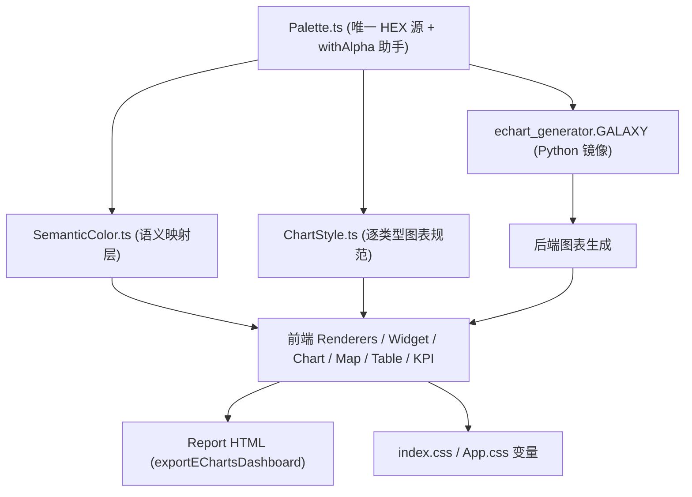

## 产品概览

为「AI 数据分析平台」建立统一 **Visual Design System（Galaxy AI Analytics）**，使 Dashboard / Report / Insight / KPI / Widget / Chart / Map / Table / Tooltip / Legend / Axis 所有生成内容保持完全一致的专业品牌风格，形成「蓝色=数据 / 紫色=AI / 青色=交互」的统一认知。在现有 `frontend/src/theme/` 基础上演进为整个项目唯一视觉来源（Single Source of Truth），前端与后端图表生成统一到同一套品牌配色与图表规范。

## 核心特性

- **品牌色板**：主背景 #020617、深空蓝(表面) #0F172A、星光蓝(数据) #38BDF8、银河紫(AI) #8B5CF6、月光白(内容) #F8FAFC、极光青(交互) #22D3EE。
- **语义色系统**：Data=星光蓝、AI=银河紫、Interaction=极光青、Content=月光白、Surface=深空蓝；状态色 success/warning/danger 保留给 KPI 涨跌/异常。
- **逐类型图表规范**：Line/Bar/Area/Pie/Scatter/Radar/Heatmap/Map 的线宽、点径、面积透明度、渐变方向、禁止项（白描边、蓝白交替、彩虹、白色柱子）统一约束。
- **组件令牌**：Grid / Axis / Legend / Tooltip / Card(radius16+柔和阴影+Hover上浮) / Typography 全部令牌化。
- **前后端同源**：前端 `theme/` 为 SSOT；后端 `echart_generator.GALAXY` 镜像同一套色，series 冷色 ramp 与前端的 `ChartStyle.series` 完全一致。
- **禁止项落地**：默认 ECharts Palette、彩虹、蓝白交替、每图一色、白色柱子、写死 HEX、各 Renderer 自定颜色一律消除。

## 范围决策（用户已确认）

- 保留 `theme/`，新增 `SemanticColor.ts`，将 `ChartPalette.ts` 改名为 `ChartStyle.ts`，套用新配色（不新建 visual/）。
- 前端 + 后端一起统一到新配色。

## 技术栈

- 前端：React + TypeScript，现有 `frontend/src/theme/` 作为 SSOT（保留目录）。
- 后端：Python / FastAPI，图表 option 由 `src/echart_generator.py` 生成，通过 `GALAXY` 字典镜像前端品牌色。

## 实现方案

### 总体策略

采用「令牌先行、渲染器后接、前后端镜像同步」三步法。先在 `theme/` 内建立完整令牌层，再逐一把 Dashboard/Widget/Report/Chart/Map/Table 渲染器与后端生成器中的写死色替换为令牌引用，最后全仓 grep 验证旧色与默认 palette 清零。

### 关键技术决策（已针对初版计划的 3 处缺陷修正）

**决策 1：HEX 只存在于 `Palette` 一处（修复 SSOT 被破坏）**

- `Palette.ts` 是唯一持有原始品牌 HEX 的文件；并新增 `withAlpha(hex, alpha)` 助手生成 rgba。
- `SemanticColor.ts` 与 `ChartStyle.ts` **全部从 `Palette`/`withAlpha` 派生**，自身不出现任何新 HEX。
- 渐变中间色（如饼图/热力图所需）一律作为命名 token 加进 `Palette`（如 `primaryBright:#67E8F9`、`sky:#0ea5e9`、`skyMid:#0369a1`、`skyDeep:#0c4a6e`、`mapNormal:#23304E`、`heatStart:#13243F`、`textMuted:#94A3B8`、`tooltipContent:#CBD5E1`），避免散落字面量。

**决策 2：ThemeProvider 走 cssVars + 内联 style（修复死 Tailwind 类）**

- 实测 `ThemeProvider.tsx:32-39` 的 `bg-[${...}]`/`border-white/[0.08]`/`from-[${...}]` 是运行时模板字符串，Tailwind 构建期扫不到，是**死类**；真正生效的是 `:41-51` 的 `cssVars`（经 `:96-98` `el.style.setProperty` 注入 `var(--db-*)`）。
- 修正：删除死 Tailwind 任意值类；容器 div 改 `style={{ backgroundColor:'var(--db-bg)', color:'var(--db-text)' }}`；`cssVars` 所有值从 theme 派生；`--db-accent-light` 旧蓝 `'rgba(96,165,250,0.20)'` 改为 `withAlpha(Palette.primary,0.20)`。保留 `DashboardTheme` 字段但改为指向 `var(--db-*)` 字符串，避免破坏现有消费者。

**决策 3：明确定义多系列冷色 ramp（修复未定义序列）**

- `ChartStyle.series` 与后端 `BLUE_PALETTE` 使用**同一份蓝→青冷色序列**（如 `primary → interaction → sky → primaryBright → primaryHover → skyMid → skyDeep → interaction`），相邻可区分、**严禁混入紫色**（紫只留给 AI 标注），杜绝默认 ECharts 调色板与彩虹。

**决策 4：ChartStyle 是「结构性变更」而非纯改名，必须同步适配所有消费方（修复会导致 tsc 编译失败/运行时 undefined 的字段断裂）**

实测现有代码正在消费旧 `ChartPalette` 里、而新 `ChartStyle` 契约将删除/移位的字段。若只改名不适配，`npx tsc --noEmit` 会直接报错。精确迁移映射如下：

- `types/dashboard.ts:248` 动态 import `import('../theme/ChartPalette').ChartPaletteToken` → 改为 `ChartStyle`/`ChartStyleToken`；第 247 行注释同步改。（这是改名后 tsc 报错的头号来源，务必先改。）
- `ChartConfigBuilder.ts:41` `c.tooltip.text` → 新 tooltip 无 `text`，改用 `c.tooltip.content`（textStyle 正文色）。
- `ChartConfigBuilder.ts:89` `c.line.axis` → 新 line 无 `axis`，改用顶层 `c.axis`。
- `ChartConfigBuilder.ts:168-170` `c.radar.axis`/`c.radar.split` → 雷达网格线仍必需，故 `ChartStyle.radar` 在 `{line,area}` 之外**补充 `axis`/`split` 两个派生 token**（见契约），消费点无需改。
- `ChartConfigBuilder.ts:157`、`EChartView.tsx:35` 的 `c.emphasisGlow` → 新 ChartStyle 保留 `emphasisGlow`，不受影响。
- `ThemeProvider.tsx:38` `chartColors: [...t.chart.series]` → 新 ChartStyle 保留 `series`，不受影响。
- 结论：改动后先编译一次 `tsc`，把上述断点全部消灭，再进入渲染器改造。

### 实现注意事项

- 改名后同步更新 `Theme.ts`（import + `Theme.chart` 类型 `ChartPaletteToken→ChartStyleToken`）、`index.ts` 导出、以及 `types/dashboard.ts:248` 的动态 import，确认全仓 `ChartPalette` 引用清零（实测共 4 个文件：Theme.ts / index.ts / types/dashboard.ts / ChartPalette.ts 自身）。
- `ChartConfigBuilder.ts` 按「决策 4」迁移映射逐点改：`tooltip.text→tooltip.content`、`line.axis→顶层 axis`、`radar.axis/split` 依赖 ChartStyle 补充字段；`buildChartBaseConfig`/`buildAxisStyle`/`buildPieStyle`/`buildRadarStyle`/`buildSparklineConfig` 全部走新令牌。
- `EChartView.tsx` 的 Tailwind `text-slate-300/500` 改为 `theme.palette.textSecondary`，emphasis 辉光改读 `ChartStyle.emphasisGlow`。
- `exportEChartsDashboard.ts` 引入 `REPORT_THEME`（从 `theme` + `withAlpha` 派生）替换 ~140 处内联 HEX/rgba，保留 `${color}40` 这类 8 位 alpha 写法有效。
- Heatmap 起点由旧 `#0B1025` 提亮为 `heatStart:#13243F`，避免低值融进卡片 #0F172A 不可见。
- 三个 dashboard 引擎的 `primary_color:"#1890ff"` → `#38BDF8`（保留 mode），渲染需人工目视确认。
- 编辑后必须重新读取确认无残留旧色字面量与 `ChartPalette` 引用；全程本地改动，不主动 commit/push。

## 架构设计



## 目录结构与文件清单

```
frontend/src/theme/
├── Palette.ts          # [MODIFY] 新品牌值 + withAlpha(hex,alpha) 助手 + 梯度中间色 token；唯一持有原始 HEX
├── SemanticColor.ts    # [NEW] 语义映射，全部从 Palette 派生，无新 HEX
├── ChartStyle.ts       # [NEW，取代 ChartPalette] 逐类型规范，全部从 Palette/SemanticColor/withAlpha 派生；含 series 冷色 ramp（无紫）
├── ChartPalette.ts     # [DELETE] 改名后删除
├── Theme.ts            # [MODIFY] import ChartStyle + SemanticColor；Theme 接口加 semantic/chart(ChartStyleToken)
├── index.ts            # [MODIFY] 导出 SemanticColor/ChartStyle，移除 ChartPalette
├── Surface.ts          # [MODIFY] tooltip bg 改 Palette.card；pageBg/card 对齐新值
├── Border.ts           # [MODIFY] 确认 radius.lg=16px，基本不变
├── Shadow.ts           # [MODIFY] glow 改 withAlpha(Palette.primary,0.18)
├── Typography.ts       # [MODIFY] 补语义说明，基本不变
└── Animation.ts        # [MODIFY] 不变

frontend/src/
├── utils/exportEChartsDashboard.ts                 # [MODIFY] REPORT_THEME 派生自 theme；替换 ~140 处内联色
├── components/EChartView.tsx                        # [MODIFY] Tailwind slate 灰改 theme.palette 令牌；emphasis 读 ChartStyle
├── components/DashboardRenderer/ThemeProvider.tsx  # [MODIFY] 删死 Tailwind 类；容器改 inline style 读 cssVars；修 --db-accent-light
├── components/DashboardRenderer/ChartConfigBuilder.ts     # [MODIFY] ChartPalette→ChartStyle 字段映射；axis/grid/tooltip/legend 读 ChartStyle
├── components/DashboardRenderer/WidgetRenderer/*.tsx      # [MODIFY] Chart/KPI/Map/Table/Insight Widget 移除写死/Tailwind 色，读令牌
├── components/MetricCard.tsx / KPICards.tsx / DataTable.tsx / 其余已 import theme 组件  # [MODIFY] 统一读令牌
├── index.css / App.css                             # [MODIFY] CSS 变量对齐新配色

src/
├── echart_generator.py     # [MODIFY] GALAXY 字典 + BLUE_PALETTE(冷色 ramp) + axis + pie/heatmap/map/area/tooltip 全部新值
├── table_renderer.py       # [MODIFY] 红涨绿跌改读 GALAXY 状态色
├── dashboard_builder.py     # [MODIFY] KPI 图表配置色改读 GALAXY
├── dashboard/layout_engine.py / composition_planner.py / blueprint_layout_engine.py  # [MODIFY] primary_color 改 #38BDF8（保留 mode），人工目视验证
```

## 关键代码结构（核心契约）

```typescript
// frontend/src/theme/Palette.ts —— 唯一持有原始 HEX 的文件
export function withAlpha(hex: string, alpha: number): string {
  const h = hex.replace('#', '');
  const r = parseInt(h.substring(0, 2), 16);
  const g = parseInt(h.substring(2, 4), 16);
  const b = parseInt(h.substring(4, 6), 16);
  return `rgba(${r},${g},${b},${alpha})`;
}
export const Palette = {
  pageBg: '#020617', card: '#0F172A', border: 'rgba(255,255,255,0.08)',
  textPrimary: '#F8FAFC', textSecondary: 'rgba(248,250,252,0.65)', textMuted: '#94A3B8',
  primary: '#38BDF8', primaryHover: '#7DD3FC', primaryActive: '#0EA5E9',
  primaryBright: '#67E8F9', sky: '#0ea5e9', skyMid: '#0369a1', skyDeep: '#0c4a6e',
  ai: '#8B5CF6', interaction: '#22D3EE', mapNormal: '#23304E', heatStart: '#13243F',
  tooltipContent: '#CBD5E1',
  success: '#34D399', warning: '#FBBF24', danger: '#FB7185',
} as const;

// frontend/src/theme/SemanticColor.ts —— 全部派生，无新 HEX
export const SemanticColor = {
  data: Palette.primary, ai: Palette.ai, interaction: Palette.interaction,
  content: Palette.textPrimary, surface: Palette.card,
  status: { success: Palette.success, warning: Palette.warning, danger: Palette.danger },
} as const;

// frontend/src/theme/ChartStyle.ts —— 全部派生，无新 HEX
export const ChartStyle = {
  line: { line: Palette.primary, width: 3, point: 4, hoverPoint: 8, area: withAlpha(Palette.primary, 0.18) },
  bar: { normal: Palette.primary, top: Palette.interaction, muted: withAlpha(Palette.primary, 0.35), emphasis: Palette.primaryHover },
  area: { line: Palette.primary, area: withAlpha(Palette.primary, 0.20) },
  pie: [Palette.primary, Palette.interaction, Palette.primaryBright, Palette.ai],
  scatter: { color: Palette.primary, opacity: 0.7 },
  radar: { line: Palette.primary, area: withAlpha(Palette.primary, 0.15), axis: withAlpha(Palette.textMuted, 0.15), split: withAlpha(Palette.textMuted, 0.08) },
  heatmap: [Palette.heatStart, Palette.skyDeep, Palette.skyMid, Palette.sky, Palette.primary, Palette.primaryBright, Palette.interaction],
  map: { normal: Palette.mapNormal, hover: Palette.interaction, highlight: Palette.primary },
  grid: Palette.border,
  axis: withAlpha(Palette.textPrimary, 0.55),
  legend: Palette.textMuted,
  tooltip: { background: Palette.card, border: Palette.border, title: Palette.textPrimary, content: Palette.tooltipContent },
  // 多系列冷色 ramp：蓝→青，严禁紫/红/绿/彩虹
  series: [Palette.primary, Palette.interaction, Palette.sky, Palette.primaryBright, Palette.primaryHover, Palette.skyMid, Palette.skyDeep, Palette.interaction],
  emphasisGlow: withAlpha(Palette.primary, 0.55),
} as const;
```

## 设计风格

Galaxy AI Analytics —— 深空暗色体系下的专业 AI 数据分析平台。整体观感：深空蓝背景 + 星光蓝数据主色 + 银河紫 AI 语义 + 极光青交互高亮，形成高辨识度的品牌视觉语言，区别于 Power BI / Excel / ECharts 官方 Demo。

## 字体系统

- 字体族：Inter / SF Pro Display / PingFang SC / Microsoft YaHei 无衬线。
- 数字/标题：月光白 #F8FAFC，字重 600–700。
- 次级文本：rgba(248,250,252,0.65)，字重 400–500。
- 图例/Label：#94A3B8。

## 颜色系统

- 主背景 #020617，卡片表面 #0F172A，边框 rgba(255,255,255,0.08)，圆角 16px，柔和阴影 + Hover 轻微上浮。
- 数据主色 星光蓝 #38BDF8（占 Dashboard ~90%），AI 语义 银河紫 #8B5CF6，交互 极光青 #22D3EE，内容 月光白 #F8FAFC。
- 图表：折线 width3/point4/hoverPoint8/area rgba(56,189,248,0.18)；柱状普通蓝、Top 青、禁止每柱异色；饼图冷色渐变 #38BDF8→#22D3EE→#67E8F9→#8B5CF6；散点蓝 opacity0.7；雷达蓝 area0.15；热力蓝渐变；地图普通 #23304E/Hover 青/高亮蓝。
- 网格 rgba(255,255,255,0.08)，坐标轴 rgba(248,250,252,0.55)，图例 #94A3B8，Tooltip 背景 #0F172A / 边框 rgba(255,255,255,0.08) / 标题 #F8FAFC / 内容 #CBD5E1。