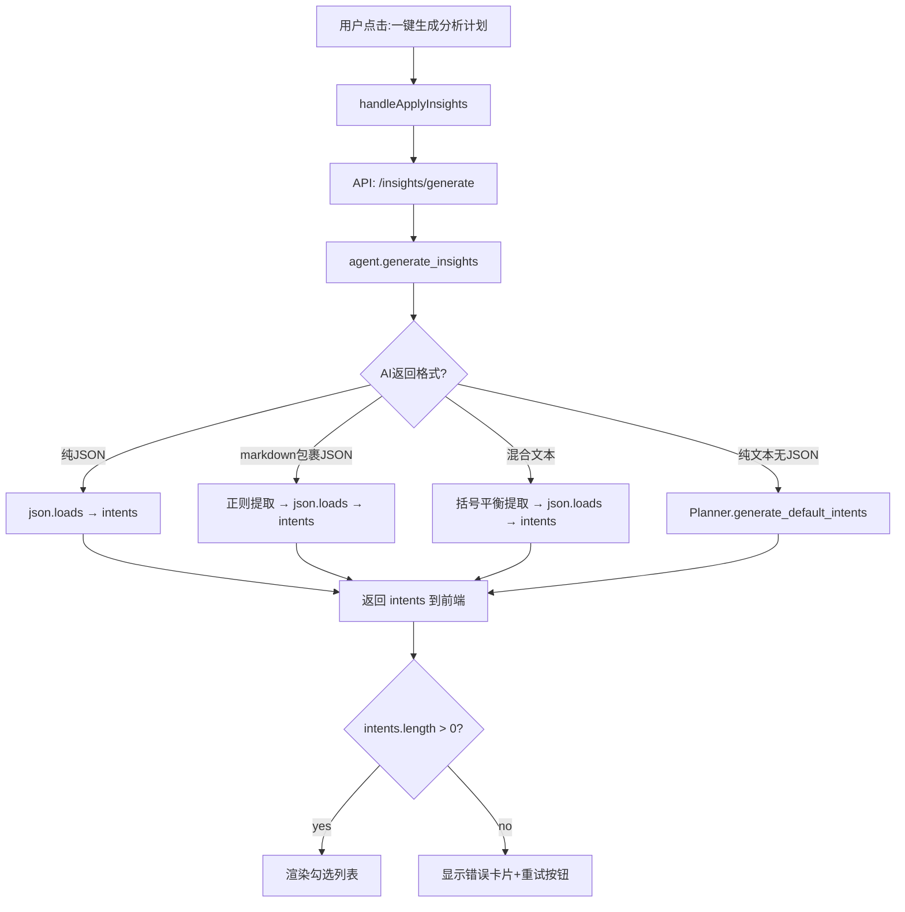

## 问题根因分析

用户点击"一键生成分析计划"后"没有任何反应"，根本原因不是一个表面 bug，而是**整条数据链路的多处脆弱点叠加**：

### 链路断裂点

1. **AI 输出不稳定**：`INSIGHTS_SYSTEM_PROMPT` 要求输出 JSON，但已删除 `response_format={"type":"json_object"}`（DeepSeek 不完全支持），导致 AI 经常返回 markdown 包裹的文本而非纯 JSON
2. **后端解析不够鲁棒**：正则提取 JSON 花括号的方式在 AI 返回混合文本+JSON 时可能提取到错误的片段（如 insights 字段内部也含花括号）
3. **intents 为空时前端静默失败**：当后端返回 `{success: true, intents: []}` 时，前端只设 `computeResult` 文字提示，但 `intents.length === 0` 导致勾选列表不渲染，用户视觉上"什么都没出来"
4. **fallback intents 生成缺失**：当 AI 无法返回 intents 时，后端没有用数据特征自动生成默认 intents 的兜底机制
5. **状态竞态**：`handleApplyInsights` 和 `generateInsights` 都调用同一个 API 但用不同状态变量（`computing` vs `loading`），可能出现一个还在 loading 时另一个被 disabled

### 核心需求

- 用户点击"一键生成分析计划"后，**无论 AI 返回什么格式，都必须在 UI 上产生可见反馈**
- 如果 AI 返回了 intents，显示勾选列表
- 如果 AI 只返回了文本，从文本+数据特征自动推断 intents
- 如果 AI 完全失败，用纯规则引擎（Planner）基于列信息生成默认 intents
- **永远不让用户看到"什么都没发生"的状态**

## 产品效果

点击按钮 → 显示加载动画 → 3-10秒后：

- 成功：出现 intents 勾选列表（3-6 个分析问题），带优先级标签
- AI 格式异常但仍能解析：同上，可能 intents 数量较少
- AI 完全失败：出现基于数据特征的默认 intents（至少 2-3 个），标注"自动推荐"
- 任何错误：页面显示具体错误信息（不是空白）

## 技术方案

### 整体策略

**三层防御**：AI JSON → AI 文本解析 → 纯规则兜底。确保任何情况下用户都能看到 intents。

### 后端加固（3处修改）

#### 1. `insights.py` — 三层 JSON 解析 + fallback intents 生成

当前问题：JSON 解析失败时直接返回 `intents: []`，前端无内容可渲染。

修改方案：

```
解析流程：
Step 1: 正则提取 ```json...``` → json.loads
Step 2: 失败 → 找第一个 { 到最后一个 } → json.loads  
Step 3: 失败 → 用 Planner 基于数据列自动生成 default intents
```

关键细节：

- Step 2 的花括号提取需要**平衡括号计数**，不能简单用 `rfind('}')`，因为 insights 字段内部也有花括号（Markdown 标题用 `##`），导致提取到错误的闭合位置
- Step 3 调用 `Planner.generate_default_intents(df)` 方法，基于 ColumnClassifier 识别的列类型生成 2-4 个默认 intents
- 每一步都打日志 `[insights] Step X: ...`

#### 2. `planner.py` — 新增 `generate_default_intents(df)` 方法

当 AI 完全无法返回 intents 时，纯规则生成：

```python
def generate_default_intents(self, df: pd.DataFrame) -> list:
    """基于数据列特征自动生成默认 intents（无 AI 时兜底）"""
    intents = []
    time_cols = self.classifier.get_time_columns(df)
    cat_cols = self.classifier.get_category_columns(df)
    num_cols = self.classifier.get_numeric_columns(df)
    
    if time_cols and num_cols:
        intents.append({"business_question": f"{num_cols[0]}的增长趋势如何？", 
                        "analysis_goal": "判断增长变化", "priority": "high", "reason": "有时间和数值列"})
    if cat_cols and num_cols:
        intents.append({"business_question": f"哪个{cat_cols[0]}的{num_cols[0]}最高？",
                        "analysis_goal": "排名对比", "priority": "high", "reason": "有分类和数值列"})
    if cat_cols and num_cols:
        intents.append({"business_question": f"各{cat_cols[0]}的{num_cols[0]}占比如何？",
                        "analysis_goal": "结构占比分析", "priority": "medium", "reason": "占比是基础分析"})
    if len(num_cols) >= 2:
        intents.append({"business_question": f"{num_cols[0]}和{num_cols[1]}是否相关？",
                        "analysis_goal": "相关关系分析", "priority": "medium", "reason": "多指标相关性"})
    
    return intents[:6]  # 最多6个
```

#### 3. `insights.py` — 调用 Planner 兜底

在 JSON 解析全部失败后：

```python
from src.planner import Planner
_PLANNER = Planner()

# Step 3 失败后
default_intents = _PLANNER.generate_default_intents(df)
return {"success": True, "insights": result, "intents": default_intents}
```

### 前端加固（2处修改）

#### 4. `AnalysisPage.tsx` — 修复 handleApplyInsights 的三层响应

当前问题：`res.intents` 为空时只设文字提示，UI 无可见变化。

修改逻辑：

```typescript
// 优先级1: AI 返回了 intents
if (res.intents && res.intents.length > 0) {
  setIntents(res.intents.map(...));
}
// 优先级2: AI 只返回了文本，但后端 fallback 生成了 intents
// （后端已保证 intents 不为空，所以这里只需处理极端情况）
else {
  // 极端情况：连 fallback 都没生成 intents
  // 显示错误卡片，而不是静默
  setComputeResult('...');
  // 同时显示一个可操作的错误提示区块
}
```

关键：**永远在 UI 上产生可见元素**——要么 intents 勾选列表，要么错误提示卡片。绝不只设 `computeResult` 文字。

#### 5. `AnalysisPage.tsx` — 消除两个 Tab 的 intents 勾选列表代码冗余

overview Tab（行616-640）和 chat Tab（行813-860）各有一份 intents 勾选列表 JSX，代码几乎相同但分散在两处。提取为内联组件函数 `IntentChecklist`，减少维护成本和状态不一致风险。

### 后端 JSON 解析的括号平衡算法

当前 `insights.py` 用 `raw.find('{')` 和 `raw.rfind('}')` 提取 JSON，这在 insights 字段含花括号时会提取到错误位置。

改为**括号平衡计数法**：

```python
def _extract_json_by_brace_balance(text: str) -> str:
    """从文本中提取最长的平衡花括号 JSON 片段"""
    start = text.find('{')
    if start == -1:
        return text
    depth = 0
    for i in range(start, len(text)):
        if text[i] == '{': depth += 1
        elif text[i] == '}': depth -= 1
        if depth == 0:
            return text[start:i+1]
    return text[start:]  # 未平衡，返回从头到尾
```

### 数据流图



## 修改文件清单

```
d:\数据分析项目\
├── backend\routers\insights.py          # [MODIFY] 三层JSON解析+括号平衡+Planner兜底
├── src\planner.py                       # [MODIFY] 新增 generate_default_intents(df) 方法
├── frontend\src\pages\AnalysisPage.tsx  # [MODIFY] 修复handleApplyInsights三层响应+提取IntentChecklist组件+确保任何情况都有UI反馈
```

### 文件修改细节

**insights.py**：

- 在现有 JSON 解析逻辑后增加括号平衡提取函数 `_extract_json_by_brace_balance`
- Step 2 改用括号平衡法代替 `rfind`
- 新增 Step 3：调用 `_PLANNER.generate_default_intents(df)` 生成兜底 intents
- import Planner
- 每步打 print 日志

**planner.py**：

- 新增 `generate_default_intents(self, df)` 方法
- 基于 ColumnClassifier 识别 time/category/numeric 列
- 生成 2-6 个默认 intents（增长趋势、排名对比、结构占比、相关性等）
- 每个 intent 的 priority 根据列类型组合决定

**AnalysisPage.tsx**：

- `handleApplyInsights`：在 intents 为空时不再只设 computeResult，而是显示一个可见的错误/提示卡片
- 提取 `IntentChecklist` 内联函数组件，overview Tab 和 chat Tab 共用
- 确保 `computing` 状态在 API 调用前后正确切换（catch 中也 reset）
- 在 API 调用期间显示 loading spinner 文字（不只是 disabled 按钮）