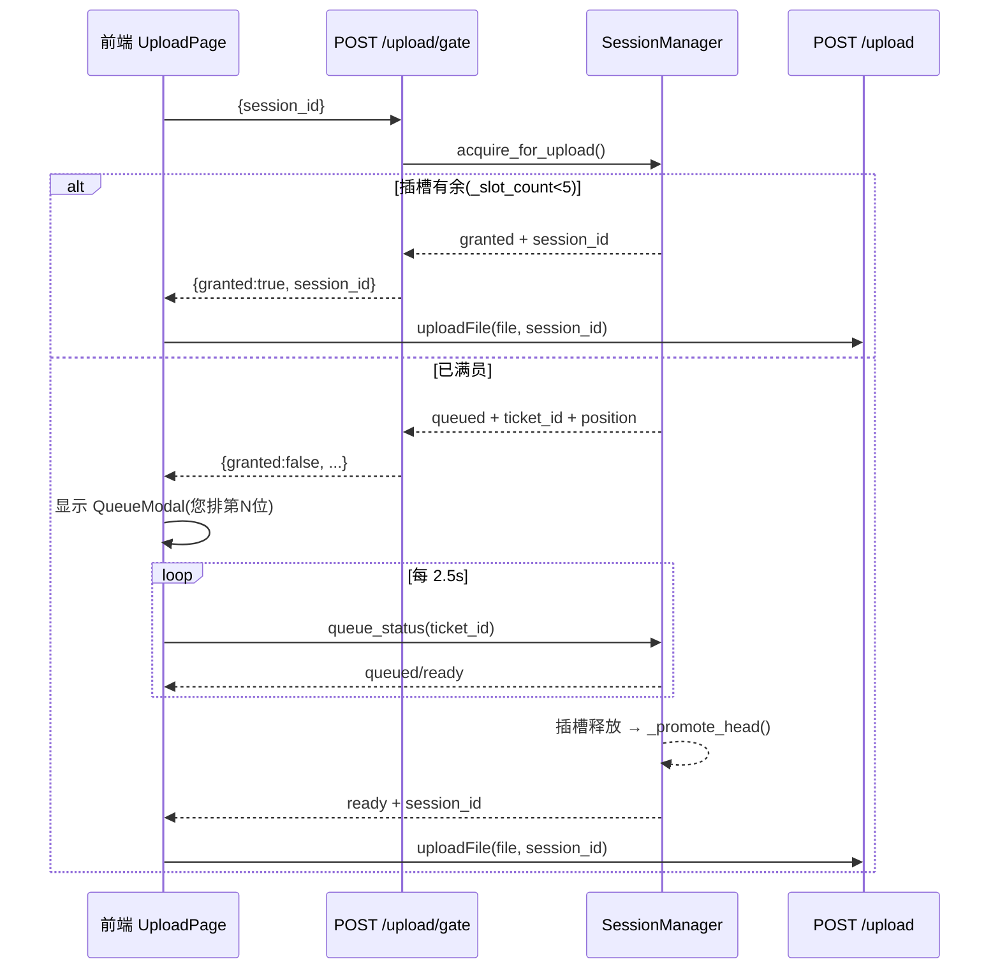

## 用户需求

将系统并发上传上限限制为 5 份数据；当已有 5 人持有数据（会话）时，第 6 人上传须进入后端真实排队队列，前端弹出排队提醒并展示当前排队位次（"您排第 N 位"），后台自动轮询，轮到该用户时无需手动操作即自动开始上传文件。

## 产品概述

在"数据上传"页面增加配额闸门与排队体验：满 5 份数据后新上传请求不再抢占/淘汰既有会话，而是领取排队号、原地等待；系统在有数据会话释放插槽时按 FIFO 自动晋升队首，前端拿到可用会话后自动上传。

## 核心功能

- 上限为 5：仅统计"持有数据的会话"（df 非空），启动时的空会话不计入，避免 6 人启动即被拦。
- 真实排队+自动入队：满员时后端发放 ticket 与位次；前端弹窗展示位次并后台轮询，晋升为 ready 后自动用返回的 session_id 上传，用户无需点击重试。
- 排队提醒弹窗：银河紫玻璃拟态风格，显示"您排第 N 位 / 当前 5/5 位已满"，含取消排队按钮。
- 优雅释放：会话清理/超时或预约超时未上传时释放插槽并自动晋升下一队首；排队票据可手动取消。

## 技术栈

- 后端：FastAPI（沿用 `backend/routers/upload.py` + `backend/services/session_manager.py`，单例 `manager`）
- 前端：React + TypeScript + Tailwind CSS（沿用 `UploadPage.tsx` / `FileUploader.tsx` / `api/client.ts` 现有结构）
- 不引入新依赖、新组件库，复用现有加锁单例与会话生命周期

## 实现方案

采用"闸门端点 + 后端队列 + 前端轮询自动入队"策略：新增一个轻量 `POST /upload/gate` 在真正传文件前预约数据插槽，满员则返回 ticket+位次；前端据结果决定直接上传还是进入排队弹窗并对 `GET /upload/queue/{ticket}` 轮询，状态变 `ready` 后自动上传。这样文件传输只发生在已拿到插槽之后，避免带宽/内存浪费，也绕开响应拦截器对 429 结构的破坏（闸门用 200 返回结构化 JSON）。

关键决策：

1. **限流对象必须是"持有数据的会话"**：`max_sessions` 改为 5，但只约束 `df is not None` 的会话；启动建空会话（`/session/new`）不再受限，否则 6 个用户启动即被拦。
2. **去掉淘汰、改为插槽计数器**：`SessionManager` 新增 `_slot_count`（已占用数据插槽数）与 FIFO `_queue`、`_reserved` 映射，`create_session` 不再淘汰最老会话。
3. **原子预约防竞态**：`acquire_for_upload` 在锁内判断 `_slot_count < max_sessions` 后递增并标记 `holds_slot`，杜绝"都看到有空位→都创建→超 5"的竞态。
4. **晋升触发点**：`clear_data` 与 `_cleanup_sync`（后台守护线程、会话超时）在释放插槽后调用 `_promote_head()` 晋升队首并预留会话；预约超时不传文件（RESERVE_TTL）也释放，避免长期占槽。
5. **复用启动会话**：闸门接收 `state.sessionId`（启动空会话），有空位时直接预约该会话、满员时把该 session_id 入队，晋升后继续用同一会话上传，不产生孤儿会话。

性能与可靠性：

- 队列/插槽操作均在 `self._lock` 内，零新增并发风险；`_queue`/`_reserved` 为内存结构，O(1) 入队、O(n) 取位次（n 极小，≤16）。
- P0 解析信号量（xlsx/sqlite 并发 3）保持不变，与插槽上限 5 互不冲突。
- 轮询间隔 2.5s、最长等待受会话超时兜底，不占用长连接；前端 `uploadingRef` 在排队+上传全程为 true，防重复触发。

## 实现注意事项

- 严守纪律：仅本地修改，不 `commit`/`push`（记忆 2026-07-09）。
- 不改动 `/session/new` 的对外语义，仅让 `create_session` 去掉淘汰逻辑（空会话不再受限）。
- `_promote_head` 若队首会话已不存在则新建会话承接，保证晋升不丢票。
- 响应拦截器（`client.ts:49`）会把非字符串 detail 转成 `[object Object]`，因此闸门/队列接口一律用 200 + 结构化 JSON，绝不用 429 携带队列信息，避免前端丢失结构。
- `QueueModal` 关闭（取消排队）时调用 `POST /upload/queue/cancel` 尽力移除票据，并停止轮询，避免晋升后继续上传。

## 架构设计



## 目录结构

```
backend/
├── services/
│   └── session_manager.py   # [MODIFY] max_sessions 默认改 5；create_session 去掉淘汰；新增 _slot_count/_queue/_reserved 与 acquire_for_upload / queue_status / cancel_queue / _promote_head；_cleanup_sync 与 clear_data 释放插槽并晋升；新增 QUEUE_TTL/RESERVE_TTL 常量。所有结构与晋升均在 self._lock 内。
└── routers/
    └── upload.py            # [MODIFY] 新增 POST /gate（调用 acquire_for_upload，200 返回 granted/session_id 或 ticket_id+position）、GET /queue/{ticket_id}（queue_status）、POST /queue/cancel（cancel_queue）。不改变原 /upload 主流程（仍 if not session_id: create_session）。
frontend/
├── src/
│   ├── api/
│   │   └── client.ts        # [MODIFY] 新增 uploadGate(sessionId) 与 getUploadQueueStatus(ticketId)，复用现有 api 实例与 baseURL。
│   ├── pages/
│   │   └── UploadPage.tsx   # [MODIFY] handleUpload 改为"先闸门后上传"：调用 uploadGate；granted 直接用返回 session_id 上传；queued 则置 QueueModal 状态并启动 2.5s 轮询，ready 后自动 uploadFile；接入取消回调。复用 SET_SESSION 同步 sessionId。
│   └── components/
│       └── QueueModal.tsx   # [NEW] 银河紫玻璃拟态排队弹窗：标题"系统繁忙"、位次"您排第 N 位"、副文案"当前 5/5 位已满，轮到您将自动上传"、取消排队按钮；role=dialog + aria-live 播报位次，背景模糊遮罩。
```

## 关键代码结构

```python
# backend/services/session_manager.py 新增方法签名（均在 self._lock 内访问共享结构）
def acquire_for_upload(self, session_id: str) -> dict:
    """预约数据插槽；满员则入队。
    返回 {'granted': bool, 'session_id'?: str, 'ticket_id'?: str, 'position'?: int}"""

def queue_status(self, ticket_id: str) -> dict:
    """返回 {'status': 'ready'|'queued'|'expired', 'session_id'?: str, 'position'?: int}"""

def cancel_queue(self, ticket_id: str) -> None:
    """从等待队列移除票据（尽力而为，不影响已晋升项）"""
```

```ts
// frontend/src/components/QueueModal.tsx 组件 props
interface QueueModalProps {
  open: boolean;
  position: number;      // 当前排队位次（1 起）
  maxSessions: number;   // 上限，用于展示"当前 N/5"
  onCancel: () => void;  // 取消排队
}
```

## 设计风格

延续项目 "Galaxy AI Analytics" 视觉体系（深空暗色 + 银河紫发光），为新增的排队弹窗采用玻璃拟态（Glassmorphism）模态层。背景为半透明深空蓝遮罩 + 背景模糊，面板为半透明卡片配银河紫描边光晕；中心用与 FileUploader 一致的旋转能量环表达"等待中"的动态感，位次数字用大号星光紫高亮并带柔光投影。

## 页面区块设计（QueueModal 单组件）

- 遮罩层：fixed 全屏 `bg-[#020617]/70` + `backdrop-blur`，点击不关闭（必须由取消按钮关闭），防止误操作。
- 面板容器：居中 `glass-card`，`border border-[#8B5CF6]/30`，`box-shadow: 0 0 40px rgba(139,92,246,0.25)`，圆角 16px，最大宽度 380px，内边距 28px。
- 顶部图标：复用旋转能量环（与上传核心一致），`animate-spin` 银河紫环，传达"系统正在为您排队"。
- 标题块："系统繁忙，正在排队" `text-2xl font-bold text-[#F8FAFC]`，副标题"当前 5/5 位已满，轮到您将自动上传" `text-sm text-[#C4B5FD]`。
- 位次高亮：大号 "您排第 N 位" 中 N 用 `text-[#8B5CF6] text-4xl font-extrabold` + 紫光投影，`aria-live="polite"` 实时播报变化。
- 操作区：幽灵按钮"取消排队" `border border-white/15 text-slate-300 hover:bg-[#8B5CF6]/10`，点击触发 onCancel 并停止轮询。
- 响应式：移动端宽度 90vw；桌面端固定 380px。键盘可达：role="dialog"、aria-modal、Esc/取消按钮聚焦。