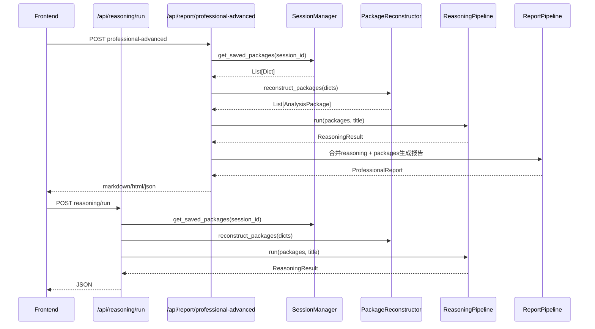

## 产品概述

为7模块业务分析框架的⑥ Business Reasoning Pipeline 挂载API路由，并将推理结果串入⑦ Professional Report，实现从数据到洞察的完整链路。

## 核心功能

### 1. 推理API端点 (/api/reasoning/run)

- 接受 session_id 和可选标题，读取已保存的分析包
- 将 dict 格式的分析包重构为 AnalysisPackage 对象
- 运行 ReasoningPipeline（Rule Engine → Evidence Engine → LLM Reasoner）
- 无需 LLM 也可运行（LLM Reasoner 内置规则回退方案）
- 返回 ReasoningResult：包含根因链、风险列表、增长机会、执行摘要、置信度评分、证据映射

### 2. 增强版专业报告端点 (/api/report/professional-advanced)

- 先运行 ReasoningPipeline 获取推理结论
- 再将推理结论（根因、风险、机会、建议）合并进 ProfessionalReport
- 报告结构更完整：执行摘要 → 数据概况 → 根因分析 → 分析详情 → 风险分析 → 增长机会 → 管理建议 → 总结
- 支持 markdown/html/json 三种输出格式
- 现有 /api/report/professional 端点不变

### 3. 技术保障

- 编写 dict→AnalysisPackage 重构工具函数，处理嵌套 dataclass（KPIItem、ChartData、DomainBusinessFinding 等）
- 遵循现有 ThreadPoolExecutor + asyncio 异步模式
- 保持向前兼容，不修改任何现有端点

## 技术栈

- 后端框架：FastAPI (Python 3.11)
- 数据模型：dataclasses + Pydantic BaseModel
- 并发模式：asyncio + ThreadPoolExecutor
- 推理引擎：ReasoningPipeline (Rule Engine + Evidence Engine + LLM Reasoner)
- 报告生成：ReportPipeline → NarrativeBuilder → Formatter

## 实现方案

### 策略

采用最小侵入式方案：

1. 创建独立的 reasoning 路由文件，不修改任何现有路由
2. 在 report.py 中新增 professional-advanced 端点，原 professional 端点零改动
3. 编写轻量级包重构工具，利用现有 NarrativeBuilder 的 dict→finding 转换能力

### 关键技术决策

- **不使用 LLM**：ReasoningPipeline 在无 llm_callable 时，LLMReasoner._build_rule_based() 自动生成规则版摘要、叙事和建议，零依赖即能产出结果
- **ThreadPoolExecutor 模式**：复用 report.py 第174行的 `ThreadPoolExecutor(max_workers=1)` + `loop.run_in_executor` 模式，防止同步推理阻塞异步事件循环
- **dict 重构策略**：利用 `NarrativeBuilder._dict_to_finding()` 已有的 dict→DomainBusinessFinding 转换能力，结合 dataclass 构造器 `AnalysisPackage(**fields)` 完成包重构

### 性能与可靠性

- ReasoningPipeline 纯规则推理，耗时通常在 100-500ms（取决于包数量和规则复杂度）
- LLMReasoner 在 detect LLM 失败时静默回退到规则模式，确保零故障
- 所有推理结论都关联 evidence_items（来源 Finding 的 chart/table/kpi 引用），确保可追溯

## 架构设计

### 新增 API 调用链路



### 模块划分

- **包重构工具** (`src/utils/package_reconstructor.py`)：dict → AnalysisPackage 转换
- **推理路由** (`backend/routers/reasoning.py`)：/api/reasoning/run 端点
- **报告路由增强** (`backend/routers/report.py`)：/api/report/professional-advanced 端点
- **路由注册** (`backend/main.py`)：import + include_router

## 目录结构

```
d:\数据分析项目\
├── src/
│   └── utils/
│       └── package_reconstructor.py  # [NEW] dict→AnalysisPackage转换工具
├── backend/
│   ├── main.py                       # [MODIFY] 第23行import、第60行后注册reasoning路由
│   └── routers/
│       ├── reasoning.py              # [NEW] 推理API路由 (POST /api/reasoning/run)
│       └── report.py                 # [MODIFY] 新增 /api/report/professional-advanced 端点
```

### 文件详细说明

**`src/utils/package_reconstructor.py`** [NEW]

- 核心函数：`reconstruct_packages(dicts: List[Dict]) -> List[AnalysisPackage]`
- 处理嵌套 dataclass：遍历 dict 中的 kpis/charts/tables/findings 字段
- KPIItem 重建：`KPIItem(**kpi_dict)`
- ChartData 重建：`ChartData(**chart_dict)`
- DomainBusinessFinding 重建：复用 `NarrativeBuilder._dict_to_finding()` 的转换逻辑
- 处理 null/缺失字段，使用 field default_factory 值补齐

**`backend/routers/reasoning.py`** [NEW]

- 定义 `ReasoningRequest(BaseModel)`：session_id, title(可选)
- 定义 `POST /api/reasoning/run` 端点
- 步骤：获取 saved_packages → reconstruct_packages → ReasoningPipeline().run() → ReasoningResult.to_dict() → JSONResponse
- 使用 ThreadPoolExecutor 在后台线程执行同步推理

**`backend/main.py`** [MODIFY]

- 第23行导入列表新增：`from backend.routers import reasoning`
- 第60行后新增：`app.include_router(reasoning.router, prefix="/api", tags=["业务推理"])`

**`backend/routers/report.py`** [MODIFY]

- 新增 `POST /api/report/professional-advanced` 端点
- 新增 `_build_advanced_professional_*` 三个辅助函数（markdown/html/json）
- 流程：reconstruct_packages → ReasoningPipeline.run() → 提取 ReasoningResult → 传给增强版报告构建器 → 格式化输出
- 不修改现有的 ProfessionalReportRequest、api_professional_report、_build_professional_* 函数