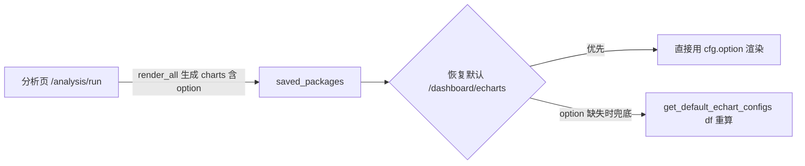

## 用户需求

修复仪表盘「恢复默认」按钮加载已保存分析包时"用原始数据重新聚合画图"导致的问题。

## 产品概述

仪表盘顶部有两个按钮：「已制作图表」（直接读已存好的完整 ECharts option 渲染，行为正确）与「恢复默认」（调 `/dashboard/echarts`，从 saved_packages 仅提取 chart_type/x/y 后用原始 DataFrame 重新 `create_echart` 画图）。

## 核心功能

- 「恢复默认」按钮加载已保存分析包中的图表时，应直接使用分析阶段已渲染好、并存于 saved_packages 中的 ECharts `option`（含帕累托累计占比系列、按数值降序排列），不再用原始数据重新聚合。
- 仅当不存在已保存分析包（首次使用/无分析结果）时，才保留 `get_default_echart_configs(df)` 默认图表兜底。
- 修复后需保证：帕累托线等衍生列图表不再丢失；排名类柱状图按计算出的数值降序展示（非按分类名/字母序）。

## 技术栈

- 后端：Python + FastAPI（沿用现有项目栈，无新增依赖）
- 仅改动一个文件：`backend/routers/dashboard.py`

## 实现方案

### 策略

「恢复默认」路由 `/dashboard/echarts` 已经能拿到 `saved_packages`，而 `saved_packages` 中的 `charts`（即 `rendered_charts`）在 `/analysis/run` 阶段已由 `ChartRenderer.render_all` 渲染出**含正确 `option` 的 ChartItem**（帕累托线系列、数值降序均已固化在 option 中）。当前问题仅在于 `_extract_chart_configs_from_packages` 只读 `chart_data`（无 option），导致 `/dashboard/echarts` 必然走 `create_echart` 重画。

最小且稳健的修复：让提取环节把已渲染的 `option` 一并带入 cfg，渲染循环优先复用 `option`，仅当 option 缺失（默认兜底场景）才回退 `create_echart`。

### 关键决策与权衡

1. **改 `_extract_chart_configs_from_packages`**：遍历 `pkg.get("chart_data", [])` 的同时，按同序索引从 `pkg.get("charts", [])` 取对应 `option` 并入 cfg（保留现有 type/x/y/title/analysis_type 与去重逻辑）。

- 理由：`chart_data` 与 `charts` 同由 `render_all` 生成、同序可安全配对；此改法复用现有结构，影响面最小。
- 防御：取 option 时做索引/字段存在性判断，缺失则 option 留空，自然回退到 `create_echart`，不引入新崩溃路径。

2. **改 `/dashboard/echarts` 渲染循环（L216-246）**：循环内先判断 `cfg.get("option")`，存在则直接 `result.append({title, option, type, x, y, analysis_type})` 并 `continue`；否则维持原 `create_echart(df, ...)` 逻辑。

- 理由：option 已是完整可渲染配置，无需重算，彻底消除"重画丢图/排序错"。

3. **保留不变**：`_normalize_map_configs` 预处理、`get_default_echart_configs(df)` 兜底分支、`classify_charts_by_tab` 的 tabs 分类、`sanitize_json` 出口。保证首次无分析包时行为不变。

### 性能与可靠性

- 无额外计算/IO 开销；option 复用为 O(1) 字典读取。
- 向后兼容：无 saved_packages 时仍走默认配置兜底，不报错。

### 实现注意事项

- 严格保持 `chart_data` 与 `charts` 同序配对；若索引越界或 option 缺失，回退 `create_echart` 而非抛异常。
- 不触碰「已制作图表」按钮（其逻辑本就正确）。
- 改动仅限后端单文件，前端无需修改。

## 架构设计

复用现有「分析包渲染」数据资产，避免二次聚合：

- 分析阶段：`/analysis/run` → `render_all` 已生成带 `option` 的 charts 并存入 saved_packages。
- 恢复默认：`/dashboard/echarts` 改为直接消费 saved_packages 中的 `option`，而非从 raw df 重算。



## 目录结构与文件改动

```
backend/
└── routers/
    └── dashboard.py   # [MODIFY]
        # 1) _extract_chart_configs_from_packages(L116-151): 遍历 chart_data 时按同序索引从 pkg["charts"] 取 option 并入 cfg，保留去重。
        # 2) /dashboard/echarts 渲染循环(L216-246): 若 cfg["option"] 存在则直接 append 并 continue，否则保留 create_echart 兜底。
```