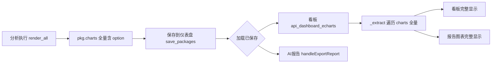

## 用户需求

用户要求彻底去掉图表「辅图」概念，并确认所有生成的图表在保存后都能正常展现。

## 产品概述

项目当前把分析结果里的图表按类型分成「主图 / 辅图」两套待遇：辅图（典型为柱状图 bar，以及箱线/雷达/热力/3D 地图/词云等）在分析结果页带「辅图」角标、被压矮、且被排到更窄的栅格；更关键的是保存后，看板与 AI 报告里辅图整张消失。用户希望所有图一律平等对待、保存后看板和报告都完整显示。

## 核心功能

- 消灭「辅图」标签：所有图表不再区分主/辅，统一渲染（无角标、统一高度、统一栅格布局）。
- 修复保存后缺图：看板与 AI 报告在加载已保存分析包后，必须完整呈现原先被标记为「辅图」的图表。
- 全量可保存：分析包「保存到仪表盘」整包保存，原先被忽略的图表在保存链路中不再丢失。

## 技术栈

复用现有架构：前端 React + TypeScript，后端 Python + FastAPI。不引入新依赖、不改构建配置。**严禁改动** `frontend/src/utils/exportEChartsDashboard.ts`（用户明确拒绝）。

## 根因分析（已查证）

1. **角色分配**：`src/chart_renderer.py:14-21` 的 `ROLE_MAP` 把 `bar→secondary`、未列出类型默认 `secondary`（第 50 行）。这是「辅图」的唯一来源。
2. **看板缺图**：`backend/routers/dashboard.py` 的 `_extract_chart_configs_from_packages`（116 行）遍历 `pkg.chart_data` 并按索引 `i` 从 `pkg.charts[i]` 取 option；当 option 为空/错位时回退 `create_echart` 重算，重算失败则 `continue` 跳过（269 行）——secondary 类型（箱线/雷达/热力/3D 地图/词云）最易在此被整张丢弃；柱状「辅图」也因索引配对脆弱而可能丢失。
3. **报告缺图同源**：`DashboardPage.handleExportReport`（343 行）调用的 AI 报告图表来自 `echarts = api.getDashboardECharts`（104-107 行），即同一份 `_extract` 产物，因此看板缺图 → 报告同步缺图，完美解释「两处都缺」。
4. **分析页可见**：`VisualizationRenderer` 直接渲染 `pkg.charts` 全量（不过滤 role），所以只在分析页能看到辅图角标，保存后即消失。

## 实现方案

三层联动修复，从源头消除「辅图」并补齐保存链路：

- **源头（后端）**：将 `chart_renderer.py` 的 `ROLE_MAP` 改为全部映射 `primary`（删除 `secondary`/`detail` 分支），让任何图表都不再被标记为辅图。
- **前端渲染**：`VisualizationRenderer.tsx` 删除第 82-83 行主/辅角标、第 86 行高度差异（`height` 统一为常数，如 360）、第 196 行 `gridColumn` 跨列差异（所有图进入 `auto-fit` 栅格平等排布）。
- **后端提取（关键修复）**：重写 `_extract_chart_configs_from_packages`，**直接遍历 `pkg.charts`**（已含 `chart_type/x/y/title/option` 的渲染结果），用 `chart.get("option")` 原样携带预渲染 option，去掉「chart_data 索引配对 + create_echart 回退」逻辑；保留按 `(chart_type, x, y)` 去重。这样每张已保存图表（含原辅图）都以其真实渲染 option 进入看板，不再有重算失败丢图。

## 实现要点

- `_extract` 改写后，原 `chart_data` 索引配对与 `create_echart` fallback 全部移除，复杂度从 O(n) 配对 + 潜在重算降为纯 O(n) 遍历，且零丢图。
- `classify_charts_by_tab` 的 `_TAB_MAX_CHARTS`（趋势 4 / 分类 6）为通用限流，与 role 无关；改写后全量进入，若实际图表超出限额再评估放宽，本次不主动改。
- 后端 `report.py` 提取 `pkg.charts` 全量、不过滤 role，本路径已正确；前端 AI 报告经 `echarts` 走 `_extract`，随看板修复一并生效。
- 改完后端需**重启后端进程**才生效（前序任务已踩坑：仅重启前端不生效）。

## 架构与文件

修改文件：

- `src/chart_renderer.py` [MODIFY] `ROLE_MAP` 全映射 `primary`，消除辅图源头。
- `frontend/src/components/VisualizationRenderer.tsx` [MODIFY] `ChartBlock` 去掉主/辅角标、统一高度、去掉 `gridColumn` 跨列差异，所有图平等渲染。
- `backend/routers/dashboard.py` [MODIFY] `_extract_chart_configs_from_packages` 改为遍历 `pkg.charts`、直接携带 `option`，移除 chart_data 索引配对与 create_echart 回退。