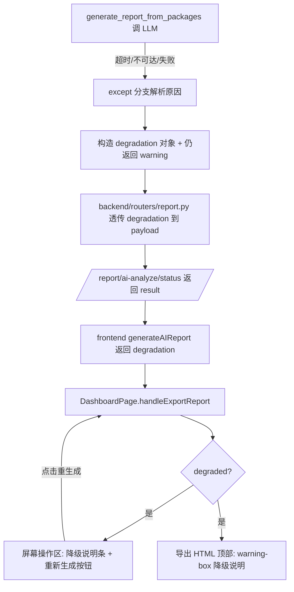

## 用户需求

在 AI 分析报告降级场景下，除了前端提供"重新生成（AI 洞察版）"按钮外，还需明确**向体验者说明降级原因**，避免体验者误以为"报告生成能力不行"。两层诉求必须同时落地：

- 提示归因到外部 AI 接口问题（超时/不可达/调用失败），并强调"统计结论仍完整准确"，与产品能力脱钩；
- 提供清晰的重新生成入口，由用户主动触发重试。

## 产品概述

当前报告生成在 LLM 调用超时/失败时，后端会静默降级为纯统计摘要（保底返回 200），但前端仅在下载的 HTML 中隐含 `warning` 文本，屏幕内无任何原因说明，体验者易误判为能力缺陷。本方案在"降级发生点"同时透传结构化原因，并在屏幕操作区与导出 HTML 双处展示"降级说明 + 重新生成"入口。

## 核心功能

- 后端：在降级时返回结构化 `degradation` 对象（是否降级、原因分类、对用户友好的说明文案、是否可重生成），对外归因 AI 接口、对内标注超时/不可达/错误。
- 前端屏幕：在报告操作区（生成按钮下方）展示降级说明条 + "重新生成（AI 洞察版）"按钮；点击复用既有异步生成流程。
- 导出 HTML：在报告顶部注入降级说明块（复用既有 warning-box 样式），使独立下载的报告也能自解释。

## 技术栈

- 后端：FastAPI（Python），`backend/routers/report.py` 异步任务 + `src/ai_agent/agent.py` 报告生成。
- 前端：React + TypeScript + Tailwind CSS（既有 `DashboardPage.tsx` 报告模块），导出 HTML 由 `exportEChartsDashboard.ts` 生成。
- 沿用既有约定：降级 sections 顺序固定（overview→kpi→trend→structure→top→anomaly→conclusion→suggestions→next_steps），不改动；发光/强调色统一银河紫 #8B5CF6；提示用既有 warning 琥珀色 #FBBF24。

## 实现方案

**策略**：后端将"降级原因"从单一字符串 `warning` 升级为结构化 `degradation` 对象；通过既有异步状态路由透传到前端；前端在屏幕内与导出 HTML 两处渲染原因 + 重生成入口。重生成直接复用 `handleExportReport`（用户主动触发，规避 SDK 自动重试导致的 720s 坑）。

**关键技术决策**：

1. **保留 `warning` 字段、新增 `degradation`**：最小化爆炸半径，向后兼容已消费 `result.warning` 的代码路径。
2. **原因分类在后端完成**：在 `generate_report_from_packages` 的 `except` 分支解析异常类型（timeout/unreachable/connection → 对外统一为"AI 接口"归因），生成用户友好文案，不向前端泄露原始堆栈。
3. **重生成不新增接口**：按钮复用 `handleExportReport` + `generateAIReport` 既有异步轮询链路，用户主动触发，非系统偷偷重试。
4. **双处展示**：屏幕内（DashboardPage 操作区）即时可见；导出 HTML 顶部注入（独立文件也能自解释）。二者文案同源，降低维护成本。

**性能与可靠性**：降级判定为纯字符串匹配（O(1)），无新增网络/计算开销；新增字段经 `sanitize_json` 校验（符合 B12 双层防护约定）；对正常生成路径零影响。

## 实现注意事项

- 分类逻辑仅覆盖已知异常关键词（timeout/timed out/connection/connect/ECONN/unreachable），其余归为 `llm_error`，文案统一为"AI 服务暂不可用"。
- 用户可见文案必须包含"统计结论完整准确，仅缺少 AI 解读"，与能力脱钩。
- 降级用独立 state（如 `reportDegraded`），不混入 `reportError`（error 仅用于真正失败）。
- 导出 HTML 复用既有 `.warning-box` 暗色样式，不新增色板。

## 架构设计



## 目录结构与文件改动

```
backend/routers/report.py          # [MODIFY] L94-100 payload 新增 degradation 透传（取自 agent 返回）
src/ai_agent/agent.py              # [MODIFY] L403-417 降级分支：解析异常类型，构造结构化 degradation
                                    #         （degraded/reason/message/canRegenerate/raw_error），保留 warning
frontend/src/types/api.ts          # [MODIFY] L117-121 AIReportResponse 新增 degradation 字段（结构化）
frontend/src/api/client.ts         # [MODIFY] generateAIReport 返回体补充 degradation（透传自 result）
frontend/src/pages/DashboardPage.tsx # [MODIFY] 新增 reportDegraded state；handleExportReport 消费 degradation；
                                    #         报告操作区(:609-619)渲染降级说明条 + 重新生成按钮（复用 handleExportReport）
frontend/src/utils/exportEChartsDashboard.ts # [MODIFY] buildReportHTML 新增 degradation 参数，顶部注入 warning-box 降级说明
```

## 关键代码结构

```typescript
// frontend/src/types/api.ts — AIReportResponse 扩展
export interface ReportDegradation {
  degraded: boolean;            // 是否降级
  reason: 'llm_timeout' | 'llm_unavailable' | 'llm_error'; // 内部归因
  message: string;              // 对用户友好、归因 AI 接口、强调统计结论完整
  canRegenerate: boolean;       // 是否提供重新生成入口
}
// AIReportResponse 内新增：degradation?: ReportDegradation
```

在 DashboardPage 报告操作区新增一条降级说明横幅（非弹窗），位于"生成分析报告并下载"按钮正下方。横幅采用项目既有暗色表层（#0F172A）卡片 + 银河紫强调色按钮，提示条沿用既有 warning 琥珀色（#FBBF24）描边与文字，与 VisualizationRenderer 的 UnsupportedBlock 视觉语言保持一致，不引入新色板。导出 HTML 复用 exportEChartsDashboard.ts 既有 .warning-box 暗色样式在报告顶部注入同级说明。