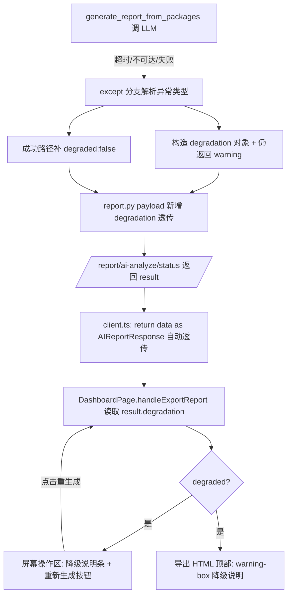

## 用户需求

在 AI 分析报告降级场景下，除前端提供"重新生成（AI 洞察版）"按钮外，还必须**明确向体验者说明降级原因**，避免体验者误判为"报告生成能力不行"。两层诉求必须同时落地：

- 提示归因到外部 AI 接口问题（超时/不可达/调用失败），并强调"统计结论仍完整准确，仅缺少 AI 解读"，与产品能力脱钩；
- 提供清晰的"重新生成"入口，由用户主动触发重试，而非系统偷偷重试。

## 产品概述

当前报告生成在 LLM 调用超时/失败时，后端会静默降级为纯统计摘要（保底返回 200），但前端仅在下载的 HTML 中隐含 `warning` 文本，屏幕内无任何原因说明，体验者易误判为能力缺陷。本方案在"降级发生点"同时透传结构化原因，并在屏幕操作区与导出 HTML 两处展示"降级说明 + 重新生成"入口。

## 核心功能

- 后端：在 V3 降级分支返回结构化 `degradation` 对象（是否降级、原因分类、用户友好文案、是否可重生成），对外归因 AI 接口、对内标注超时/不可达/错误。
- 前端屏幕：在报告操作区（生成按钮下方）展示降级说明条 + "重新生成（AI 洞察版）"按钮；点击复用既有异步生成流程。
- 导出 HTML：在报告顶部注入降级说明块（复用既有 warning-box 样式），使独立下载的报告也能自解释。

## 技术栈

- 后端：FastAPI（Python），`backend/routers/report.py` 异步任务 + `src/ai_agent/agent.py` 报告生成（V3 `generate_report_from_packages`）。
- 前端：React + TypeScript + Tailwind CSS（既有 `DashboardPage.tsx` 报告模块），导出 HTML 由 `exportEChartsDashboard.ts` 生成。
- 沿用既有约定：降级 sections 顺序固定（overview→kpi→trend→structure→top→anomaly→conclusion→suggestions→next_steps）不改动；强调色统一银河紫 #8B5CF6；提示用既有 warning 琥珀色 #FBBF24。

## 实现方案

**策略**：后端将"降级原因"从单一字符串 `warning` 升级为结构化 `degradation` 对象；通过既有异步状态路由透传到前端；前端在屏幕内与导出 HTML 两处渲染原因 + 重生成入口。重生成直接复用 `handleExportReport`（用户主动触发，规避 SDK 自动重试导致的 720s 坑）。

**关键技术决策**

1. **保留 `warning` 字段、新增 `degradation`**：最小化爆炸半径，向后兼容已消费 `result.warning` 的代码路径。
2. **前端 `client.ts` 无需改动**：`generateAIReport` 使用 `return data as AIReportResponse`（类型断言，运行时不校验），只要 `AIReportResponse` 类型补上 `degradation` 字段、后端 payload 加上该键，`result.degradation` 运行时自动透传。
3. **`report.py` 必须同步透传 `degradation`**：在 `:94-100` 的 payload dict 中新增 `"degradation": result.get("degradation")`，否则前端收不到（核心修正点）。
4. **V3 成功路径补 `degraded:false`**：`agent.py:397-401` 正常返回无 degradation；前端用 `result.degradation?.degraded` 判断，缺失即视为未降级也能跑，但成功路径补 `"degradation":{"degraded":False}` 更统一。
5. **原因分类在后端完成**：在 `generate_report_from_packages` 的 except 分支解析异常类型（timeout/timed out/connection/connect/ECONN/unreachable → 统一归因 AI 接口），生成用户友好文案，不向前端泄露原始堆栈。
6. **重生成不新增接口**：按钮复用 `handleExportReport` + `generateAIReport` 既有异步轮询链路，用户主动触发。
7. **双处展示、文案同源**：屏幕内（DashboardPage 操作区）即时可见；导出 HTML 顶部注入（独立文件也能自解释），共用同一 `degradation.message`。

**性能与可靠性**：降级判定为纯字符串匹配（O(1)），无新增网络/计算开销；新增字段经 `sanitize_json` 校验（符合 B12 双层防护约定）；对正常生成路径零影响。

## 实现注意事项

- 分类逻辑仅覆盖已知异常关键词（timeout/timed out/connection/connect/ECONN/unreachable），其余归为 `llm_error`，文案统一为"AI 服务暂不可用"。
- 用户可见文案必须包含"统计结论完整准确，仅缺少 AI 解读"，与能力脱钩。
- 降级用独立 state（`reportDegraded`），不混入 `reportError`（error 仅用于真正失败，即 agent.py:418-424 的极端失败分支，该分支走前端红色报错，不显示 banner，无需改动）。
- 导出 HTML 复用既有 `.warning-box` 暗色样式，不新增色板。
- `generateEChartsDashboardHTML`（被 grid/classic/command/medical/report 共用）新增 `degradation` 必须为可选参数（带默认），仅在 `case 'report'` 透传，medical/command 等模板零改动。

## 架构设计



## 目录结构与文件改动

```
backend/routers/report.py              # [MODIFY] L94-100 payload 新增 "degradation": result.get("degradation") 透传（取自 agent 返回）；其余分支不动
src/ai_agent/agent.py                  # [MODIFY] L397-401 成功路径补 "degradation":{"degraded":False}；
                                       #         L403-417 降级 except 分支：解析异常类型，构造结构化 degradation
                                       #         （degraded/reason/message/canRegenerate/raw_error），保留 warning 向后兼容；
                                       #         L418-424 极端失败分支不改动
frontend/src/types/api.ts              # [MODIFY] L116-121 AIReportResponse 新增 degradation 字段；新增 ReportDegradation 接口
                                       #         （client.ts 无需改：generateAIReport 已用 as AIReportResponse 透传）
frontend/src/pages/DashboardPage.tsx    # [MODIFY] 新增 reportDegraded state；handleExportReport 消费 result.degradation 并透传 HTML 生成；
                                       #         报告操作区 L609-619 渲染降级说明条 + 重新生成按钮（复用 handleExportReport）
frontend/src/utils/exportEChartsDashboard.ts # [MODIFY] generateEChartsDashboardHTML 新增可选 degradation 参数（仅 case 'report' 透传）；
                                       #         buildReportHTML 新增可选 degradation 参数，顶部注入 .warning-box 降级说明块
```

## 关键代码结构

```typescript
// frontend/src/types/api.ts — AIReportResponse 扩展
export interface ReportDegradation {
  degraded: boolean;                                   // 是否降级
  reason: 'llm_timeout' | 'llm_unavailable' | 'llm_error'; // 内部归因（不向前端泄露原始堆栈）
  message: string;                                     // 对用户友好、归因 AI 接口、强调统计结论完整准确
  canRegenerate: boolean;                              // 是否提供重新生成入口
}
// AIReportResponse 内新增：degradation?: ReportDegradation
```

## 设计风格

采用项目既有「Galaxy AI Analytics」深空暗色设计系统，不引入新组件库、不新增色板。降级说明以**内联横幅（Inline Banner）**形式嵌入报告操作区（非弹窗），位于"生成分析报告并下载"按钮正下方。

## 屏幕内降级说明条

- 容器：项目既有暗色表层卡片（#0F172A），圆角、细边框，与 VisualizationRenderer 的 UnsupportedBlock 视觉语言一致。
- 提示区：沿用 warning 琥珀色 #FBBF24 描边与图标文字，左侧 ⚠️ 图标 + 标题"报告已降级为统计摘要"+ 正文说明（归因 AI 接口 + 统计结论完整准确）。
- 操作区：银河紫 #8B5CF6 主按钮"重新生成（AI 洞察版）"，带 hover/focus 发光态（银河紫辉光），点击复用 `handleExportReport`。
- 仅在 `result.degradation?.degraded === true` 时渲染，正常生成时不出现，零干扰。

## 导出 HTML 降级说明块

复用 `exportEChartsDashboard.ts` 既有 `.warning-box` 暗色样式（琥珀色描边），在报告顶部 Section 之前注入同款说明文字，使独立下载的 HTML 文件也能自解释降级原因。

## 交互与动效

- 横幅出现时以细微淡入（opacity/translateY）呈现，避免突兀。
- 重新生成按钮 hover 时银河紫辉光增强、active 态轻微缩放，符合项目强调色规范。
- 重新生成期间复用现有 `reportGenerating` 进度提示，避免重复造轮子。