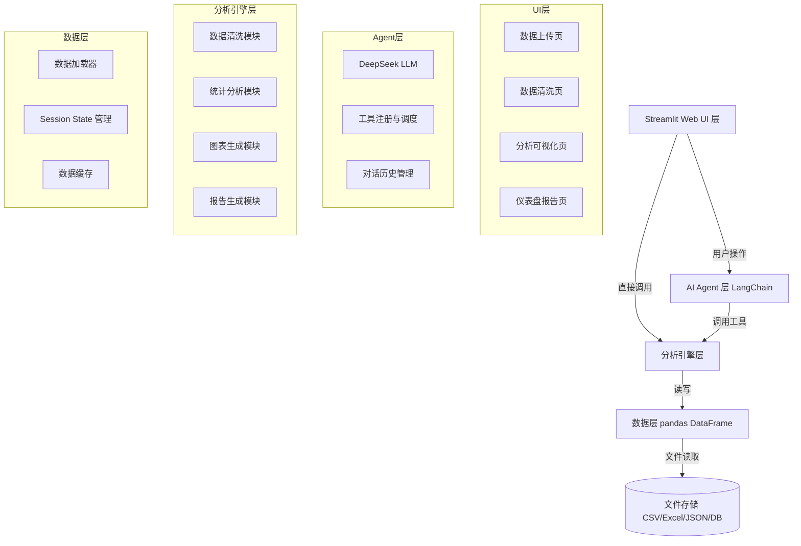

## 产品概述

开发一个基于 AI 的数据分析智能体 Web 应用。用户上传结构化数据表（CSV/Excel/JSON/SQLite）后，AI 自动完成数据清洗、统计分析、绘图、仪表盘制作和 HTML 报告输出的全流程分析。面向数据分析岗位求职场景，兼具简历项目展示和实际使用价值。

## 核心功能

- **数据上传**：支持 CSV、Excel(.xlsx)、JSON、SQLite(.db) 文件上传，上传后展示数据预览和字段信息
- **AI 数据清洗**：自动识别并处理缺失值、数据类型自动修正（日期识别）、异常值检测与处理，用户可确认或调整清洗方案
- **统计分析**：描述性统计（均值/中位数/标准差等）、分组对比分析、相关性分析（相关系数矩阵），结果以表格和图表展示
- **智能绘图**：支持柱状图、折线图、散点图、饼图等基础图表，AI 根据数据特征自动推荐最合适的图表类型
- **仪表盘**：简单版仪表盘，关键指标卡片 + 图表平铺展示（类似报表），后续可升级为交互版
- **AI 对话分析**：两种模式——页面加载时 AI 自动生成数据洞察报告；用户可用自然语言提问，AI 自动调用 Python 代码工具进行分析并回答
- **输出报告**：生成 HTML 网页分析报告，可在浏览器查看，后续可扩展 PDF/Word 格式

## 技术选型

### Tech Stack Selection

- **Web 框架**：Streamlit（Python 原生，最适合数据应用，开发效率高，简历亮眼）
- **AI 模型**：DeepSeek API（deepseek-chat 模型，性价比高，中文理解能力强，支持 Function Calling）
- **Agent 框架**：LangChain（支持 Function Calling，让 AI 自动调用 Python 代码工具，实现真正的智能体）
- **数据处理**：pandas + numpy
- **图表库**：Plotly（交互式图表，支持缩放、悬停查看数值，适合 Web 展示）
- **仪表盘**：Streamlit 原生布局 + Plotly 图表组件
- **报告生成**：Jinja2 模板引擎渲染 HTML 报告
- **主题样式**：自定义 CSS 深色主题 + streamlit-antd-components（ANT Design 风格组件）
- **部署方案**：Streamlit Cloud（免费，快速部署）或腾讯云（后续）

### Implementation Approach

**整体策略**：采用模块化四层架构，将应用分为数据层、分析引擎层、AI Agent 层、展示层，各层职责清晰，便于维护和扩展。

1. **数据层**：使用 pandas 统一读取多格式文件为 DataFrame，利用 Streamlit 的 `session_state` 管理数据在会话中的生命周期，支持几十万行数据处理。

2. **AI Agent 层**：基于 LangChain 构建 Agent，配备以下工具函数：

- `execute_python_code`：执行 Python 代码分析数据并返回结果
- `get_data_summary`：获取数据的统计摘要和 schema 信息
- `generate_chart_code`：根据数据和需求生成 Plotly 绘图代码

AI 接收到用户请求后，自动选择合适的工具调用，实现真正的"智能分析"。

3. **分析引擎层**：将核心分析功能封装为独立模块（数据清洗、统计分析、绘图、报告生成），每个模块提供标准化接口，供 Agent 层和展示层调用。

4. **展示层**：Streamlit 多页面/多 Tab 布局，深色专业主题，分模块展示不同功能。

**关键决策理由**：

- 选择 LangChain Agent 而非简单 API 调用：Agent 模式支持 Function Calling，AI 可以根据需要自动选择并调用合适的工具，真正实现智能化，而非简单的"把数据发给 AI 拿结果"。这是本项目的核心亮点，写在简历上非常有竞争力。
- 选择 Plotly 而非 Matplotlib：Plotly 生成的是交互式 HTML 图表，支持缩放、拖拽、悬停查看数值，用户体验远优于静态图片，且适合 Web 环境。
- 选择 Streamlit 而非 Flask/Django：Streamlit 专为数据应用设计，开发效率极高（几十行代码即可构建交互式数据应用），原生支持图表展示、文件上传、会话状态管理，非常适合 1-2 周出 Demo 的需求。

**性能考虑**：

- AI 交互时只发送数据 Schema 和统计摘要给 AI，不发送全量数据，避免 token 超限和响应延迟
- 使用 Streamlit 的 `@st.cache_data` 装饰器缓存数据加载和分析结果，避免重复计算
- 大文件处理：使用 pandas 的 `chunksize` 参数按需加载，避免内存溢出

**避免技术债务**：

- 各功能模块独立封装，遵循单一职责原则，后续扩展新功能时不影响现有代码
- 使用配置文件管理常量（API Key、默认参数等），避免硬编码
- Agent 工具函数设计为可插拔，方便后续扩展新工具

### Implementation Notes

1. **DeepSeek API 集成要点**：

- DeepSeek 提供 OpenAI 兼容的 API 格式，可使用 `langchain-openai` 库，将 `base_url` 设置为 DeepSeek 的 API 地址
- 设置合理的 `max_tokens`（建议 2048）和 `temperature`（建议 0.3，保证分析结果稳定性）
- 做好 API 调用失败的降级处理（捕获异常，展示友好错误提示，不导致应用崩溃）

2. **Agent 工具设计要点**：

- 每个工具函数需要有清晰的 `name`、`description` 和 `args_schema`，让 AI 准确理解工具的用途和参数
- 工具函数的返回值需要格式化（如 DataFrame 转为 Markdown 表格字符串），方便 AI 读取和处理
- 限制工具执行的超时时间，避免无限循环或耗时过长的操作

3. **数据安全与隔离**：

- 每个用户的数据存储在独立的 Streamlit `session_state` 中，会话结束后数据不持久化（符合"先不需要用户系统"的需求）
- 不将用户数据用于任何外部用途，AI 调用时只发送数据摘要

4. **错误处理**：

- 文件上传时校验格式和大小，给出明确错误提示
- 数据分析过程中捕获所有异常，展示友好的错误信息和处理建议
- AI 调用失败时，提供"重试"按钮，不丢失用户已上传的数据

5.  **blast Radius 控制（向后兼容）**：

- 各功能模块独立，单个模块出问题不影响其他功能
- 优先实现核心功能（数据上传、清洗、统计、绘图），AI 功能作为增强，即使 AI 调用失败，用户仍可使用基础分析功能

### Architecture Design

系统采用四层分层架构，各层职责清晰，边界明确：



**数据流说明**：

1. 用户上传文件 → 数据加载器读取 → 存入 `session_state`
2. 用户触发分析 → AI Agent 接收请求 → 选择合适工具 → 调用分析引擎
3. 分析结果 → 展示层渲染（表格/图表/报告）
4. 用户自然语言提问 → AI Agent 理解意图 → 调用 `execute_python_code` 工具 → 执行分析代码 → 返回结果给用户

### Directory Structure

## 目录结构说明

本项目为全新 Python Streamlit 项目，采用模块化设计，各功能独立封装，便于维护和扩展。

```
d:/数据分析项目/
├── app.py                      # [NEW] Streamlit 主入口文件，负责页面路由、侧边栏导航、整体布局
├── config.py                   # [NEW] 配置文件，存放 DeepSeek API Key、默认参数、常量定义
├── requirements.txt            # [NEW] Python 依赖清单（streamlit, langchain, pandas, plotly 等）
├── .streamlit/
│   └── config.toml            # [NEW] Streamlit 配置文件，设置深色主题、布局宽度、页面标题
├── src/                        # [NEW] 核心功能模块目录
│   ├── __init__.py
│   ├── data_loader.py         # [NEW] 数据加载模块。负责读取 CSV/Excel/JSON/SQLite 文件，
│   │                          #        统一返回 pandas DataFrame，包含文件格式校验和编码自动检测
│   ├── data_cleaner.py        # [NEW] 数据清洗模块。实现缺失值检测与处理（删除/填充）、
│   │                          #        数据类型自动修正（日期识别等）、异常值检测（Z-score/IQR方法），
│   │                          #        提供清洗建议列表供 AI 和用户选择
│   ├── stats_analyzer.py      # [NEW] 统计分析模块。实现描述性统计（均值/中位数/标准差/分位数等）、
│   │                          #        分组对比分析（groupby + agg）、相关性分析（Pearson/Spearman），
│   │                          #        返回格式化结果（DataFrame + 可视化图表）
│   ├── chart_generator.py     # [NEW] 图表生成模块。封装 Plotly 图表生成函数（柱状图/折线图/
│   │                          #        散点图/饼图），实现 AI 智能图表推荐逻辑（根据数据特征
│   │                          #        和用户输入推荐最合适的图表类型）
│   ├── dashboard_builder.py   # [NEW] 仪表盘构建模块。负责将多个图表和指标卡片组合为
│   │                          #        仪表盘布局（使用 Streamlit columns/expander 实现），
│   │                          #        支持关键指标计算和展示
│   ├── report_generator.py    # [NEW] 报告生成模块。使用 Jinja2 模板渲染 HTML 分析报告，
│   │                          #        报告包含数据概览、清洗记录、统计结果、图表快照、
│   │                          #        AI 洞察结论，支持浏览器直接查看
│   └── ai_agent/             # [NEW] AI Agent 子模块目录
│       ├── __init__.py
│       ├── agent.py           # [NEW] LangChain Agent 核心类。配置 DeepSeek LLM，
│       │                          #        注册工具函数，实现 Agent 初始化和调用接口
│       ├── tools.py           # [NEW] Agent 工具函数定义。实现 execute_python_code（执行
│       │                          #        Python 代码分析数据）、get_data_summary（获取
│       │                          #        数据摘要）、generate_chart（生成图表）等工具，
│       │                          #        每个工具包含完整的 name/description/args_schema
│       └── prompts.py         # [NEW] AI Prompt 模板。定义系统提示词（设定 AI 角色为
│       │                          #        数据分析专家）、用户提示词模板、数据摘要格式模板
├── templates/                  # [NEW] 模板文件目录
│   └── report_template.html   # [NEW] HTML 报告 Jinja2 模板。定义报告的整体布局、
│                              #        样式（深色主题风格）、数据展示区域、图表嵌入方式
├── static/                     # [NEW] 静态资源目录
│   └── custom.css             # [NEW] 自定义 CSS 样式文件。定义深色主题配色、
│                              #        卡片样式、表格样式、按钮样式等，通过 Streamlit
│                              #        的 HTML 组件注入
└── utils/                      # [NEW] 工具函数目录
    ├── __init__.py
    ├── session.py             # [NEW] Streamlit 会话状态管理工具。封装 session_state
    │                          #        的读写操作，管理上传数据、清洗记录、分析结果的存储
    └── helpers.py             # [NEW] 通用辅助函数。包含数据格式判断、数值格式化、
                               #        异常值计算方法、图表配色方案等工具函数
```

### Key Code Structures

核心接口定义如下（仅展示最关键的两个接口）：

```python
# src/ai_agent/tools.py - Agent 工具函数接口
from langchain_core.tools import BaseTool

class ExecutePythonCodeTool(BaseTool):
    """执行 Python 代码分析数据的工具"""
    name: str = "execute_python_code"
    description: str = (
        "执行 Python 代码来分析 pandas DataFrame 数据。"
        "输入是一个包含有效 Python 代码的字符串，代码中可以使用 'df' 变量访问当前数据。"
        "返回代码执行结果（字符串格式）。"
        "用于回答需要计算、统计或数据处理的问题。"
    )

class GenerateChartTool(BaseTool):
    """生成数据图表的工具"""
    name: str = "generate_chart"
    description: str = (
        "根据数据生成可视化图表。"
        "输入包含图表类型（bar/line/scatter/pie）、x 轴列名、y 轴列名（可选）。"
        "返回 Plotly 图表对象。"
        "用于回答需要数据可视化的请求。"
    )

# src/ai_agent/agent.py - Agent 核心接口
class DataAnalysisAgent:
    """数据分析 AI Agent"""
    
    def __init__(self, api_key: str, model: str = "deepseek-chat"):
        """初始化 Agent，配置 LLM 和工具"""
        ...
    
    def analyze(self, user_query: str, df: pd.DataFrame) -> str:
        """分析用户问题，返回 AI 回答（可能包含图表）"""
        ...
    
    def generate_insights(self, df: pd.DataFrame) -> str:
        """自动生成数据洞察报告"""
        ...
```

## 设计风格

采用**专业商务深色主题**，参考现代企业级数据分析平台（如 Metabase 深色模式、Tableau 深色主题）。整体风格专业、大气，配色沉稳，突出数据可视化效果，给面试官和用户留下"企业级产品"的印象。

## 页面规划（共 4 个核心视图）

### 页面 1：数据上传与预览视图

- **顶部导航栏块**：左侧展示应用 Logo 和项目名称 "DataMind AI"，右侧显示"使用帮助"链接，深色背景（#0E1117），底部有细微的蓝色边框装饰线
- **上传区域块**：页面中央放置拖拽上传区，支持点击选择文件，上传区域有虚线边框和上传图标动画，下方显示支持格式图标（CSV/Excel/JSON/DB），上传后自动切换到预览状态
- **数据基本信息卡片块**：上传成功后，顶部展示数据基本信息卡片（行数、列数、内存占用），使用图标 + 数值的展示方式，卡片有轻微的蓝色边框发光效果
- **数据表格预览块**：展示数据前 100 行（可配置），支持列排序和搜索，表格使用深色条纹样式，鼠标悬停行高亮
- **字段信息块**：表格下方展示每列的详细信息（列名、数据类型、缺失值数量、唯一值数量），以可折叠的卡片列表展示

### 页面 2：数据清洗视图

- **AI 清洗建议卡片块**：页面顶部展示 AI 自动检测到的数据质量问题，每个问题以独立卡片展示（如"发现 3 个缺失值"、"日期列未自动识别"），卡片右侧有"应用"和"忽略"两个按钮，应用后卡片变为绿色成功状态
- **手动清洗操作面板块**：建议卡片下方是可手动操作的清洗面板，以下拉菜单和按钮形式提供常用清洗操作（删除含缺失值行/用均值填充/删除重复行/转换数据类型等），每次操作后有操作记录展示
- **清洗前后对比块**：页面右侧（或下方）展示清洗前后数据对比，以并排表格或统计摘要对比图的形式展示，对比区域有清晰的分割线和"before/after"标签

### 页面 3：分析与可视化视图（核心视图）

- **Tab 切换导航块**：页面顶部有三个 Tab 按钮（统计分析 / 智能绘图 / AI 对话），当前选中 Tab 有蓝色下划线指示器，Tab 切换时有平滑的淡入淡出过渡动画
- **统计分析内容块**（Tab 1 内容）：上方展示描述性统计表格（数值列的统计指标），中间展示分组对比分析结果（可下拉选择分组列），下方展示相关性热力图（Plotly 交互式），每个板块右上角有"导出数据"按钮
- **智能绘图内容块**（Tab 2 内容）：左侧为图表配置面板（图表类型选择、X 轴/Y 轴/颜色/分组下拉框、AI 推荐标签以蓝色徽章展示），右侧为图表展示区（Plotly 交互图表，支持缩放和悬停），图表下方有"保存图表"按钮
- **AI 对话内容块**（Tab 3 内容）：页面加载时自动在顶部展示 AI 生成的"数据洞察摘要"（以卡片形式展示关键发现），下方是对话输入区（文本框 + 发送按钮，支持 Enter 发送），底部是对话历史区（用户提问和 AI 回答交替展示，AI 回答中可嵌入数据表格和图表，有复制回答按钮）

### 页面 4：仪表盘与报告视图

- **关键指标卡片块**：页面顶部平铺 4-6 个关键指标卡片（如总记录数、平均销售额、最大最小值等），卡片有图标、数值、和趋势箭头/百分比变化，卡片背景有轻微的渐变效果
- **图表展示网格块**：指标卡片下方以 2x2 网格布局展示关键图表，每个图表有标题和"放大"按钮，点击后弹出模态框展示大图，图表使用 Plotly 交互式渲染
- **报告生成操作块**：页面底部放置"生成分析报告"主按钮（蓝色渐变背景，有悬停放大效果），点击后生成 HTML 报告并在新窗口打开预览，预览页面提供"下载报告"和"分享链接"两个按钮

## 交互设计

- 所有按钮和卡片有 hover 效果（颜色变化或轻微放大）
- Tab 切换、页面切换有平滑过渡动画
- 数据加载和 AI 分析时有 Loading 动画（Spinner 或进度条）
- 操作流程有清晰的反馈（成功/错误/警告提示，使用 Streamlit 的 toast/st alert 组件）
- 支持键盘快捷键（Enter 发送消息、Ctrl+Enter 执行代码等）