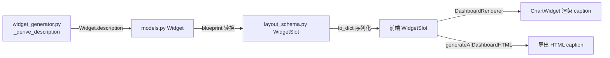

## 用户需求

智能驾驶舱（AI 模板，aiSchema，由 DashboardRenderer 渲染）中，每个图表（chart widget）的**下方应显示一段文字说明**，用于解释该图表达的含义，帮助用户快速理解图表内容。

## 产品概述

为 AI 智能驾驶舱的图表卡片增加"图表说明（caption）"区块，位于图表容器正下方，展示该图表所表达的业务含义。说明文字由后端在生成 Widget 时已派生，但需要打通全链路使其传递到前端并渲染；同时导出的 HTML 文件也应包含同样的说明，保证一致。

## 核心功能

- 每个 chart 类型 Widget 下方展示其 `description` 文字说明
- 说明文字为空时（部分 widget 无 insights 派生）不渲染说明区块，避免留白
- 导出的 AI 驾驶舱 HTML 文件中图表下方同样展示说明
- 复用后端已有 `Widget.description`（已通过 `_derive_description` 从 config 或 insights[0] 生成），不新增 LLM 调用

## 技术栈

- 前端：React + TypeScript（Vite），现有 DashboardRenderer / ChartWidget 组件体系
- 后端：Python（FastAPI），现有 dashboard 蓝图布局引擎与 Widget 模型
- 数据流：AnalysisPackage → Widget（含 description）→ WidgetSlot → 前端 WidgetSlot → ChartWidget 渲染

## 实现方法

采用**全链路补齐 description 字段**的策略，而非新增文本生成：后端 `Widget.description` 已由 `src/dashboard/widget_generator.py:_derive_description` 生成（从 config.description 或 insights[0] 派生，≤100 字），但在「Widget → WidgetSlot 转换」与「WidgetSlot.to_dict 序列化」两处被丢弃，前端类型与渲染也未接收。只需在断点处补洞并在前端渲染即可，无性能开销、无新增 API。

## 关键决策与理由

1. **复用现有 `Widget.description`，不重新生成**：避免引入 LLM 调用带来的延迟、token 成本与不确定性；该字段本就为"简短描述（2 句话以内）"语义，契合"图下说明"需求。
2. **后端两处断点分别修复**：

- `layout_schema.py: WidgetSlot` 增加 `description` 字段并在 `to_dict()` 输出，确保序列化不丢。
- `blueprint_layout_engine.py:271` 构造 `WidgetSlot(...)` 时透传 `description=w.description`，确保转换不丢（`w` 为 `models.Widget`，第 88 行确认已有 `description` 字段）。

3. **前端类型对齐后端**：`types/dashboard.ts: WidgetSlot` 增加 `description: string`，与后端 to_dict 保持一致。
4. **ChartWidget 渲染 caption**：在 `<div ref={chartRef} .../>`（第 270 行）下方新增说明区块，使用 `theme.textSecondary` 低对比色、小字号，hover 时不喧宾夺主；`widget.description` 为空字符串时不渲染该区块（空值兜底）。
5. **导出 HTML 同步**：`generateAIDashboardHTML` 中 chart/table 卡片已用 `makeChartDiv` 包裹，在卡片 div 内图表容器后追加说明段落，保持与在线版视觉一致。

## 性能与可靠性

- 纯文本透传与渲染，无新增计算或网络请求，O(1) 渲染开销。
- 空值兜底：`description` 可能为空（无 insights 的 widget），前端必须做 `if (!desc) return null` 保护，避免空 div 占位导致布局留白。
- 不破坏现有交互（Cross Filter / Highlight / DrillDown）：说明区块置于图表容器之外、卡片 padding 之内，不影响 ECharts 容器尺寸与事件绑定。
- 后端改动遵循现有 `to_dict` 模式，与 `supported_filters` / `metadata` 同级输出，结构清晰。

## 架构设计

数据贯通链路：



当前断点在 B→C（blueprint 未透传）与 C→D（to_dict 未输出 + 前端缺字段），修复后 E/F 渲染。

## 目录结构与文件改动

```
src/dashboard/layout_schema.py                          # [MODIFY] WidgetSlot 增加 description 字段；to_dict() 增加 "description": self.description
src/dashboard/blueprint_layout_engine.py                # [MODIFY] 构造 WidgetSlot 时增加 description=w.description
frontend/src/types/dashboard.ts                         # [MODIFY] WidgetSlot 接口增加 description: string
frontend/src/components/DashboardRenderer/WidgetRenderer/ChartWidget.tsx  # [MODIFY] 图表容器下方渲染说明区块（空值兜底）
frontend/src/utils/exportEChartsDashboard.ts            # [MODIFY] generateAIDashboardHTML 的 chart/table 卡片内同步渲染说明
```

## 实现要点

- **layout_schema.py**：`WidgetSlot` 类增加 `description: str = ""`；`to_dict()` 返回 dict 增加 `"description": self.description`（建议放在 `title` 之后，顺序与前端类型对齐）。
- **blueprint_layout_engine.py**：第 271 行 `WidgetSlot(...)` 增加 `description=w.description`（`w` 为 `models.Widget` 实例，必有该属性）。
- **dashboard.ts**：`WidgetSlot` 接口（39-53 行）增加 `description: string;`（建议在 `title` 或 `widget_type` 后）。
- **ChartWidget.tsx**：在 `return` 的卡片 `<div>` 内、`chartRef` 容器 `<div>` 之后，新增：

```
{widget.description ? (
<p className={`mt-2 text-xs leading-relaxed ${theme.textSecondary} opacity-80`}>
{widget.description}
</p>
) : null}
```

- **exportEChartsDashboard.ts**：`generateAIDashboardHTML` 中 chart/table 的 `makeChartDiv` 返回字符串后，在 widget 外层 `div` 内追加说明 HTML（从 widget.chart_config 或 widget 顶层取 description，注意导出函数当前接收的是 `Record<string, unknown>` 形式的 schema，需从 `w.description` 读取）。