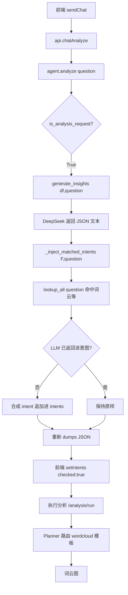

## 用户需求

用户在分析可视化模块的 AI 对话中输入“我想要词云图相关分析”，系统没有真正生成词云，而是被大模型自行否决为“结构化数据不适合词云”，只返回 4 个通用分析意图（产品排名/华东对比/渠道利润/复购率），导致前端勾选列表里没有词云项，用户无法再对 AI 输出生成词云图。

## 核心功能

在不改动任何现有端点、不改动前端的前提下，修复后端 AI 对话链路：当用户问题命中已知分析类型关键词（如“词云/词频”）时，由确定性路由把该意图强制补入 LLM 返回的分析意图列表，使前端能勾选并点“执行分析”出图。

### 1. 关键词命中即补入意图

- 在 `agent.generate_insights` 返回的 JSON 文本上，用 `AnalysisLibrary.lookup_all(user_query)` 取回所有关键词命中的分析意图
- 对每个命中、但 LLM 未返回的意图，合成一条可执行 intent（`analysis_goal` 用意图的 `display_name`，天然含“词频/词云”关键词，下游 `Planner.plan()` 必路由到 `wordcloud` 模板）
- 重新序列化 JSON 返回，前端 `setIntents(checked:true)` 后勾选列表自动出现词云项

### 2. 最小化、向前兼容

- 仅修改 `src/ai_agent/agent.py`，纯增量（新增 1 个单例函数 + 2 个辅助函数，包裹一处返回）
- LLM 正常返回该意图时跳过补入，不受影响；解析失败/无命中/无新增时原样返回
- 前端零改动（现有 `sendChat`→`executeAnalysis`→`/analysis/run`→`Planner`→词云图 链路已通）

### 3. 技术保障

- `AnalysisLibrary` 单例懒加载，避免模块级 import 副作用与循环导入
- 复用既有括号平衡 JSON 解析思路（本地化，不依赖 `insights.py`）
- 关键词列表追加 `词云`/`词频`，使 `analyze()` 的 `is_analysis_request` 判定更明确

## 技术栈

- 语言：Python 3.11
- 后端框架：FastAPI（既有，本次不新增端点）
- 分析知识中心：`src/analysis_library`（V3 YAML 驱动，唯一知识源）
- 路由目标：`src/ai_agent/agent.py`（`DataAnalysisAgent.analyze` / `generate_insights`）
- 下游执行：`Planner.plan()` + `AnalysisLibrary.lookup()` + `wordcloud_analysis` 模板（已验证可正常出图）

## 实现方案

### 策略

采用“确定性的意图补丁”方案：LLM 返回后仍由系统按用户问题关键词做一次兜底注入。这是既有 `Planner`/`AnalysisLibrary.lookup_all` 关键词匹配能力的复用，与项目“YAML 驱动、Planner 去业务化”的架构完全一致，不引入任何新业务知识。

### 关键技术决策

1. **本地化解析，避免跨模块耦合**：`_extract_first_json(text)` 在 `agent.py` 内部用括号深度计数法把 LLM 返回文本还原成 dict，复刻 `backend/routers/insights.py:_extract_json_by_brace_balance` 思路，但作为模块内私有函数，不改动 `insights.py`。
2. **`AnalysisLibrary` 懒加载单例**：`src/analysis_library/registry.py` 构造时会扫描全部 YAML（含 `wordcloud.yaml`），有 I/O 开销。用模块级 `_get_library()` 缓存单例，首次调用时构造，规避模块 import 期副作用与潜在循环导入（`agent.py` 已被多处 import）。
3. **补入判重基于关键词**：对 `lookup_all` 命中的意图，检查现有 `intents` 的 `business_question`/`analysis_goal` 是否已包含该意图任一 `keyword`；已包含则跳过，避免重复。
4. **合成 intent 的可路由性**：`analysis_goal` 直接取 `intent.display_name`（词云为“词频/词云分析”，含“词云”“词频”），保证下游 `Planner.plan()` 的 `AnalysisLibrary.lookup(analysis_goal)` 命中 `wordcloud` 模板（priority 88）。`business_question` 优先用 `intent.business_questions[0]`，否则用 `f"请进行{display_name}"`。

### 性能与可靠性

- `lookup_all` 为内存线性扫描（约十几个意图），O(n) 可忽略；`AnalysisLibrary` 单例只构造一次。
- 仅当 `user_query` 非空且有命中时才做 dict 解析与重序列化；解析异常/无命中/无新增一律原样返回，绝不阻断主流程。
- 不改动 `generate_insights` 的 LLM 调用与 fallback，不触碰 `insights.py` 的三层解析，保持既有容错边界完整。

## 架构设计

本次为单文件增量修改，无新增模块。修改点集中在 `src/ai_agent/agent.py`：



## 目录结构

```
d:\数据分析项目\
└── src/
    └── ai_agent/
        └── agent.py   # [MODIFY] ① 新增 _get_library() 懒加载单例
                                #            ② 新增 _extract_first_json(text)
                                #            ③ 新增 _inject_matched_intents(ai_text, user_query)
                                #            ④ analyze() is_analysis_request 分支包裹注入
                                #            ⑤ 关键词列表追加 '词云'/'词频'
```

## 关键代码结构（接口级）

```python
# agent.py 模块级
_LIB_INSTANCE = None

def _get_library():
    """懒加载 AnalysisLibrary 单例（避免 import 期 I/O 与循环导入）"""
    global _LIB_INSTANCE
    if _LIB_INSTANCE is None:
        from src.analysis_library import AnalysisLibrary
        _LIB_INSTANCE = AnalysisLibrary()
    return _LIB_INSTANCE

def _inject_matched_intents(ai_text: str, user_query: str) -> str:
    """解析 LLM 返回的洞察 JSON，按用户问题关键词补入缺失的分析意图；
    解析失败 / 无命中 / 无新增时原样返回。"""
    # 1. _extract_first_json 还原 dict
    # 2. matched = _get_library().lookup_all(user_query or "")
    # 3. 对命中且现有 intents 未含其关键词的意图，合成：
    #    {"business_question": ..., "analysis_goal": intent.display_name,
    #     "priority": "high", "reason": f"识别到关键词，已自动加入分析计划"}
    #    追加进 data["intents"]
    # 4. return json.dumps(data, ensure_ascii=False)
```