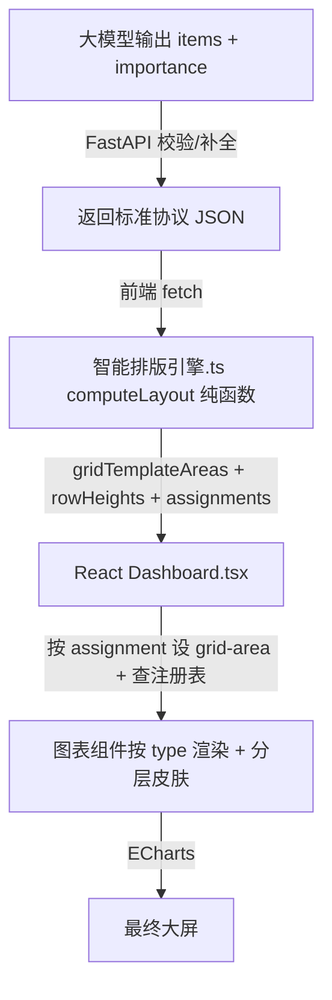

## 用户需求

用户希望解决现有 Bento-box 大屏的核心矛盾：**手动配置布局导致图表位置固定死，无法灵活扩展；大模型自由输出排版又毫无质量保障**。

## 产品概述

构建一个**三层解耦的智能大屏布局系统**（React 前端 + FastAPI 后端）：大模型只负责"选哪些图表 + 标记重要性"，智能排版引擎（纯函数）根据启发式规则自动计算每张卡片的 grid 落位与尺寸，React 渲染层消费引擎输出、经图表组件注册表完成绘制。新增图表类型或新图表时，只需在大模型输出中增加一条 item（或注册表加一项），引擎自动排版，无需手动改 grid-template-areas。

## 核心功能

- **简化布局协议**：大模型输出 `items[]`（含 type、data、importance 三字段），不再硬编码 gridArea 坐标
- **智能排版引擎**：根据 importance 分级（hero/side/wide/full）自动生成 12 列 CSS Grid 矩阵，保证 hero 居中、side 环绕、wide/full 靠下、防重叠防溢出
- **层级皮肤复用**：复用现有 applyCardSkin 的 bento/hero 分层逻辑，不同 importance 自动套用对应视觉权重
- **可扩展注册**：新图表类型通过引擎内一条规则即可接入，不修改渲染层代码
- **入口改造**：大屏测试.html 改为加载新协议并调用引擎，保留现有错误处理栏

## 技术栈

- **前端：React + TypeScript**：消费引擎输出并渲染布局。引擎为纯函数（TS），不依赖 React 状态/生命周期
- **后端：FastAPI（Python）**：托管大模型调用，返回标准 `items[] + importance` 协议 JSON 给前端；可选在 Python 侧实现同算法引擎做校验/预排版
- **ECharts 5.5.0**：图表渲染（React 内用 echarts-for-react 或 ref 挂载）
- **CSS Grid + grid-template-areas**：Bento-box 布局核心（由引擎动态生成字符串，React 内联 style 设置）
- **说明**：当前文档基于测试项目（纯 JS 同期群分析）提炼，真实项目为 React + FastAPI，本计划据此适配

## 实现方案

### 核心策略：引入智能排版引擎层，解耦"选图"与"排版"

当前架构中 `大屏布局.json` 写死了 gridArea 坐标矩阵，导致新增图表必须手动改 JSON 布局。大模型直接输出坐标又无法保证排版质量。

**方案决定**：建立三层架构——

1. **协议层**（大模型输出 / FastAPI 返回）：大模型只输出 `items[]`，每张卡片声明 `type` / `data` / `importance`（hero|side|wide|full），不声明坐标。FastAPI 可加 system prompt 约束或 Pydantic schema 校验补全。

### Token 控制：后端 profiling 降噪（关键约束）

**问题**：后端数据源（mock / DB）原始 JSON 包含大量与"排版决策"无关的字段，全量喂给 LLM 会造成 token 爆炸 + 噪声干扰判断。

**原则**：排版只依赖**图表级元信息**，不需要数据本身。LLM 应只读精炼后的"候选清单"，不碰原始数据。

**FastAPI 侧做 profiling（降噪）后再给 LLM**：

```
原始数据源 (mock9.json / DB)
   ↓ FastAPI 先做 profiling（提取元信息）
精炼后的"图表候选清单"  ← 只含：type / 字段含义 / 行数 / 聚合维度 / 数值范围
   ↓ LLM 基于候选清单做业务判断（打 attentionWeight）
LLM 输出 items[]  ← 极短，只选了哪些图 + 评分
   ↓ computeLayout 引擎
最终布局
```

给 LLM 的候选清单示例（几百 token，而非几万）：

```json
{
  "candidates": [
    {
      "slot": "rfm_pie",
      "type": "ring",
      "label": "RFM 营收构成环形图",
      "rows": 5,
      "dimensions": ["客户分层"],
      "metrics": ["营收占比"],
      "valueRange": "12%~38%",
      "suggestedBusinessValue": 0.9
    },
    {
      "slot": "raw_orders",
      "type": "table",
      "label": "原始订单明细",
      "rows": 12840,
      "note": "明细级，信息熵低，不适合做主视觉"
    }
  ]
}
```

**限制 token 的工程手段**：

- **候选数量上限**：profiling 后只保留 Top-N（如 N=12）最有潜力的候选，其余不进 LLM 上下文
- **后端先验打分**：用规则（营收相关 > 转化相关 > 明细）先给 `suggestedBusinessValue`，LLM 只微调/确认，减少其"理解数据"的推理负担
- **输出 schema 强约束**：用 function calling / JSON schema 锁死输出结构，`items[]` 只含 `slot` + `attentionWeight`，禁止自由发挥产生冗余
- **选图与读数据分离**：LLM 只决定布局与评分；真实数据在渲染阶段由前端按 `slot` 直接 fetch，LLM 全程不碰原始数据

### 业务权重 attentionWeight 的两段式计算

**谁算、怎么算**：业务权重不是 LLM 凭空编的，而是**后端先验（确定性规则）+ LLM 语义微调**两段式，引擎按最终分数排序决定视觉落位。

**第一段：FastAPI 后端先验打分（规则，零 token）**

profiling 时按字段语义给基线分 `suggestedBusinessValue`：

| 规则 | 加分逻辑 | 例子 |
|------|----------|------|
| 指标类型 | 营收/GMV/转化类 > 流量/明细类 | `rfm_pie`(营收占比) 0.9 |
| 聚合层级 | 已聚合的汇总图 > 原始明细表 | 漏斗 0.85 / 订单明细 0.2 |
| 行数 | 维度少而精（5~20 行）> 超多行 | 5 行环形图高分 |
| 信息熵 | 一张图能读出明确结论 > 需人肉比对 | 趋势断崖图高分 |

**第二段：LLM 语义微调（少量 token）**

LLM 拿到精炼候选清单后，结合**业务上下文**（如"双11大促复盘" vs "日常运营"）在基线分上微调，输出最终 `attentionWeight`：

```
attentionWeight = suggestedBusinessValue(后端) × 0.6
                + LLM语义判断(业务场景契合度) × 0.4
```

LLM 判断维度：商业价值（对当前决策的关键度）、信息熵（一张图能得几个结论）、稀缺性（是否唯一能回答某问题）。

**为什么不全交给 LLM 算**：① token 控制——后端基线作锚点，LLM 只确认/微调，不用从头理解数据；② 稳定性——纯 LLM 打分会抖动，后端基线保下限；③ 可解释——每条分可回溯规则（"营收类 +0.3"），非黑箱。

**引擎如何消费该分数**：`computeLayout` 对所有 item 的 `attentionWeight` 排序——Top1 → 视觉重心（hero 中央位，不限定类型）；Top2~5 → side 环绕；`type: table` 强制 full（类型约束优先于分数）；side 满则剩余高分降级 wide。
2. **引擎层**（新增 `智能排版引擎.ts`，纯函数）：输入 items 数组，输出 `{ gridTemplateAreas, rowHeights, cardAssignments[] }`。核心算法为分档填充：先放 hero（占据中央 6 列 × 2 行），再环绕放置 side（hero 两侧各 3 列），剩余 wide/full 按优先级从下往上等宽填充，自动计算行数与每行高度避免溢出。引擎不依赖 React，可在前端或后端任一侧重用。
3. **渲染层**（React 组件 `Dashboard.tsx` + 图表组件注册表）：接收引擎输出，动态设置容器 `grid-template-areas`，遍历 assignments 渲染卡片组件（按 `type` 从注册表取对应图表组件），按 importance 套用分层皮肤，并并发拉取数据渲染 ECharts。

### 关键决策与权衡

- **为什么不用 masonry/自动流**：自动流无法保证 hero 必居中且视觉最突出，Bento 的核心是"策划感"的层级，必须显式分区。
- **为什么不能把布局写死在 React 组件里**：真实项目前端是 React，但若把 grid 写死在 Dashboard JSX 中，每加一个图表就要改组件。正确做法：Dashboard 是通用布局容器，只消费引擎的 `assignments`，不认识具体图表；具体图表通过**注册表（registry）**映射 `type → React 图表组件`，新增图表只在注册表加一项。引擎是纯函数（TS），与 React 完全解耦，也可在 FastAPI 侧用 Python 实现同算法做后端预排版/校验。
- **防溢出策略**：引擎按 items 总数与分档比例估算行数，rowHeights 数组动态生成（hero 行高 280，普通行高 260，表格行高自适应），避免表格被压缩。
- **性能**：引擎为 O(n) 线性分档，React 用 `useMemo` 缓存布局、并发请求数据，无额外开销。

### 架构设计



### 数据流

1. 大模型输出 items + importance（可由 FastAPI 的 system prompt 约束字段，或 Pydantic 校验补全）
2. 前端从 FastAPI 拉取标准协议 JSON
3. React 调用 `computeLayout(items)`（纯函数，`useMemo` 缓存）
4. 引擎返回布局描述对象
5. Dashboard 组件设置根容器 `grid-template-areas` 与 `grid-template-rows`
6. 遍历 assignments，按 `type` 查注册表渲染对应图表组件并设 `grid-area`，套用分层皮肤
7. 并发请求数据 + 渲染对应 ECharts 图表

## 实现注意事项

- **向后兼容**：FastAPI 仍可返回旧协议（带 gridArea 矩阵），前端按 `type === 'bento-auto'` 分发新引擎路径，旧路径直接渲染，不破坏既有能力。
- **卡片复用**：图表组件通过注册表 `type → React 组件` 映射，新增 type 时仅在注册表加一项，不重写渲染逻辑。
- **防重叠**：引擎输出 assignments 时校验每个 grid-area 唯一性，hero 区优先级最高独占中央。
- **错误捕获**：React 用 ErrorBoundary 包裹 Dashboard，引擎计算异常时显示可读提示；FastAPI 侧用 Pydantic 校验协议，返回 422 时前端给出友好报错。

## 目录结构（React + FastAPI 真实项目）

```
frontend/
├── src/
│   ├── layout/
│   │   ├── computeLayout.ts        # [NEW] 智能排版引擎：纯函数，输入 items[] → 布局描述。分档填充、行数估算、防溢出防重叠。
│   │   └── chartRegistry.tsx       # [NEW] type → React 图表组件 注册表（ring/bar/funnel/line/table/radar/dual/kpi）。
│   ├── components/
│   │   ├── Dashboard.tsx           # [NEW] 通用布局容器，消费引擎输出，动态 grid + 遍历 assignments 渲染。
│   │   ├── Card.tsx                # 分层皮肤组件（hero/side/wide/full/kpi），对应原 applyCardSkin。
│   │   └── charts/                 # ECharts 图表组件（RingChart/FunnelChart/...），复用现有适配逻辑。
│   └── api/
│       └── fetchLayout.ts          # 从 FastAPI 拉取协议 JSON。
backend/  (FastAPI)
├── app/
│   ├── main.py                     # /api/dashboard 接口，调用大模型，返回 items[] + importance 协议。
│   ├── schemas.py                  # Pydantic：LayoutItem / DashboardLayout，约束 type/data/importance。
│   └── prompts.py                  # system prompt：引导 LLM 只选图表 + 标 importance，不输出坐标。
```

## 关键代码结构

```typescript
// 智能排版引擎核心接口（纯函数，无 React 依赖）
export interface LayoutItem {
  type: string;        // kpi | ring | bar | funnel | line | table | radar | dual
  data?: string;       // 数据源 slot 名
  title?: string;
  importance: 'kpi' | 'hero' | 'side' | 'wide' | 'full';
}

export function computeLayout(items: LayoutItem[]) {
  // returns: {
  //   gridTemplateAreas: string,   // CSS grid-template-areas 多行字符串
  //   rowHeights: number[],        // 每行高度数组
  //   assignments: Array<{ id: string; area: string; importance: string; item: LayoutItem }>
  // }
}
```

## 设计风格

延续现有 Bento-box + Glassmorphism 设计资产，以"分层毛玻璃 + 差异化卡片视觉权重"为核心语言。布局由引擎动态生成，视觉层级由 importance 分档驱动：

- **Hero 档**（环形图）：32px 大圆角，白色实底 + 紫-蓝渐变边框光晕，大字号标题 20px，内边距 28px，永远居中且体积最大
- **Side 档**（排行/漏斗）：24px 圆角，半透明白毛玻璃，标题 15px，内边距 20px，环绕 hero 两侧
- **Wide 档**（折线/双轴）：24px 圆角，毛玻璃，标题 16px，内边距 24px，靠下等宽
- **Full 档**（表格）：24px 圆角，毛玻璃，全宽，内边距 24px，底部

布局策略：12 列 CSS Grid，卡片间距 20px 营造呼吸感，背景浅紫-粉渐变。卡片 hover 微动效（轻微上浮 + 阴影增强），保持动态感。
