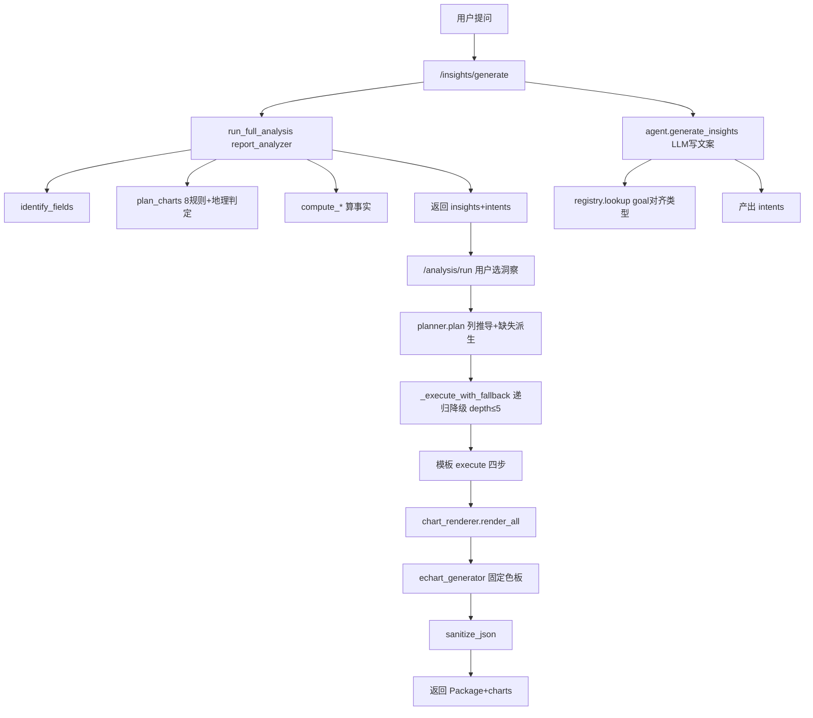

# 数据洞察分析后端全链路

> 对应代码（按调用顺序）：
> - 接入层：`backend/routers/insights.py`、`backend/routers/analysis.py`
> - 编排层：`src/report_analyzer.py`、`src/ai_agent/agent.py`、`src/analysis_library/registry.py`、`src/planner.py`
> - 模板/计算层：`src/analysis_templates/base.py`、`src/analysis_templates/*`
> - 图表层：`src/chart_renderer.py`、`src/echart_generator.py`
> - 全局：`src/utils/json_serializer.py`（sanitize_json）
>
> 这是**分析可视化模块** AI 对话里"数据洞察分析"的幕后全链路。一句话：**AI 只出意图文案，真正算数是后端确定性代码。**

## 〇、一句话总览：两阶段

数据洞察分析分两个阶段，核心原则贯穿始终——

> **阶段 A 生成洞察（出"意图"，不动数据）；阶段 B 执行分析（真正跑 pandas，出图表）。**

```
用户问"帮我分析下数据"
      │
      ▼
[阶段 A] insights.py /insights/generate
      ├─ 后端先算事实：report_analyzer.run_full_analysis()   ← 确定性 pandas
      └─ AI 写文案+产intents：agent.generate_insights()      ← LLM 出 analysis_goal
      │       （registry.lookup 把 goal 对齐到系统分析类型）
      ▼  返回 { insights文本 + intents[] }
用户点某个洞察 / 说"详细分析这个"
      │
      ▼
[阶段 B] analysis.py /analysis/run
      ├─ planner.plan()：意图→分析方法+列推导+缺失派生
      ├─ 模板执行引擎：base.execute() 四步（计算→边界修复→Insight→Package）
      ├─ chart_renderer + echart_generator：Package → ECharts option
      └─ sanitize_json：NaN/inf/numpy/Timestamp 兜底
      ▼  返回 { AnalysisPackage + charts[] }
```

## 一、整体链路图（Mermaid）



## 二、阶段 A：生成洞察（出"意图"，不动数据）

### 2.1 入口：`insights.py` `/insights/generate`（L24-72, L143-167）

- 先调 `run_full_analysis(df, user_query)` 让**后端用确定性代码把事实算出来**（字段识别、图表规划、指标计算）；
- 再调 `agent.generate_insights(df, user_query)` 让 **LLM 基于这些事实写人话文案、并产出 `intents`**（用户可点击进入阶段 B 的分析意图）；
- 若 LLM 挂掉，有 `_generate_intents_fallback` 用 `phase_2_charts` **反推 intents**，保证链路不中断。

### 2.2 后端先算事实：`report_analyzer.run_full_analysis`（L712-744）

三阶段流水线（全是确定性 pandas，无 LLM）：

| 阶段 | 函数 | 干什么 |
|---|---|---|
| ① identify_fields | 列识别 | 用 `column_classifier` 分出 时间/数值/分类/地理 列 |
| ② plan_charts | 图表规划 | **8 条固定规则** + 地理判定（`GEO_KEYWORDS`）决定画什么图 |
| ③ compute_* | 指标计算 | 真正算趋势/结构/Top/异常等事实数字 |

`plan_charts` 的 8 条规则是"AI 不可控、后端兜底"的典型：即便 LLM 乱说，后端也按固定规则给出一份可信的图表规划。

#### 2.2.1 后端预先计算的规则（三层确定性 Pipeline）

`run_full_analysis` 不是 AI 临时决定的，而是一整套**写死的确定性规则（rule-based）**。一句话总规则：**"有这个字段类型，就必然算这类事实"**。每个 `compute_*` 内部第一行都是早退判断——没有对应字段就返回空，有就必算：

```python
overview    = _to_native(get_data_overview(df))
basic_stats = _to_native(compute_basic_stats(df, fields["metrics"]))
trend       = _to_native(compute_trend_analysis(df, fields["time_dimension"], fields["metrics"]))
top_analysis = _to_native(compute_top_analysis(df, fields["dimensions"], fields["metrics"]))
structure   = _to_native(compute_structure_analysis(df, fields["dimensions"], fields["metrics"]))
anomalies   = _to_native(compute_anomaly_analysis(df, fields["metrics"], fields["dimensions"]))
yoy_mom     = _to_native(compute_yoy_mom(df, fields["time_dimension"], fields["metrics"], saved_charts))
```

**第一层：字段识别（`identify_fields`）规则** —— 给列"贴标签"，不算数：

| 识别结果 | 含义 | 来源 |
|---|---|---|
| `time_dimension` | 哪列是时间 | `column_classifier` 的 `time_cols[0]` |
| `metrics` | 数值指标列 | `numeric_cols` |
| `dimensions` | 分类维度列 | `category_cols` |
| `other` | 其余列 | `other` |

**启用矩阵（第一层 → 第二层触发）**：

| 条件（字段识别结果） | 触发计算 |
|---|---|
| 有 `metrics`（数值列） | 基础统计、异常分析 |
| 有 `time_dimension` + `metrics` | 趋势分析、同环比 |
| 有 `dimensions` + `metrics` | Top 分析、结构分析 |

**第二层：每类计算内部的统计规则 / 阈值**（全是统计学标准，保证可复现、不幻觉）：

| 计算 | 内部规则 / 阈值 |
|---|---|
| **数据概览** `get_data_overview` | 行数/列数、**缺失值总数 + 缺失率**、重复行数、内存 MB、数值/分类列数 |
| **基础统计** `compute_basic_stats` | 固定 7 指标：总和/均值/中位数/最大/最小/标准差/计数，统一 `round(,2)` |
| **趋势** `compute_trend_analysis` | 按时间排序；增长率 = `(末-首)/｜首｜×100`；波动率 = 标准差/均值（变异系数）；统计最长连续涨/跌次数；方向按增长率正负判 |
| **Top** `compute_top_analysis` | `groupby(维度)[指标].sum()` 取 `head(5)`/`tail(5)`；**Top3 集中度 = head(3).sum()/total×100**；维度只取前 2、指标前 2 |
| **结构** `compute_structure_analysis` | `groupby` 求和后 `share = 值/总和×100`；只展示前 8 类 |
| **异常** `compute_anomaly_analysis` | ① **Z-score**：`｜z｜>2` 判离群（取 top3）；② **IQR 法**：上界 `Q3+1.5×IQR`、下界 `Q1-1.5×IQR`，超界即突增突降；③ **占比异常**：某维度类别 `share>0.5`（50%）告警 |
| **同环比** `compute_yoy_mom` | 优先复用已存图表的 table 数据；无则退化为基础统计 |

关键阈值代码证据：

```python
# 异常 Z-score 阈值
outlier_mask = z_abs > 2.0
# IQR 1.5 倍法则
q1, q3 = s.quantile(0.25), s.quantile(0.75)
iqr = q3 - q1
upper, lower = q3 + 1.5 * iqr, q1 - 1.5 * iqr
# Top3 集中度
"top3_concentration": round(grouped.head(3).sum() / max(grouped.sum(), 0.0001) * 100, 1)
```

**第三层：图表推荐规则（`plan_charts`，确定性）** —— 分两阶段，全程 `core_titles` 集合去重防重复：

- **阶段 A 保底**（报告固定章节必须有图，顺序固定 0=趋势 / 1=结构 / 2=TOP）：
  - 有 `time_col+metrics` → 折线图（趋势）
  - 有 `dimensions+metrics` 且 `_is_geo_dimension`（含"省/市/区…"）→ **3D 地图**，否则 → **饼图**（结构）
  - 有 `dimensions+metrics` → 柱状图（排名）
- **阶段 B 自由**（8 条规则发挥）：趋势→折线、对比排名→柱状+排序表、占比→饼图+汇总表、地区→3D 地图+汇总表…（边界约束：维度[:2]、指标[:2]、趋势指标[:3]）。

> 这套"预计算规则"正是"先算后写"架构的核心：**"算"全部由确定性规则完成**，AI 不参与"算什么、画什么"的决策，只拿 `data_summary` 里这些规则算出的硬数字写文案。规则保证事实可复现、不幻觉（Z>2、IQR 1.5、Top3 集中度都是统计学标准）。

### 2.3 AI 写文案 + 产 intents：`agent.generate_insights`（L176-229）

```
LLM 输出文本+JSON
      │
      ▼
_extract_first_json()  ← 抠出 JSON（兼容 ``` 包裹）
      │
      ▼
_inject_matched_intents()  ← 把后端 run_full_analysis 的结果塞回 intents，保证前后一致
```

- LLM 只负责把"数据说了什么"翻译成**人话洞察**和**可点选的分析意图**（`analysis_goal` 文本）；
- 真正的数字来自 2.2 的后端计算，不是 LLM 编的。

#### 2.3.1 LLM 怎么"吃"后端结果、又怎么到前端屏幕

LLM 不是"直接读 DataFrame"，而是读**后端浓缩后的中文文本摘要**。完整链路五步：

**① 后端先把 `stats` 拼成中文摘要**（`_build_insights_data_summary`，report_analyzer.py L1110）

把 `run_full_analysis` 的 `stats` 转成一段结构化文本 `data_summary`，并明确告知 LLM「必须用这些真实列名」：

```python
lines.append("【数据基本信息】")
lines.append(f"- 行数：{overview['total_rows']:,}")
lines.append(f"- 完整列名列表：{overview['column_names']}")
# 字段分类（最关键：LLM 的分析建议必须用真实列名）
lines.append("【字段分类——分析建议中必须使用这些真实列名！】")
lines.append(f"- [CAL] 时间列：{time_col if time_col else '（无）'}")
lines.append(f"- [KPI] 数值指标列：{', '.join(metrics) if metrics else '（无）'}")
lines.append(f"- [TAG] 分类维度列：{', '.join(dimensions) if dimensions else '（无）'}")
# 数据质量 / 趋势 / Top / 异常 … 逐块拼进文本
```

**② 摘要 + Prompt 模板 → 喂给 LLM**（`agent.generate_insights` L194-218）

- `INSIGHTS_SYSTEM_PROMPT`（prompts.py L54）：规定 LLM **必须输出 JSON**，含 `insights`（Markdown 人话洞察，4 章节：数据概览/关键发现/数据质量/分析建议）+ `intents[]`（每项 `business_question`/`analysis_goal`/`priority`/`reason`）；并列出"分析方向关键词"，**铁律禁止输出任何技术实现细节**（chart_type / template_name 等）。
- `INSIGHTS_USER_PROMPT_TEMPLATE`（prompts.py L89）：把 `{data_summary}` 填入，要求严格输出 JSON。
- `temperature=0.0`、`max_tokens=4096`：保证可复现、不胡编。

```python
user_prompt = INSIGHTS_USER_PROMPT_TEMPLATE.format(data_summary=data_summary) + query_context
response = self.client.chat.completions.create(
    model=self.model,
    messages=[{"role":"system","content":INSIGHTS_SYSTEM_PROMPT},
              {"role":"user","content":user_prompt}],
    temperature=0.0, max_tokens=4096, timeout=120)
ai_text = response.choices[0].message.content or ""   # 返回 JSON 字符串
```

> 关键认知：**LLM 读到的只有 `data_summary` 这个字符串，DataFrame 本身从不进 prompt**。它做的是"读十几个关键数字 → 写人话 + 推荐分析方向"，而非"自己算数"。

**③ 后端三层解析 LLM 输出**（`insights.py` `_parse_ai_result_to_intents` L125-183）

LLM 回的是 JSON 字符串，后端要稳稳抠出 `insights` 和 `intents`：

```
Step1 正则提取 ```json…``` → json.loads → 抽 intents
Step2 括号平衡提取 → json.loads（应对 insights 字段内含花括号）
Step3 Planner 纯规则兜底 generate_default_intents（标 is_fallback）
```

解析完返回前端：`{ success, insights(文本), intents(数组), is_fallback }`。

**④ 前端拿到后分两路渲染**（`AnalysisPage.tsx` `generateInsights` L589-610）

```ts
const res = await api.generateInsights(...);
setInsights(normalizeInsights(res.insights || ''));   // ← 洞察文案
if (res.intents?.length) {
  setIntents(res.intents.map(item => ({
    business_question: item.business_question,
    analysis_goal: item.analysis_goal,
    priority: item.priority || 'medium',
    reason: res.is_fallback ? `[自动推荐] ${item.reason}` : item.reason,
    checked: item.priority === 'high',   // high 默认勾选
  })));
}
```

- **`insights` 文本** → 经 `normalizeInsights` 清洗后按 **Markdown 渲染**到屏幕（给人读的"数据说了什么"）；
- **`intents` 数组** → 渲染成**可勾选的分析计划列表**（`business_question` + `analysis_goal` + `priority` 标签），高优先级默认勾选。用户勾选后点「执行分析」→ 进入阶段 B（`/analysis/run`）。

**⑤ 补一层"防 LLM 漏意图"**（`_inject_matched_intents` agent.py L496）

当用户在对话里点名某图（如"词云图"），LLM 可能因"结构化数据不适合词云"而否决。此处用 `AnalysisLibrary.lookup_all(query)` 把用户原话匹配到对应分析类型，**强制补回一条 intent**，确保前端能生成该图。

> 整条链路印证前文的「先算后写」架构（见 2.2.1）：计算归 Python、文案归 LLM，前端只负责"把结果画出来 + 把意图变成可勾选计划"。

##### 2.3.1.1 后端结果是不是"全部"给 LLM？

要区分两种"全部"：

- **形式上是文本摘要，不是原始数据**：喂给 LLM 的不是 `stats` 对象、更不是 DataFrame，而是 `_build_insights_data_summary(stats)` 序列化出的**中文文本 `data_summary`**（`report_analyzer.py` L1110，已确认整合【数据基本信息】【字段分类-真实列名】【数据质量】，并接收完整 `stats` 与 `charts` 参数把趋势/Top/结构/异常/同环比也写进去）。DataFrame 本身从不进 prompt。
- **维度上是"全"的**：后端算的各类事实（概览/字段/质量/趋势/Top/结构/异常/同环比）都会进摘要。
- **粒度上不是"全"的，是精选截断的**：每个 `compute_*` 在算的时候就已经截断（见 2.2.1 第二层）——基础统计只给 7 个汇总值、趋势只给首末/增长率/连涨连跌且指标 `[:3]`、Top 只 `head(5)/tail(5)`、结构只前 8 类、异常只 Z>2 的 top3。所以进 LLM 的是"每个维度的关键统计量"，不是逐行明细、也不是完整 `stats` 字典。
- **`charts` 也参与**：`plan_charts` 的图表规划一并传入，让 LLM 的 `intents` 与后端"能画什么图"对齐（再经 `_inject_matched_intents` 强制对齐）。

> 一句话：**后端结果在"维度"上是全给 LLM 的，在"粒度"上是精选截断的——给的是一份人能读的关键数字清单，不是原始数据。**

### 2.4 意图如何对齐到系统分析类型：`registry.lookup`（registry.py L91-108）

AI 给的 `analysis_goal` 是自然语言（如"看看销售额的趋势"）。`AnalysisLibrary.lookup()` 用**"关键词子串匹配 + priority 最高"**把它对齐到系统里已有的分析类型：

- YAML 知识库（`src/analysis_library/*.yaml`）是**分析能力的 SSOT**；
- 命中多个时取 `priority` 最大的那个；
- 还有 `lookup_all`（L110）返回全部候选，供更精细的匹配。

这就是"AI 出意图、后端对齐意图"的关键桥。

### 2.5 阶段 A 的兜底（三层）

`generate_insights` 对 LLM 输出有**三层兜底**，任一层成功即返回：

1. **JSON 直接解析**：`_extract_first_json` 抠出合法 JSON → 直接用；
2. **文本正则 / `suggest_intents_for_columns`**：LLM 没给干净 JSON 时，用列特征纯规则推荐 intents；
3. **强制规则标 `is_fallback`**：实在不行，用确定性规则兜底产出一份"保底洞察"，并打 `is_fallback` 标记，前端可据此提示"这是兜底结果"。

> 同源思想参见 [[数据清洗兜底机制]]：模型可能乱出，后端永远有确定性兜底。

## 三、阶段 B：执行分析（真正跑 pandas，出图表）

### 3.1 入口：`analysis.py` `/analysis/run`（L69-184）

接收阶段 A 的 `intent`（含 `analysis_goal`、维度、指标），进入真实计算。

### 3.2 Planner 翻译意图 + 列推导 + 缺失派生：`planner.py`

`Planner.plan()` 把意图翻译成"用哪个分析方法、吃哪些列"：
- **列推断**：从 schema 找出时间/数值/分类列；
- **缺失列派生**（确定性规则，非 LLM）：
  - 缺数值指标但有分类维度 → 自动生成 `__derived_count__` 计数指标（`planner.py` L223-224）；
  - 缺日期维度但有 年/月(日) 列 → 合并生成 `__derived_date__`（L243-244）；
  - 缺分类维度 → 放宽选用任意文本列（对词云友好）；
- 派生成功就**不再判 `unsupported`**，极大提升分析成功率。

### 3.3 模板执行引擎：四步模式（`analysis_templates/base.py` L105-219）

每个分析类型是一个模板，`AnalysisPackage` 是统一产出。`execute()` 走**四步模式**：

```
① 数据计算   → 跑 pandas 算指标
② 边界修复   → _safe_divide / _safe_pct_change / _safe_agg 处理除零/空表
③ Insight    → 生成业务发现（build_findings）
④ 输出 Package → 封装成 AnalysisPackage 返回
```

> ⚠️ **经典坑**：`build_findings` **必须返回 `BusinessFinding` 对象**，不能直接返回字符串——否则会触发 `'str' object has no attribute 'link_evidence'` 错误（见 `src/domain/business_finding.py` L284 的 `link_evidence`）。模板里应调 `self.factory.ranking / concentration / summary` 来构造，而非裸字符串。

### 3.4 图表引擎：`chart_renderer.py` + `echart_generator.py`

- `render_all / render`（L34-65）：把 Package 渲染成 ECharts option；**单图失败返回 `None` 不影响整体**（其余图照常出）；
- `echart_generator.py`：按固定色板（`BLUE_PALETTE` / 暖色前置 10 色，见视觉规范）生成 option，绝不用默认彩虹调色板；
- 词云等特殊情况：每个 data item 直接附静态 `textStyle.color`（避免 `echarts-wordcloud` 2.1.0 的 function 着色失效）。

### 3.5 阶段 B 的兜底（多层降级）

`analysis.py` 有**递归降级**兜底链：

```
_execute_with_fallback(df, method, ...)   ← 递归 depth ≤ 5
      │
      ├─ 成功 → 返回 Package
      └─ 失败 → _try_fallback_chain() 换参数/方法重试
                  │
                  ├─ 有降级方案 → 重试（depth+1）
                  └─ 无方案 → _unsupported() 返回"暂不支持"的友好结果
```

- 一次分析最多降级 5 层，避免无限递归；
- 全部失败才进 `_unsupported`，给前端一个**可展示的空结果**而非崩溃。

### 3.6 全局兜底：`sanitize_json`

所有 5 个高风险路由（`analysis` / `data` / `stats` / `dashboard` / `chart`）返回前都必须过 `src/utils/json_serializer.py` 的 `sanitize_json()`，把 **NaN / inf / numpy 类型 / Timestamp / Decimal** 兜底成 JSON 安全值。这是"最后一道网"，防止坏 JSON 把前端搞崩。

## 四、引擎清单（一张表）

| 引擎                         | 文件                                              | 阶段    | 职责                                                     |
| -------------------------- | ----------------------------------------------- | ----- | ------------------------------------------------------ |
| AnalysisLibrary（YAML SSOT） | `src/analysis_library/registry.py`              | A/B   | 关键词+priority 把 goal 对齐到系统分析类型                          |
| report_analyzer            | `src/report_analyzer.py`                        | A     | identify_fields → plan_charts（8规则+地理）→ compute_* 算事实   |
| ai_agent（LLM）              | `src/ai_agent/agent.py`                         | A     | 写人话文案 + 产 intents + 三层兜底                               |
| Planner                    | `src/planner.py`                                | B     | 意图→方法+列推导+缺失派生（`__derived_count__`/`__derived_date__`） |
| 模板执行引擎                     | `src/analysis_templates/base.py` + `*/`         | B     | 四步模式：计算→边界修复→Insight→Package                           |
| 图表引擎                       | `src/chart_renderer.py` + `echart_generator.py` | B     | Package → ECharts option（固定色板，单图失败不崩）                  |
| 全局容错                       | `src/utils/json_serializer.py`                  | B（出口） | sanitize_json 兜底 NaN/inf/numpy/Timestamp               |

## 五、计算逻辑 ↔ AI 输出 的匹配规则（核心）

1. **AI 只出 `analysis_goal`（意图文本）**，后端用 `registry.lookup` 把它对齐到系统分析类型——AI 不决定"怎么算"，只说"想看什么"。
2. **列匹配由 Planner 推断**：时间/数值/分类列自动找；缺失则按确定性规则派生，不依赖 AI 判断。
3. **数字来自后端，文案来自 AI**：阶段 A 的事实数字是 `run_full_analysis` 算的，LLM 只负责翻译和润色，避免"AI 编数"。
4. **图表与 Package 一一对应**：`chart_renderer.render_all` 把 Package 渲染成图，单图失败返回 `None` 不拖垮整体。
5. **任何一步 AI/计算不可控，都有确定性兜底**：阶段 A 三层兜底、阶段 B 递归降级 + `sanitize_json`。

## 六、兜底总览（多层保险）

```
阶段 A（洞察）
  ├─ LLM JSON 解析失败 → _extract_first_json 抠 JSON
  ├─ LLM 完全挂 → _generate_intents_fallback 反推 intents
  └─ 兜底产保底洞察 → 标 is_fallback

阶段 B（执行）
  ├─ 列缺失 → planner 派生 __derived_count__ / __derived_date__
  ├─ 模板失败 → _execute_with_fallback 递归降级（depth≤5）
  ├─ 全失败 → _unsupported 友好空结果
  └─ 出口 → sanitize_json 兜底坏 JSON
```

> 与 [[数据清洗兜底机制]] 同源：**模型不可控，后端必兜底**。区别在清洗兜底保护"数据不被改坏"，洞察兜底保护"分析链路不断、结果可展示"。

## 七、关键澄清：业务图表由谁生成（LLM 的真实角色）

一个常见误解："生成数据洞察/业务图表 = LLM 分析数据出图，后端只是备料"。**这是错的。** 下面把链路里"谁干了什么"拆开。

### 7.1 真正生成业务图表的是后端确定性代码，不是 LLM

- 阶段 A 的 `run_full_analysis` 里 `plan_charts` 已经用**确定性规则**规划好"该画什么图"（折线/饼图/柱状/3D 地图…）；
- 用户勾选某个意图 → 阶段 B：`Planner.plan()` 把 `analysis_goal` 对齐到系统分析类型 → 模板执行引擎算数 → `chart_renderer` 生成 ECharts option；
- **整条出图链路（阶段 B）没有 LLM 参与**，全是 Python（pandas + 确定性渲染）。

> 即：你要的"符合原始数据的相关重要业务图表"，是**后端确定性出的**，LLM 从头到尾没碰画图。

### 7.2 LLM 在链路里的真实角色（只在阶段 A）

| 角色 | 干什么 | 不可替代？ |
|---|---|---|
| 写人话洞察 | 把后端算的事实翻译成 `insights` Markdown 文案（"数据说了什么"） | 确定性统计给不了"解读" |
| 理解自然语言 | 把用户在聊天框的问题（"哪个产品最赚钱"）翻译成 `intents` 分析意图 | 自由对话必须 NLP |
| 动态推荐 | 根据用户具体问题**优先**推相关意图（而非永远固定 趋势/结构/Top） | `plan_charts` 是固定规则，不会因用户问题变化 |

关键约束：`intents` 的 `analysis_goal` 还要经 `registry.lookup` **对齐回系统已有分析类型**——**LLM 不能发明新图，只能从后端已规划的能力里选**。

### 7.3 结论：对"出符合数据的重要业务图表"而言，LLM 非必需

- 想"一键出标准业务图表、不要 AI 文案/不要聊天"：项目已有**纯规则路径**——`/intents/default`（`insights.py` L228）不调 LLM，直接用 `Planner.generate_default_intents(df)` 生成分析计划，再进阶段 B 出图；
- 当前"一键生成数据洞察"按钮走 `/insights/generate`，它把"AI 洞察报告 + 推荐计划"**绑在一起强制走了 LLM**——这是产品形态（洞察报告），不是技术必需；
- **LLM 的不可替代价值只剩两件事**：① 把数字写成人话洞察文案；② 理解用户的自然语言提问。其余"出图"全归后端。

> 一句话：**图是后端确定性出的，LLM 只是"业务语义翻译器 + 对话入口"，不是"图表生成器"。你的直觉对了一半——出图确实不靠 LLM；LLM 存在的意义是"让人能用人话问、用人话读"。**

## 八、相关笔记

- [[数据清洗兜底机制]] —— 同源的"AI 不可控、后端兜底"思想（保护数据）
- [[数据清洗AI规则_prompt约束]] —— AI 只出方案不动数据的 prompt 约束
- [[后端技术栈]] —— 后端分层架构、insights/analysis 路由归属
- [[路由是什么]] —— `/api/insights/*`、`/api/analysis/*` 路由注册
- [[LLM JSON 字段名漂移]] —— 另一个"AI 输出 JSON 不可控"的坑
