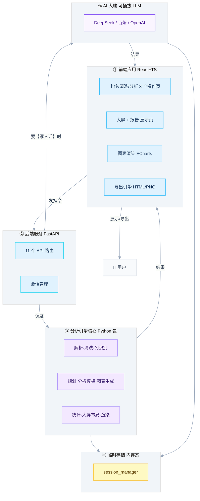

# DataMind AI 架构（产品视角 · 一页看懂）

> 本笔记是**给"外人"看的架构**——面试官、投资人、刚接手的产品经理，10 秒就能明白「这项目能干啥、由什么拼成」。技术视角的系统三层图见 [[项目架构全景图]]；前后端细拆见 [[前端技术栈]] / [[后端技术栈]]；总入口见 [[README]]。

## 一句话它是啥

> **DataMind AI 是一个"把一张原始表格，变成可视化大屏 + 分析报告"的智能数据分析平台。** 用户上传 Excel/CSV，平台自动清洗数据、AI 给解读、一键生成图表、拼成可投屏的大屏，最后还能导出一份能直接发的 HTML 分析报告。

---

## 一、这项目能干什么（6 大能力 · 用户视角）

| #   | 能力               | 用户实际能做的                                            |
| --- | ---------------- | -------------------------------------------------- |
| 1   | **智能上传**         | 拖入 CSV / Excel / JSON，自动识别字段类型                     |
| 2   | **数据清洗**         | 补缺失值、揪异常值、去重 —— 可视化点选，不用写代码                        |
| 3   | **AI 数据洞察**      | 一键让 AI 读懂数据，输出"该分析什么"的建议 + 人话结论                    |
| 4   | **智能分析出图**       | 选个分析意图（趋势/排名/结构/地图/词云…），自动匹配算法出 ECharts 图表         |
| 5   | **可视化大屏**        | 多套预设模板（指挥舱 / 网格 / 医疗看板 / 可视化看板…），图表按模板布局自动排布，可联动高亮、导出 HTML/PNG |
| 6   | **AI 分析报告 + 导出** | 一键生成管理层视角的 HTML 报告；大屏/报告可导出 **HTML**，大屏还可截 **PNG** |

---

## 二、它由什么组成（5 大部件 · 组成视角）

**一句话讲清关系**：前端是"操作台"，后端是"调度员"，引擎核心是"干活的工人"，AI 是"写文案的参谋"，内存是"临时工作台"——用户在前端点一点，后端指挥引擎算、偶尔问 AI 要段文案，结果回到前端拼成图/屏/报告。

---

## 三、用什么造的（技术栈一句话）

- **前端**：React 18 + TypeScript + Vite + Tailwind；图表用 **ECharts 6 + GL（3D地图）+ wordcloud**
- **后端**：**FastAPI（Python）**，部署在 **Render**
- **AI**：**可插拔 LLM**（DeepSeek / 阿里百炼 / OpenAI，用户填 Key 即用）
- **存储**：**纯内存态，无数据库**（数据临时放内存，重启就清）
- **导出**：自研 HTML 生成引擎（大屏/报告）+ html2canvas（PNG）

> 各技术选型对应的讲解笔记，见 [[前端技术栈]] 与 [[后端技术栈]]。

---

## 四、为什么这样搭（3 条设计灵魂）

1. **AI 只动嘴，工人动手** —— LLM 只负责"写洞察、写报告"，所有算数/匹配/画图都是确定性 Python 引擎，结果可复现。
2. **每个 AI 环节都有"没网也能跑"的兜底** —— AI 挂了，系统自动用规则顶上，整条链路不崩。
3. **故意不上数据库** —— 内存态 + 前端本地缓存副本，轻量、好部署、抗云服务的休眠重启。

---

## 相关笔记

- [[README]] —— 知识库总索引（本笔记在此登记）
- [[项目架构全景图]] —— 技术视角的系统三层架构图（与本文互补：本文讲"能干啥"，那篇讲"怎么拆"）
- [[前端技术栈]] —— 前端技术聚合页（MOC）
- [[后端技术栈]] —— 后端技术聚合页（MOC）
- [[API调用是什么]] —— 理解"前端调后端""后端调 LLM"两层调用关系的基础
