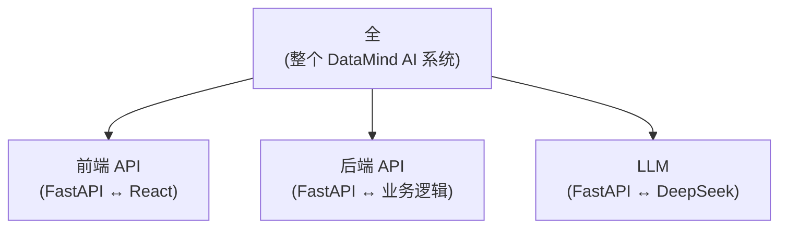
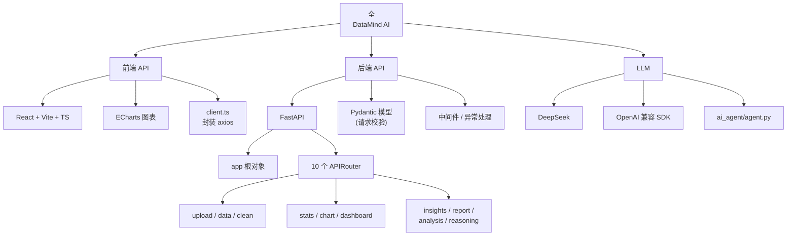
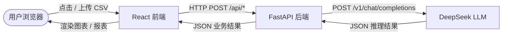
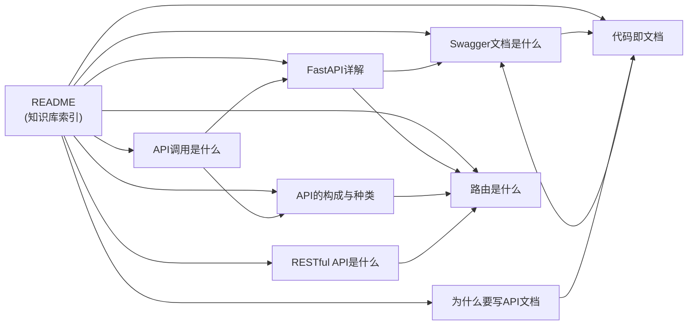

# 项目架构全景图

> 本图对应你手画的那张「全 → 前端 API / 后端 API / LLM」的关系图，用 Mermaid 画在 Obsidian 里，可编辑、可缩放、可点击跳转。详见 [[README|知识库索引]]。

## 一、原始手绘图（系统三层架构）

完全照搬你手写的那张图，根节点是「全」，下面分出三条线：



> 解读：本项目后端 **既是 API 的"被调用方"（被前端调）**，**又是 API 的"调用方"（去调 LLM）**。所以 "全" 拆开看，是「一个被两头发起请求的中心节点」。详见 [[API调用是什么]]。

## 二、展开版（看每一层的内部结构）

把三个分支分别展开，看每一层里有什么：



## 三、调用关系图（看数据怎么流）

把"谁调谁"用箭头方向画清楚：**箭头方向 = 请求方向**。



> **顺读** = 请求路径（自上而下）；**逆读** = 响应路径（自下而上）。`FASTAPI` 是整个系统的"中心调度"，向上接前端、向下调 LLM，自身执行业务计算。参考 [[API调用是什么]]。

## 四、知识库内部的关系图（看笔记之间的双向链接）

下面这张图是**自动从 `[[wikilink]]` 生成的**——你在 Obsidian 里按 Ctrl+G 打开 Graph 视图就能看到一模一样的图，每条边都对应一段 `[[...]]`：



> 在 Obsidian 里 `[[路由是什么]]` 这种链接会自动建立一条"双向边"——A 笔记里写 `[[B]]`，B 笔记里就能反向看到 A；Graph 视图会用这条边把两个节点连起来。详见 [[代码即文档]]。

## 五、怎么在 Obsidian 里看这些图

| 方式 | 操作 | 适合 |
|---|---|---|
| **Mermaid 代码块** | 在笔记里写 ` ```mermaid ` 代码块，Obsidian 自动渲染 | 想精确控制图的内容、随时改 |
| **Graph 视图** | 左侧栏点"Graph"图标（或 Ctrl+G） | 看整库自动生成的关系网 |
| **Excalidraw 插件** | 社区插件，手绘风格 | 想要白板自由手绘效果 |
| **Canvas 插件** | 官方原生，多卡片自由排版 | 想做"卡片墙"式知识地图 |

> 本笔记全部用 **Mermaid**，原因是 Mermaid 是 Obsidian 原生支持、纯文本（可纳入 git）、可复用，不依赖额外插件。

## 相关笔记

- [[README]] —— 知识库索引（本笔记也由此索引）
- [[项目架构产品视角]] —— 互补视角：本文讲"系统怎么拆"，那篇讲"项目能干啥、由什么拼成"
- [[API调用是什么]] —— "全" 之所以要拆成三层，是因为系统里有两层调用
- [[API的构成与种类]] —— 三件套的"被调用方 vs 调用方"角色
- [[FastAPI详解]] —— 后端 API 的实现细节
- [[路由是什么]] —— 后端 API 的具体落地
- [[RESTful API是什么]] —— 路径 = 资源，命名规律的来源
- [[Swagger文档是什么]] —— 自动生成的全部路由文档
- [[代码即文档]] —— 路由即文档的核心理念
- [[为什么要写API文档]] —— 自动文档的边界
